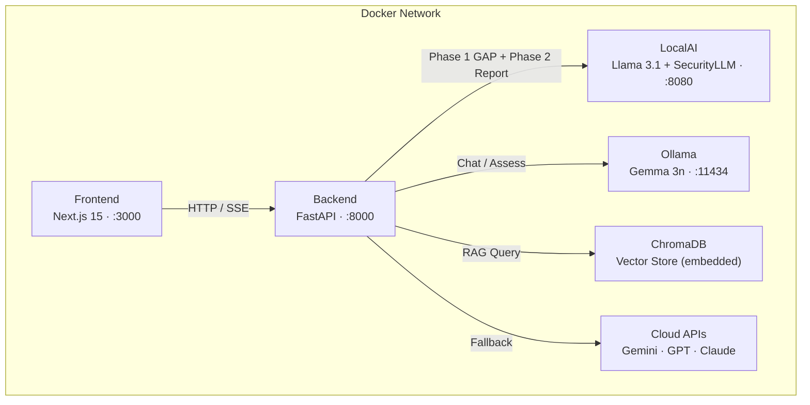

<div align="center">
  <h1>🛡️ CyberAI Assessment Platform</h1>
  <p><strong>AI-Powered Cybersecurity Assessment · Multi-Model RAG Chatbot · ISO 27001 / TCVN 11930</strong></p>
  <p>
    <a href="README.md"></a>
    <a href="README_vi.md"></a>
  </p>
  <p>
    
    
    
    
    
    
    
    
    
  </p>
</div>

---

Enterprise-grade cybersecurity assessment platform combining multi-model RAG chatbot capabilities with automated ISO 27001 / TCVN 11930 compliance evaluation. Runs fully local via LocalAI + Ollama with intelligent cloud fallback.

---

## 1. Quick Start

```bash
git clone https://github.com/your-org/phobert-chatbot-project.git
cd phobert-chatbot-project
cp .env.example .env
```

```bash
# Optional: download local models
pip install huggingface_hub hf_transfer
python scripts/download_models.py --model llama --model security
```

```bash
docker compose up -d
```

| Service | URL |
|---------|-----|
| Frontend | http://localhost:3000 |
| Backend API | http://localhost:8000 |
| Swagger Docs | http://localhost:8000/docs |
| LocalAI | http://localhost:8080 |
| Ollama | http://localhost:11434 |

```bash
# Verify
docker compose ps
curl http://localhost:8000/health
```

---

## 2. Features Overview

| Feature | Description |
|---------|-------------|
| **Multi-Model Chat** | SSE streaming across 18+ models (OpenAI, Google, Anthropic, Ollama, LocalAI) with session memory |
| **ISO 27001 Assessment** | 4-step wizard with 2-phase AI pipeline — GAP analysis + formatted compliance report |
| **TCVN 11930 Assessment** | Vietnamese cybersecurity standard evaluation with 34 controls and weighted scoring |
| **RAG Pipeline** | 21 security standards indexed in ChromaDB with multi-query expansion and confidence filtering |
| **Smart Routing** | Hybrid intent classifier auto-selects SecurityLLM, Llama, or cloud models per query |
| **Standards Management** | Upload custom standards (JSON/YAML, up to 500 controls), auto-indexed to ChromaDB |
| **Web Search** | DuckDuckGo integration for real-time information when knowledge base lacks coverage |
| **Dual Local Inference** | LocalAI (Llama 3.1 + SecurityLLM) and Ollama (Gemma 3n) with automatic cloud fallback |
| **Prometheus Metrics** | Request counters, latency histograms, active sessions, RAG hit/miss tracking |
| **Security** | Rate limiting, JWT auth, CORS, Pydantic validation, prompt injection detection |

---

## 3. Architecture



**Fallback chain:** `LocalAI → Ollama → gemini-3-flash-preview → gpt-5-mini → claude-sonnet-4`

---

## 4. Environment Variables

Key variables from [`.env.example`](.env.example):

| Variable | Default | Description |
|----------|---------|-------------|
| `MODEL_NAME` | `Meta-Llama-3.1-8B-Instruct-Q4_K_M.gguf` | Primary LocalAI model (report generation) |
| `SECURITY_MODEL_NAME` | `SecurityLLM-7B-Q4_K_M.gguf` | Security model (GAP analysis) |
| `LOCALAI_URL` | `http://localai:8080` | LocalAI endpoint |
| `OLLAMA_URL` | `http://ollama:11434` | Ollama endpoint |
| `PREFER_LOCAL` | `true` | Prefer local inference over cloud |
| `CLOUD_LLM_API_URL` | `https://open-claude.com/v1` | Cloud LLM gateway URL |
| `CLOUD_MODEL_NAME` | `gemini-3-flash-preview` | Default cloud model |
| `CLOUD_API_KEYS` | — | Comma-separated API keys for cloud fallback |
| `JWT_SECRET` | — | JWT signing secret (≥32 chars, required in prod) |
| `JWT_EXPIRE_MINUTES` | `60` | JWT token expiry |
| `CORS_ORIGINS` | `http://localhost:3000` | Allowed CORS origins |
| `RATE_LIMIT_CHAT` | `10/minute` | Chat endpoint rate limit |
| `RATE_LIMIT_ASSESS` | `3/minute` | Assessment endpoint rate limit |
| `INFERENCE_TIMEOUT` | `300` | LocalAI request timeout (seconds) |
| `CLOUD_TIMEOUT` | `60` | Cloud API request timeout (seconds) |
| `CONTEXT_SIZE` | `8192` | LocalAI context window |
| `THREADS` | `6` | LocalAI CPU threads |
| `ISO_DOCS_PATH` | `/data/iso_documents` | RAG knowledge base directory |
| `VECTOR_STORE_PATH` | `/data/vector_store` | ChromaDB persistence directory |
| `LOG_LEVEL` | `INFO` | Logging level |
| `DEBUG` | `true` | Debug mode (relaxes JWT validation) |

---

## 5. Documentation

| Document | Description |
|----------|-------------|
| [Architecture](docs/en/architecture.md) | System design, service interactions, data flow |
| [API Reference](docs/en/api.md) | Complete endpoint documentation |
| [Deployment Guide](docs/en/deployment.md) | Production deployment, Nginx, resource planning |
| [Chatbot & RAG](docs/en/chatbot_rag.md) | Chat pipeline, RAG strategy, prompt design |
| [ChromaDB Guide](docs/en/chromadb_guide.md) | Vector store setup, collection management |
| [Analytics & Monitoring](docs/en/analytics_monitoring.md) | Prometheus metrics, dashboard setup |
| [Backup Strategy](docs/en/backup_strategy.md) | Data backup and recovery procedures |
| [ISO Assessment Form](docs/en/iso_assessment_form.md) | Assessment wizard, 2-phase pipeline, scoring |
| [Algorithms](docs/en/algorithms.md) | Scoring algorithms, intent classification, RAG retrieval |
| [Benchmark](docs/en/benchmark.md) | Performance benchmarks and model comparisons |
| [Case Studies](docs/en/case_studies.md) | Real-world assessment examples and results |

Vietnamese docs: [`docs/vi/`](docs/vi/)

---

## License

MIT — see [LICENSE](LICENSE) for details.
