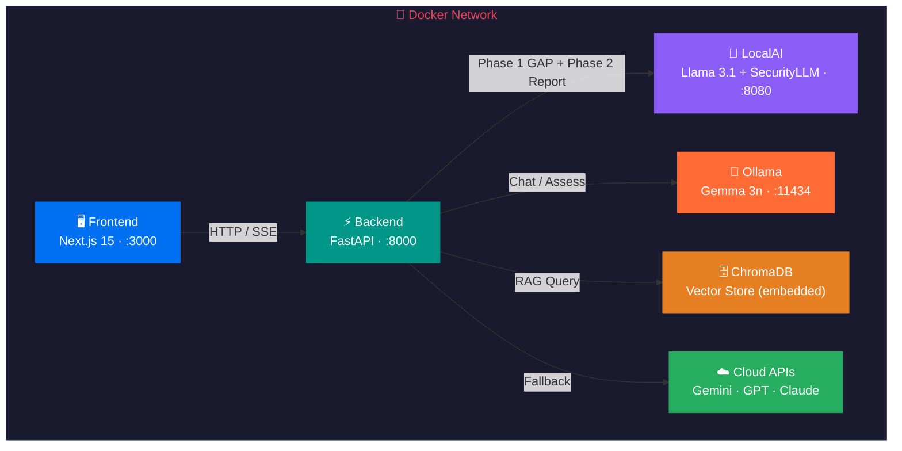
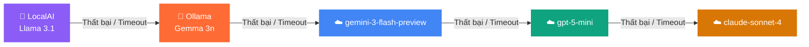

<div align="center">
  <h1>🛡️ CyberAI Assessment Platform</h1>
  <p><strong>Đánh giá An ninh mạng bằng AI · Chatbot RAG (Tìm kiếm tăng cường sinh) đa model · ISO 27001 / TCVN 11930</strong></p>
  <p>
    <a href="README.md"></a>
    <a href="README_vi.md"></a>
  </p>
  <p>
    
    
    
    
    
    
    
    
    
  </p>
</div>

---

Nền tảng đánh giá an ninh mạng cấp doanh nghiệp, kết hợp chatbot RAG (Tìm kiếm tăng cường sinh) đa model với đánh giá tuân thủ ISO 27001 / TCVN 11930 tự động. Chạy hoàn toàn cục bộ qua LocalAI + Ollama với Fallback Chain (Chuỗi dự phòng) cloud thông minh.

---

## 📑 Mục lục

| # | Phần | Mô tả |
|---|------|--------|
| 1 | [🚀 Khởi động nhanh](#1--khởi-động-nhanh) | Clone, cấu hình, chạy Docker |
| 2 | [✨ Tổng quan tính năng](#2--tổng-quan-tính-năng) | 10 tính năng chính của nền tảng |
| 3 | [🏗️ Kiến trúc hệ thống](#3-️-kiến-trúc-hệ-thống) | Sơ đồ Docker network & Fallback Chain |
| 4 | [⚙️ Biến môi trường](#4-️-biến-môi-trường) | Cấu hình `.env` đầy đủ |
| 5 | [📚 Tài liệu](#5--tài-liệu) | Liên kết đến tài liệu chi tiết |
| 6 | [📄 Giấy phép](#-giấy-phép) | MIT License |

---

## 1. 🚀 Khởi động nhanh

```bash
git clone https://github.com/your-org/phobert-chatbot-project.git
cd phobert-chatbot-project
cp .env.example .env
```

<details>
<summary>📦 <strong>Tùy chọn: Tải model cục bộ</strong></summary>

```bash
# Cài đặt công cụ tải model
pip install huggingface_hub hf_transfer
# Tải model Llama và Security
python scripts/download_models.py --model llama --model security
```

</details>

```bash
# Khởi động tất cả dịch vụ
docker compose up -d
```

### 🌐 Bảng dịch vụ

| Dịch vụ | URL | Mô tả |
|---------|-----|--------|
| 🖥️ Giao diện (Frontend) | http://localhost:3000 | Ứng dụng Next.js 15 |
| ⚡ Backend API | http://localhost:8000 | FastAPI server |
| 📖 Swagger Docs | http://localhost:8000/docs | Tài liệu API tương tác |
| 🤖 LocalAI | http://localhost:8080 | Llama 3.1 + SecurityLLM |
| 🦙 Ollama | http://localhost:11434 | Gemma 3n E4B |

```bash
# Kiểm tra trạng thái
docker compose ps
curl http://localhost:8000/health
```

---

## 2. ✨ Tổng quan tính năng

| Tính năng | Mô tả |
|-----------|--------|
| **💬 Chat đa model** | Streaming SSE (Sự kiện phía máy chủ) qua 18+ model (OpenAI, Google, Anthropic, Ollama, LocalAI) với bộ nhớ phiên |
| **📋 Đánh giá ISO 27001** | Wizard 4 bước với pipeline AI 2 phase — phân tích GAP + báo cáo tuân thủ định dạng |
| **🇻🇳 Đánh giá TCVN 11930** | Đánh giá tiêu chuẩn an ninh mạng Việt Nam với 34 control và chấm điểm có trọng số |
| **🔍 Pipeline RAG (Tìm kiếm tăng cường sinh)** | 21 tiêu chuẩn bảo mật được index trong ChromaDB với mở rộng multi-query và lọc confidence |
| **🧠 Định tuyến thông minh (Smart Routing)** | Bộ phân loại intent hybrid tự động chọn SecurityLLM, Llama, hoặc cloud model theo truy vấn |
| **📁 Quản lý tiêu chuẩn** | Upload tiêu chuẩn tùy chỉnh (JSON/YAML, tối đa 500 control), tự động index vào ChromaDB |
| **🌐 Tìm kiếm web** | Tích hợp DuckDuckGo để truy vấn thông tin real-time khi knowledge base không đủ |
| **🖥️ Inference cục bộ kép (Dual Local Inference)** | LocalAI (Llama 3.1 + SecurityLLM) và Ollama (Gemma 3n) với Fallback Chain (Chuỗi dự phòng) cloud tự động |
| **📊 Prometheus Metrics** | Bộ đếm request, histogram latency, phiên đang hoạt động, theo dõi hit/miss RAG |
| **🔒 Bảo mật (Security)** | Rate Limiting (Giới hạn tốc độ), JWT auth, CORS, Pydantic validation, phát hiện prompt injection |

---

## 3. 🏗️ Kiến trúc hệ thống

### Sơ đồ Docker Network



### Fallback Chain (Chuỗi dự phòng)



> **Chuỗi dự phòng:** `LocalAI → Ollama → gemini-3-flash-preview → gpt-5-mini → claude-sonnet-4`
>
> Hệ thống ưu tiên inference cục bộ (`PREFER_LOCAL=true`) và tự động chuyển sang cloud khi model local không khả dụng hoặc timeout.

---

## 4. ⚙️ Biến môi trường

Các biến chính từ [`.env.example`](.env.example):

<details>
<summary>🤖 <strong>Cấu hình Model & Inference</strong></summary>

| Biến | Mặc định | Mô tả |
|------|----------|--------|
| `MODEL_NAME` | `Meta-Llama-3.1-8B-Instruct-Q4_K_M.gguf` | Model LocalAI chính (tạo báo cáo) |
| `SECURITY_MODEL_NAME` | `SecurityLLM-7B-Q4_K_M.gguf` | Model bảo mật (phân tích GAP) |
| `LOCALAI_URL` | `http://localai:8080` | Endpoint LocalAI |
| `OLLAMA_URL` | `http://ollama:11434` | Endpoint Ollama |
| `PREFER_LOCAL` | `true` | Ưu tiên inference cục bộ thay vì cloud |
| `CONTEXT_SIZE` | `8192` | Cửa sổ ngữ cảnh LocalAI |
| `THREADS` | `6` | Số luồng CPU LocalAI |
| `INFERENCE_TIMEOUT` | `300` | Timeout request LocalAI (giây) |

</details>

<details>
<summary>☁️ <strong>Cấu hình Cloud LLM</strong></summary>

| Biến | Mặc định | Mô tả |
|------|----------|--------|
| `CLOUD_LLM_API_URL` | `https://open-claude.com/v1` | URL gateway Cloud LLM |
| `CLOUD_MODEL_NAME` | `gemini-3-flash-preview` | Model cloud mặc định |
| `CLOUD_API_KEYS` | — | API key cho Fallback Chain (Chuỗi dự phòng) cloud (ngăn cách bằng dấu phẩy) |
| `CLOUD_TIMEOUT` | `60` | Timeout request Cloud API (giây) |

</details>

<details>
<summary>🔒 <strong>Bảo mật & Rate Limiting (Giới hạn tốc độ)</strong></summary>

| Biến | Mặc định | Mô tả |
|------|----------|--------|
| `JWT_SECRET` | — | Secret ký JWT (≥32 ký tự, bắt buộc ở production) |
| `JWT_EXPIRE_MINUTES` | `60` | Thời gian hết hạn JWT token |
| `CORS_ORIGINS` | `http://localhost:3000` | Các origin CORS được phép |
| `RATE_LIMIT_CHAT` | `10/minute` | Rate Limiting (Giới hạn tốc độ) endpoint chat |
| `RATE_LIMIT_ASSESS` | `3/minute` | Rate Limiting (Giới hạn tốc độ) endpoint đánh giá |

</details>

<details>
<summary>📂 <strong>Đường dẫn dữ liệu & Logging</strong></summary>

| Biến | Mặc định | Mô tả |
|------|----------|--------|
| `ISO_DOCS_PATH` | `/data/iso_documents` | Thư mục knowledge base RAG (Tìm kiếm tăng cường sinh) |
| `VECTOR_STORE_PATH` | `/data/vector_store` | Thư mục lưu trữ ChromaDB |
| `LOG_LEVEL` | `INFO` | Mức độ log |
| `DEBUG` | `true` | Chế độ debug (nới lỏng xác thực JWT) |

</details>

---

## 5. 📚 Tài liệu

### 🇻🇳 Tài liệu tiếng Việt

| Tài liệu | Mô tả |
|-----------|--------|
| [🏗️ Kiến trúc](docs/vi/architecture.md) | Thiết kế hệ thống, tương tác dịch vụ, luồng dữ liệu |
| [⚡ Tham chiếu API](docs/vi/api.md) | Tài liệu đầy đủ về endpoint |
| [🚀 Hướng dẫn triển khai](docs/vi/deployment.md) | Triển khai production, Nginx, kế hoạch tài nguyên |
| [💬 Chatbot & RAG](docs/vi/chatbot_rag.md) | Pipeline chat, chiến lược RAG, thiết kế prompt |
| [🗄️ Hướng dẫn ChromaDB](docs/vi/chromadb_guide.md) | Thiết lập vector store, quản lý collection |
| [📊 Analytics & Giám sát](docs/vi/analytics_monitoring.md) | Prometheus metrics, thiết lập dashboard |
| [💾 Chiến lược sao lưu](docs/en/backup_strategy.md) | Quy trình sao lưu và khôi phục dữ liệu |
| [📋 Form đánh giá ISO](docs/vi/iso_assessment_form.md) | Wizard đánh giá, pipeline 2 phase, chấm điểm |
| [🧮 Thuật toán](docs/vi/algorithms.md) | Thuật toán chấm điểm, phân loại intent, truy xuất RAG |
| [📈 Benchmark](docs/vi/benchmark.md) | Benchmark hiệu năng và so sánh model |
| [📝 Case Studies (Nghiên cứu tình huống)](docs/vi/case_studies.md) | Ví dụ đánh giá thực tế và kết quả |

### 🇬🇧 Tài liệu tiếng Anh

| Tài liệu | Mô tả |
|-----------|--------|
| [Architecture](docs/en/architecture.md) | System design, service interactions, data flow |
| [API Reference](docs/en/api.md) | Complete endpoint documentation |
| [Deployment Guide](docs/en/deployment.md) | Production deployment, Nginx, resource planning |
| [Chatbot & RAG](docs/en/chatbot_rag.md) | Chat pipeline, RAG strategy, prompt design |
| [ChromaDB Guide](docs/en/chromadb_guide.md) | Vector store setup, collection management |
| [Analytics & Monitoring](docs/en/analytics_monitoring.md) | Prometheus metrics, dashboard setup |
| [Backup Strategy](docs/en/backup_strategy.md) | Data backup and recovery procedures |
| [ISO Assessment Form](docs/en/iso_assessment_form.md) | Assessment wizard, 2-phase pipeline, scoring |
| [Algorithms](docs/en/algorithms.md) | Scoring algorithms, intent classification, RAG retrieval |
| [Benchmark](docs/en/benchmark.md) | Performance benchmarks and model comparisons |
| [Case Studies](docs/en/case_studies.md) | Real-world assessment examples and results |

---

## 📄 Giấy phép

MIT — xem [LICENSE](LICENSE) để biết chi tiết.
