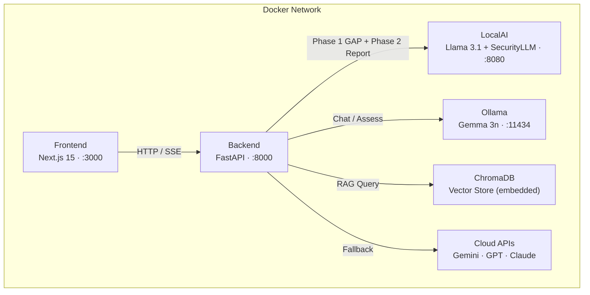

<div align="center">
  <h1>🛡️ CyberAI Assessment Platform</h1>
  <p><strong>Đánh giá An ninh mạng bằng AI · Chatbot RAG đa model · ISO 27001 / TCVN 11930</strong></p>
  <p>
    <a href="README.md"></a>
    <a href="README_vi.md"></a>
  </p>
  <p>
    
    
    
    
    
    
    
    
    
  </p>
</div>

---

Nền tảng đánh giá an ninh mạng cấp doanh nghiệp, kết hợp chatbot RAG đa model với đánh giá tuân thủ ISO 27001 / TCVN 11930 tự động. Chạy hoàn toàn cục bộ qua LocalAI + Ollama với fallback cloud thông minh.

---

## 1. Khởi động nhanh

```bash
git clone https://github.com/your-org/phobert-chatbot-project.git
cd phobert-chatbot-project
cp .env.example .env
```

```bash
# Tùy chọn: tải model cục bộ
pip install huggingface_hub hf_transfer
python scripts/download_models.py --model llama --model security
```

```bash
docker compose up -d
```

| Dịch vụ | URL |
|---------|-----|
| Giao diện | http://localhost:3000 |
| Backend API | http://localhost:8000 |
| Swagger Docs | http://localhost:8000/docs |
| LocalAI | http://localhost:8080 |
| Ollama | http://localhost:11434 |

```bash
# Kiểm tra
docker compose ps
curl http://localhost:8000/health
```

---

## 2. Tính năng

| Tính năng | Mô tả |
|-----------|-------|
| **Chat đa model** | Streaming SSE qua 18+ model (OpenAI, Google, Anthropic, Ollama, LocalAI) với bộ nhớ phiên |
| **Đánh giá ISO 27001** | Wizard 4 bước với pipeline AI 2 phase — phân tích GAP + báo cáo tuân thủ định dạng |
| **Đánh giá TCVN 11930** | Đánh giá tiêu chuẩn an ninh mạng Việt Nam với 34 control và chấm điểm có trọng số |
| **Pipeline RAG** | 21 tiêu chuẩn bảo mật được index trong ChromaDB với mở rộng multi-query và lọc confidence |
| **Định tuyến thông minh** | Bộ phân loại intent hybrid tự động chọn SecurityLLM, Llama, hoặc cloud model theo truy vấn |
| **Quản lý tiêu chuẩn** | Upload tiêu chuẩn tùy chỉnh (JSON/YAML, tối đa 500 control), tự động index vào ChromaDB |
| **Tìm kiếm web** | Tích hợp DuckDuckGo để truy vấn thông tin real-time khi knowledge base không đủ |
| **Inference cục bộ kép** | LocalAI (Llama 3.1 + SecurityLLM) và Ollama (Gemma 3n) với fallback cloud tự động |
| **Prometheus Metrics** | Bộ đếm request, histogram latency, phiên đang hoạt động, theo dõi hit/miss RAG |
| **Bảo mật** | Rate limiting, JWT auth, CORS, Pydantic validation, phát hiện prompt injection |

---

## 3. Kiến trúc



**Chuỗi fallback:** `LocalAI → Ollama → gemini-3-flash-preview → gpt-5-mini → claude-sonnet-4`

---

## 4. Biến môi trường

Các biến chính từ [`.env.example`](.env.example):

| Biến | Mặc định | Mô tả |
|------|----------|-------|
| `MODEL_NAME` | `Meta-Llama-3.1-8B-Instruct-Q4_K_M.gguf` | Model LocalAI chính (tạo báo cáo) |
| `SECURITY_MODEL_NAME` | `SecurityLLM-7B-Q4_K_M.gguf` | Model bảo mật (phân tích GAP) |
| `LOCALAI_URL` | `http://localai:8080` | Endpoint LocalAI |
| `OLLAMA_URL` | `http://ollama:11434` | Endpoint Ollama |
| `PREFER_LOCAL` | `true` | Ưu tiên inference cục bộ thay vì cloud |
| `CLOUD_LLM_API_URL` | `https://open-claude.com/v1` | URL gateway Cloud LLM |
| `CLOUD_MODEL_NAME` | `gemini-3-flash-preview` | Model cloud mặc định |
| `CLOUD_API_KEYS` | — | API key cho fallback cloud (ngăn cách bằng dấu phẩy) |
| `JWT_SECRET` | — | Secret ký JWT (≥32 ký tự, bắt buộc ở production) |
| `JWT_EXPIRE_MINUTES` | `60` | Thời gian hết hạn JWT token |
| `CORS_ORIGINS` | `http://localhost:3000` | Các origin CORS được phép |
| `RATE_LIMIT_CHAT` | `10/minute` | Giới hạn tốc độ endpoint chat |
| `RATE_LIMIT_ASSESS` | `3/minute` | Giới hạn tốc độ endpoint đánh giá |
| `INFERENCE_TIMEOUT` | `300` | Timeout request LocalAI (giây) |
| `CLOUD_TIMEOUT` | `60` | Timeout request Cloud API (giây) |
| `CONTEXT_SIZE` | `8192` | Cửa sổ ngữ cảnh LocalAI |
| `THREADS` | `6` | Số luồng CPU LocalAI |
| `ISO_DOCS_PATH` | `/data/iso_documents` | Thư mục knowledge base RAG |
| `VECTOR_STORE_PATH` | `/data/vector_store` | Thư mục lưu trữ ChromaDB |
| `LOG_LEVEL` | `INFO` | Mức độ log |
| `DEBUG` | `true` | Chế độ debug (nới lỏng xác thực JWT) |

---

## 5. Tài liệu

| Tài liệu | Mô tả |
|-----------|-------|
| [Kiến trúc](docs/vi/architecture.md) | Thiết kế hệ thống, tương tác dịch vụ, luồng dữ liệu |
| [Tham chiếu API](docs/vi/api.md) | Tài liệu đầy đủ về endpoint |
| [Hướng dẫn triển khai](docs/vi/deployment.md) | Triển khai production, Nginx, kế hoạch tài nguyên |
| [Chatbot & RAG](docs/vi/chatbot_rag.md) | Pipeline chat, chiến lược RAG, thiết kế prompt |
| [Hướng dẫn ChromaDB](docs/vi/chromadb_guide.md) | Thiết lập vector store, quản lý collection |
| [Analytics & Giám sát](docs/vi/analytics_monitoring.md) | Prometheus metrics, thiết lập dashboard |
| [Chiến lược sao lưu](docs/en/backup_strategy.md) | Quy trình sao lưu và khôi phục dữ liệu |
| [Form đánh giá ISO](docs/vi/iso_assessment_form.md) | Wizard đánh giá, pipeline 2 phase, chấm điểm |
| [Thuật toán](docs/en/algorithms.md) | Thuật toán chấm điểm, phân loại intent, truy xuất RAG |
| [Benchmark](docs/en/benchmark.md) | Benchmark hiệu năng và so sánh model |
| [Case Studies](docs/en/case_studies.md) | Ví dụ đánh giá thực tế và kết quả |

Tài liệu tiếng Anh: [`docs/en/`](docs/en/)

---

## Giấy phép

MIT — xem [LICENSE](LICENSE) để biết chi tiết.
