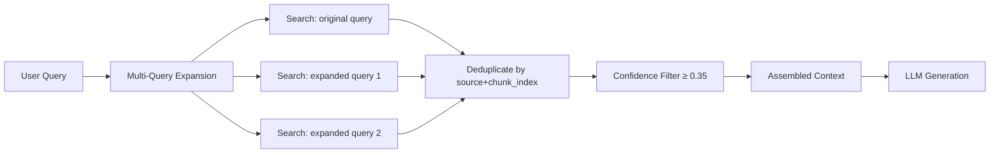
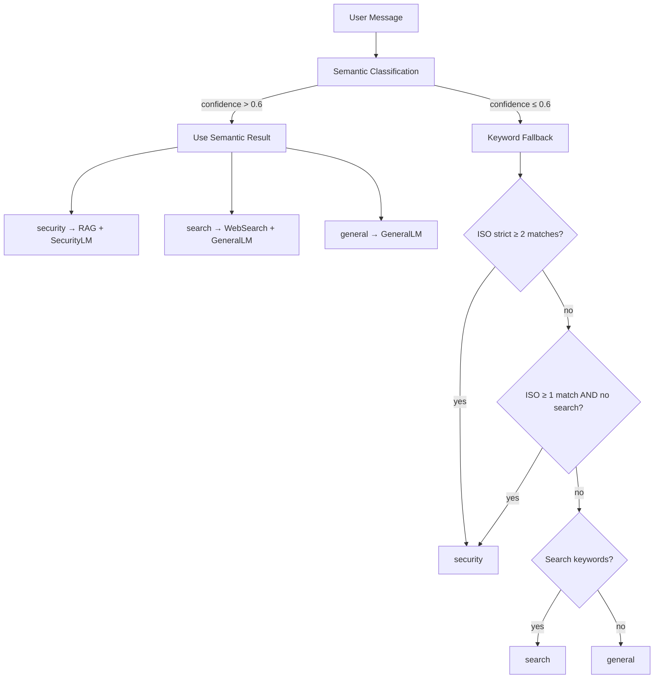
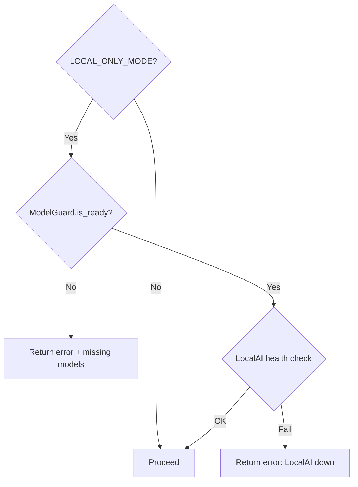
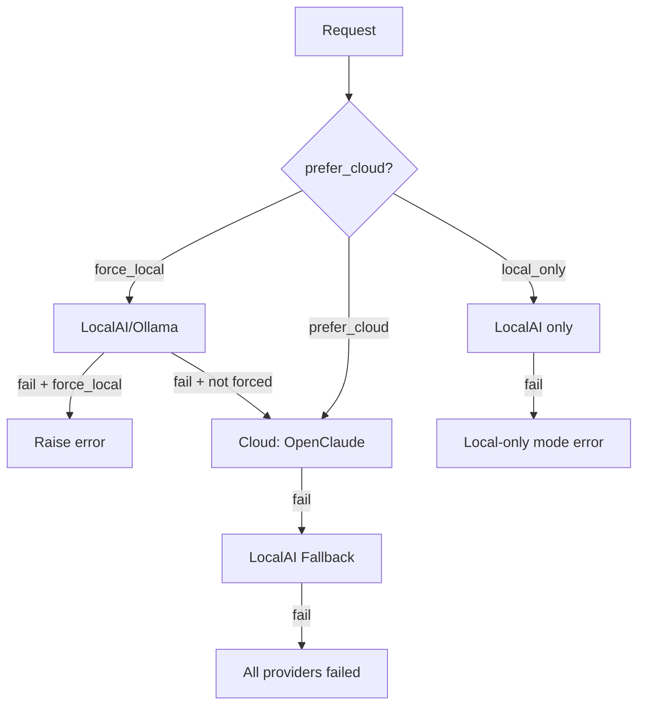

# Algorithms Reference

Technical documentation of every significant algorithm in the CyberAI Assessment Platform, extracted from source code.

## Table of Contents

- [1. RAG Retrieval](#1-rag-retrieval)
- [2. Model Routing](#2-model-routing)
- [3. Weighted Compliance Scoring](#3-weighted-compliance-scoring)
- [4. Risk Register Scoring](#4-risk-register-scoring)
- [5. Severity Normalization](#5-severity-normalization)
- [6. Input Safety Guard](#6-input-safety-guard)
- [7. Cloud LLM Fallback Chain](#7-cloud-llm-fallback-chain)

---

## 1. RAG Retrieval

Sources: [`rag_service.py`](backend/services/rag_service.py), [`vector_store.py`](backend/repositories/vector_store.py)

### 1.1 Mechanism

The RAG pipeline operates in three stages:

1. **Chunking** — Markdown documents are split into overlapping chunks with header hierarchy context injection.
2. **Retrieval** — ChromaDB cosine similarity search over HNSW-indexed embeddings, with optional multi-query expansion.
3. **Confidence Filtering** — Low-similarity chunks are discarded before context assembly.



### 1.2 Chunking Strategy

Defined in [`VectorStore._chunk_text()`](backend/repositories/vector_store.py:30):

| Parameter | Value | Description |
|-----------|-------|-------------|
| `chunk_size` | **600** chars | Target chunk size before splitting |
| `overlap` | **150** chars | Overlap window from end of previous chunk |
| Split trigger | Natural break | Only splits when not inside a table row (`\|`), list item (`- `), or indented block |

**Header hierarchy injection**: each chunk that doesn't start with a heading gets a `[Context: # H1 > ## H2 > ### H3]` prefix preserving document structure.

```python
# Pseudocode: _chunk_text()
current_headers = []
for line in lines:
    track_header_hierarchy(line)  # H1 resets, H2 appends, H3 appends
    current_chunk.append(line)
    current_length += len(line)

    if current_length >= 600 and is_natural_break(line):
        prepend_header_context(current_chunk, current_headers)
        chunks.append(current_chunk)
        # Overlap: keep last ~150 chars as start of next chunk
        current_chunk = tail_lines(current_chunk, 150)
```

### 1.3 Multi-Query Expansion

Defined in [`VectorStore.multi_query_search()`](backend/repositories/vector_store.py:158):

Query expansion rules:

| Condition | Expanded Query |
|-----------|---------------|
| Query contains `"iso"` or `"tcvn"` | `"tiêu chuẩn {query}"` |
| Query contains `"đánh giá"` | `query.replace("đánh giá", "kiểm toán")` |

Results are deduplicated by `{source}_{chunk_index}` composite key, sorted by descending score, and capped at `top_k` (default: **5**).

### 1.4 Confidence Threshold Filtering

Defined in [`_filter_by_confidence()`](backend/services/rag_service.py:18):

```
RAG_CONFIDENCE_THRESHOLD = 0.35
```

ChromaDB returns cosine **distance**. Conversion to similarity:

```
similarity_score = 1 - cosine_distance
```

Only chunks with `score >= 0.35` (i.e., `distance <= 0.65`) pass the filter. Prometheus counter `cyberai_rag_queries_total` is incremented with `result="hit"` or `result="miss"`.

### 1.5 Configuration Parameters

| Parameter | Value | Source |
|-----------|-------|--------|
| `RAG_CONFIDENCE_THRESHOLD` | `0.35` | [`rag_service.py:15`](backend/services/rag_service.py:15) |
| `chunk_size` | `600` | [`vector_store.py:30`](backend/repositories/vector_store.py:30) |
| `overlap` | `150` | [`vector_store.py:30`](backend/repositories/vector_store.py:30) |
| `top_k` | `5` | [`rag_service.py:49`](backend/services/rag_service.py:49) |
| ChromaDB distance metric | `cosine` | [`vector_store.py:26`](backend/repositories/vector_store.py:26) |
| Index algorithm | HNSW | ChromaDB default (via `hnsw:space` metadata) |
| Batch index size | `100` | [`vector_store.py:113`](backend/repositories/vector_store.py:113) |

### 1.6 Alternative Approaches

| Approach | Pros | Cons | Status |
|----------|------|------|--------|
| **Cosine similarity (current)** | Fast, works well for normalized embeddings | Sensitive to embedding quality | ✅ Implemented |
| BM25 keyword search | No embedding model needed | Misses semantic synonyms | Not implemented |
| Hybrid BM25 + vector | Best of both worlds | Higher complexity, dual index | Not implemented |
| Re-ranking (cross-encoder) | Higher precision on top-k | Slower, requires separate model | Not implemented |

### 1.7 Example Calculation

```
Query: "ISO 27001 access control policy"
ChromaDB returns 5 chunks:

Chunk A: distance=0.25 → score=0.75 ✅ (≥ 0.35)
Chunk B: distance=0.40 → score=0.60 ✅
Chunk C: distance=0.55 → score=0.45 ✅
Chunk D: distance=0.70 → score=0.30 ❌ (< 0.35, filtered)
Chunk E: distance=0.80 → score=0.20 ❌

Result: 3 chunks assembled into context, 2 discarded.
Context = ChunkA + "\n\n---\n\n" + ChunkB + "\n\n---\n\n" + ChunkC
```

---

## 2. Model Routing

Source: [`model_router.py`](backend/services/model_router.py)

### 2.1 Mechanism

Hybrid two-phase intent classification: **semantic first**, then **keyword fallback** if confidence is too low.



### 2.2 Semantic Classification

Defined in [`_semantic_classify()`](backend/services/model_router.py:146):

Uses an in-memory ChromaDB collection (`intent_classifier`, cosine space) seeded with intent templates from [`INTENT_TEMPLATES`](backend/services/model_router.py:14).

| Intent | Template Count | Examples |
|--------|---------------|----------|
| `security` | ~34 | `"đánh giá rủi ro bảo mật"`, `"iso 27001"`, `"risk assessment"` |
| `search` | ~19 | `"tin tức mới nhất"`, `"latest news"`, `"stock price today"` |
| `general` | ~15 | `"xin chào"`, `"hello"`, `"what can you do"` |

**Voting algorithm**:

```python
# Query top-3 nearest templates
results = collection.query(query_texts=[message], n_results=3)

# Weighted vote: sum similarities per intent
for i, meta in enumerate(metadatas):
    intent = meta["intent"]
    similarity = 1 - distances[i]
    votes[intent] += similarity

# Winner = highest total vote, normalized by result count
best_intent = max(votes, key=votes.get)
confidence = votes[best_intent] / len(metadatas)  # normalized by 3
```

### 2.3 Keyword Fallback

Three pre-compiled regex patterns:

| Pattern | Keywords | Match Threshold |
|---------|----------|----------------|
| [`_iso_pattern`](backend/services/model_router.py:112) | 34 ISO/compliance terms | `≥ 1` match |
| [`_iso_strict_pattern`](backend/services/model_router.py:113) | 30 strict security terms (word-boundary) | `≥ 2` matches |
| [`_search_pattern`](backend/services/model_router.py:114) | 31 search-intent terms | `≥ 1` match |

**Decision matrix** (when `confidence ≤ 0.6`):

| `has_search` | `has_iso` | `has_iso_strict` | Route |
|:---:|:---:|:---:|---|
| ✅ | ✅ | ❌ | `search` |
| any | any | ✅ | `security` |
| ❌ | ✅ | ❌ | `security` |
| ✅ | ❌ | ❌ | `search` |
| ❌ | ❌ | ❌ | `general` |

### 2.4 Route Output

[`route_model()`](backend/services/model_router.py:173) returns:

```python
{
    "model": str,           # SECURITY_MODEL or GENERAL_MODEL
    "use_rag": bool,        # True only for "security" route
    "use_search": bool,     # True only for "search" route
    "matched_keywords": [],
    "route": str,           # "security" | "search" | "general"
    "confidence": float,
    "classification_method": str,  # "semantic" | "keyword"
}
```

### 2.5 Alternative Approaches

| Approach | Pros | Cons | Status |
|----------|------|------|--------|
| **Hybrid semantic + keyword (current)** | High accuracy, graceful degradation | Requires ChromaDB for semantic | ✅ Implemented |
| LLM-based classification | Most flexible | Slow, expensive per request | Not implemented |
| Fine-tuned classifier (BERT) | Fast, high accuracy | Training data needed | Not implemented |
| Rule-only (keywords) | Simplest, no dependencies | Misses semantic meaning | Used as fallback |

### 2.6 Example Calculation

```
Input: "đánh giá rủi ro ISO 27001 cho hệ thống"

Semantic phase:
  Top-3 templates: "đánh giá rủi ro bảo mật" (d=0.15), "iso 27001" (d=0.20), "risk assessment" (d=0.35)
  Votes: security = (0.85 + 0.80 + 0.65) = 2.30
  Confidence = 2.30 / 3 = 0.767 > 0.6 → USE SEMANTIC

Result: route="security", use_rag=True, model=SECURITY_MODEL, method="semantic"
```

---

## 3. Weighted Compliance Scoring

Sources: [`controls_catalog.py`](backend/services/controls_catalog.py), [`assessment_helpers.py`](backend/services/assessment_helpers.py)

### 3.1 Mechanism

Controls are weighted by severity. Compliance percentage is computed as ratio of **achieved weighted score** to **maximum weighted score**, not simple count-based.

### 3.2 Weight Score Mapping

Defined in [`WEIGHT_SCORE`](backend/services/controls_catalog.py:159):

| Severity | Weight | Description |
|----------|--------|-------------|
| `critical` | **4** | Must-have controls (e.g., access control, encryption, incident response) |
| `high` | **3** | Important controls (e.g., background checks, SDLC) |
| `medium` | **2** | Standard controls (e.g., contact with authorities, web filtering) |
| `low` | **1** | Nice-to-have controls (e.g., NTP sync, desk policy) |

### 3.3 Formula

Defined in [`calc_compliance()`](backend/services/controls_catalog.py:173):

```
weight_map = { control_id: WEIGHT_SCORE[control.weight] for each control }

max_weighted    = Σ weight_map[all_controls]
achieved_weighted = Σ weight_map[implemented_controls]

percentage = (achieved_weighted / max_weighted) × 100
```

```python
# Pseudocode
flat = get_flat_controls(standard)
weight_map = {c["id"]: WEIGHT_SCORE[c["weight"]] for c in flat}
max_w = sum(weight_map.values())
achieved_w = sum(weight_map[cid] for cid in implemented if cid in weight_map)
percentage = round(achieved_w / max_w * 100, 1)
```

### 3.4 Compliance Tier Classification

Defined in [`_build_structured_json()`](backend/services/chat_service.py:731):

| Percentage | Tier | Label |
|-----------|------|-------|
| `≥ 80%` | `high` | Tuân thủ cao |
| `≥ 50%` | `medium` | Tuân thủ một phần |
| `≥ 25%` | `low` | Tuân thủ thấp |
| `< 25%` | `critical` | Không tuân thủ |

### 3.5 Weight Breakdown

Defined in [`build_weight_breakdown()`](backend/services/controls_catalog.py:192):

For each severity tier, tracks:
- `total`: number of controls in that tier
- `implemented`: number achieved
- Missing controls listed by ID + label

### 3.6 ISO 27001:2022 Control Distribution

From [`ISO_27001_CATEGORIES`](backend/services/controls_catalog.py:3):

| Category | Controls | Critical | High | Medium | Low |
|----------|----------|----------|------|--------|-----|
| A.5 Tổ chức | 37 | 10 | 14 | 10 | 3 |
| A.6 Con người | 8 | 1 | 5 | 2 | 0 |
| A.7 Vật lý | 14 | 0 | 5 | 7 | 2 |
| A.8 Công nghệ | 34 | 14 | 12 | 7 | 1 |
| **Total** | **93** | **25** | **36** | **26** | **6** |

### 3.7 Example Calculation

```
Organization has implemented: [A.5.1, A.5.15, A.8.1, A.7.7]

Control weights:
  A.5.1  (critical) = 4
  A.5.15 (critical) = 4
  A.8.1  (critical) = 4
  A.7.7  (low)      = 1

achieved_weighted = 4 + 4 + 4 + 1 = 13

max_weighted (all 93 controls):
  25 critical × 4 = 100
  36 high     × 3 = 108
  26 medium   × 2 =  52
   6 low      × 1 =   6
  total           = 266

percentage = (13 / 266) × 100 = 4.9%
tier = "critical" (< 25%)
```

---

## 4. Risk Register Scoring

Sources: [`assessment_helpers.py`](backend/services/assessment_helpers.py), [`chat_service.py`](backend/services/chat_service.py)

### 4.1 Mechanism

Each unimplemented control is assigned a **Likelihood × Impact** risk score by the SecurityLM model during Phase 1 assessment. When the LLM fails, a deterministic fallback infers risk from control weight metadata.

### 4.2 Risk Score Formula

```
Risk = Likelihood × Impact
```

| Parameter | Range | Description |
|-----------|-------|-------------|
| Likelihood (L) | 1–5 | Probability of exploitation |
| Impact (I) | 1–5 | Business impact if exploited |
| Risk | 1–25 | Composite risk score |

### 4.3 LLM-Generated Risk Register

The SecurityLM model outputs JSON per control category:

```json
[
  {
    "id": "A.5.1",
    "severity": "critical",
    "likelihood": 4,
    "impact": 5,
    "risk": 20,
    "gap": "Chính sách ATTT chưa được ban hành",
    "recommendation": "Ban hành chính sách ATTT ngay trong 30 ngày"
  }
]
```

Validation in [`validate_chunk_output()`](backend/services/assessment_helpers.py:67):
- Likelihood clamped to `[1, 5]`
- Impact clamped to `[1, 5]`
- Risk clamped to `[1, 25]`
- Gap text truncated to **200** chars
- Recommendation truncated to **200** chars
- **Anti-hallucination**: control IDs not in the valid set are rejected

### 4.4 Deterministic Fallback (LLM Failure)

Defined in [`infer_gap_from_control()`](backend/services/assessment_helpers.py:46):

When all 3 LLM retry attempts fail for a category, gaps are inferred from control metadata:

| Control Weight | Likelihood | Impact | Risk |
|---------------|------------|--------|------|
| `critical` | 4 | 4 | 16 |
| `high` | 3 | 3 | 9 |
| `medium` | 2 | 2 | 4 |
| `low` | 1 | 1 | 1 |

Maximum **10** controls inferred per failed category.

### 4.5 Risk Register Sorting

Defined in [`gap_items_to_markdown()`](backend/services/assessment_helpers.py:113):

```python
sorted_items = sorted(
    all_gap_items,
    key=lambda x: (SEV_ORDER[x["severity"]], -x["risk"])
)
```

Primary sort: severity order (`critical=0 > high=1 > medium=2 > low=3`).
Secondary sort: risk score descending.

### 4.6 Alternative Approaches

| Approach | Pros | Cons | Status |
|----------|------|------|--------|
| **LLM-assessed L×I (current)** | Context-aware, considers infrastructure | Model dependent, variable | ✅ Implemented |
| **Deterministic from weight (fallback)** | Consistent, no LLM needed | No infrastructure context | ✅ Implemented (fallback) |
| CVSS-based scoring | Industry standard | Requires CVE mapping | Not implemented |
| Historical incident data | Most accurate | Requires incident database | Not implemented |

### 4.7 Example Calculation

```
Category: A.8 Công nghệ
Missing control: A.8.8 "Quản lý lỗ hổng kỹ thuật" (weight=critical)

LLM assessment:
  Likelihood = 4 (high probability — no vulnerability scanning)
  Impact = 5 (critical — could lead to data breach)
  Risk = 4 × 5 = 20

Fallback (if LLM fails):
  Weight = critical → L=4, I=4, Risk=16
```

---

## 5. Severity Normalization

Source: [`assessment_helpers.py`](backend/services/assessment_helpers.py)

### 5.1 Mechanism

The 7B SecurityLM model tends to over-classify gaps as "critical". The normalization algorithm detects this bias and redistributes severity labels proportionally based on risk scores.

### 5.2 Trigger Condition

Defined in [`normalize_severity_distribution()`](backend/services/assessment_helpers.py:137):

```
Trigger: (critical_count / total_gaps) > 0.70 AND total_gaps >= 3
```

If more than **70%** of gaps are marked `critical`, normalization activates.

### 5.3 Target Distribution

Based on real-world ISO audit distributions:

| Severity | Target % | Cutoff Index |
|----------|----------|-------------|
| `critical` | ~25% | `[0, n × 0.25)` |
| `high` | ~25% | `[n × 0.25, n × 0.50)` |
| `medium` | ~30% | `[n × 0.50, n × 0.80)` |
| `low` | ~20% | `[n × 0.80, n)` |

### 5.4 Algorithm

```python
def normalize_severity_distribution(gap_items):
    if len(gap_items) < 3:
        return gap_items  # too few to normalize

    critical_ratio = count(severity=="critical") / len(gap_items)
    if critical_ratio <= 0.70:
        return gap_items  # distribution is acceptable

    # Sort by risk score descending (highest risk keeps "critical")
    sorted_items = sorted(gap_items, key=lambda x: -x["risk"])
    n = len(sorted_items)

    for i, item in enumerate(sorted_items):
        if   i < n * 0.25:  item["severity"] = "critical"
        elif i < n * 0.50:  item["severity"] = "high"
        elif i < n * 0.80:  item["severity"] = "medium"
        else:                item["severity"] = "low"

    return sorted_items
```

### 5.5 Constants

| Constant | Value | Source |
|----------|-------|--------|
| `WEIGHT_SCORE` | `{"critical": 4, "high": 3, "medium": 2, "low": 1}` | [`assessment_helpers.py:10`](backend/services/assessment_helpers.py:10) |
| `SEV_EMOJI` | `{"critical": "🔴", "high": "🟠", "medium": "🟡", "low": "⚪"}` | [`assessment_helpers.py:11`](backend/services/assessment_helpers.py:11) |
| `SEV_ORDER` | `{"critical": 0, "high": 1, "medium": 2, "low": 3}` | [`assessment_helpers.py:12`](backend/services/assessment_helpers.py:12) |
| Normalization trigger | `> 70%` critical | [`assessment_helpers.py:147`](backend/services/assessment_helpers.py:147) |
| Min items for normalization | `3` | [`assessment_helpers.py:143`](backend/services/assessment_helpers.py:143) |

### 5.6 Cross-Framework Severity Mapping

The [`WEIGHT_SCORE`](backend/services/controls_catalog.py:159) mapping is shared across frameworks:

| Framework | Uses Same Weights | Notes |
|-----------|:-:|-------|
| ISO 27001:2022 | ✅ | 93 controls with per-control weight assignment |
| TCVN 11930:2017 | ✅ | 34 controls, same `critical/high/medium/low` scale |
| Custom standards | ✅ | Via [`standard_service.load_standard()`](backend/services/chat_service.py:404) |

### 5.7 Alternative Approaches

| Approach | Pros | Cons | Status |
|----------|------|------|--------|
| **Post-hoc redistribution (current)** | Simple, preserves relative ordering by risk | Fixed percentages may not fit all orgs | ✅ Implemented |
| Constrained decoding (force LLM output) | Prevents bias at source | Complex, model-specific | Not implemented |
| Calibration via temperature | Less aggressive outputs | Unpredictable | Not implemented |
| Ensemble (multiple LLM passes) | More reliable | 3× cost and latency | Not implemented |

### 5.8 Example Calculation

```
Input: 10 gap items, 8 marked "critical" (80% > 70% threshold)

Sorted by risk descending:
  [Risk=20, Risk=18, Risk=16, Risk=15, Risk=12, Risk=10, Risk=9, Risk=8, Risk=6, Risk=4]

After normalization (n=10):
  Index 0-1 (< 2.5): critical  → Risk 20, 18
  Index 2-4 (< 5.0): high      → Risk 16, 15, 12
  Index 5-7 (< 8.0): medium    → Risk 10, 9, 8
  Index 8-9 (≥ 8.0): low       → Risk 6, 4

Result: 2 critical, 3 high, 3 medium, 2 low
```

---

## 6. Input Safety Guard

Sources: [`chat_service.py`](backend/services/chat_service.py), [`model_guard.py`](backend/services/model_guard.py)

### 6.1 Prompt Injection Detection

Defined in [`sanitize_user_input()`](backend/services/chat_service.py:43):

Two regex patterns detect prompt injection attempts:

**Pattern 1 — Injection phrases** ([`_INJECTION_PATTERNS`](backend/services/chat_service.py:29)):

```regex
ignore\s+previous\s+instructions
|disregard\s+all\s+prior
|you\s+are\s+now\b
|act\s+as\b
|forget\s+everything
|<\|im_start\|>
|<\|im_end\|>
```

**Pattern 2 — System prefix** ([`_SYSTEM_PREFIX_RE`](backend/services/chat_service.py:40)):

```regex
^\s*system\s*:
```

Matches `system:` only at the **start** of the message (to avoid false positives in normal text).

### 6.2 Detection Algorithm

```python
def sanitize_user_input(text):
    if _INJECTION_PATTERNS.search(text) or _SYSTEM_PREFIX_RE.match(text):
        log_warning("Prompt injection attempt blocked")
        raise HTTPException(400, "Invalid input: message contains disallowed content.")
    return text
```

**Action**: raises HTTP 400 immediately — no sanitization/stripping, full rejection.

### 6.3 Special Token Stripping

Defined in [`SPECIAL_TOKENS`](backend/services/chat_service.py:22):

LLM output is cleaned of leaked special tokens:

```regex
<\|eot_id\|>|<\|start_header_id\|>|<\|end_header_id\|>|
<\|begin_of_text\|>|<\|end_of_text\|>|<\|finetune_right_pad_id\|>|
<\|reserved_special_token_\d+\|>
```

Applied via [`ChatService.clean_response()`](backend/services/chat_service.py:82).

### 6.4 Model Availability Guard

Defined in [`ModelGuard`](backend/services/model_guard.py:10):

Pre-flight check for local model file availability:

```python
class ModelGuard:
    def refresh():
        for model_id in settings.required_model_ids:
            path = _resolve_model_path(MODELS_PATH, model_id)
            summary[model_id] = "present" if path else "missing"

    def is_ready():
        return all(status == "present" for status in state.values())
```

**Resolution strategy**: checks two candidate paths per model:
1. `{MODELS_PATH}/{model_id}` (full path)
2. `{MODELS_PATH}/{basename(model_id)}` (filename only)

### 6.5 Local-Only Mode Guard

Defined in [`ChatService._local_only_guard()`](backend/services/chat_service.py:326):



Health check: sends a minimal inference request (`"hi"`, `max_tokens=5`) with a configurable timeout (default **8s**).

### 6.6 Alternative Approaches

| Approach | Pros | Cons | Status |
|----------|------|------|--------|
| **Regex pattern matching (current)** | Fast, zero latency, deterministic | Limited to known patterns | ✅ Implemented |
| ML-based injection classifier | Catches novel attacks | Requires training data, adds latency | Not implemented |
| LLM-based self-check | High accuracy | Expensive, recursive risk | Not implemented |
| Token-level perplexity analysis | Detects anomalous inputs | Complex, model-specific | Not implemented |

---

## 7. Cloud LLM Fallback Chain

Source: [`cloud_llm_service.py`](backend/services/cloud_llm_service.py)

### 7.1 Mechanism

Multi-tier provider fallback with per-key rate-limit tracking and per-model availability fallback.



### 7.2 Task-Model Mapping

Defined in [`TASK_MODEL_MAP`](backend/services/cloud_llm_service.py:15):

| Task Type | Model |
|-----------|-------|
| `iso_analysis` | `gemini-3-flash-preview` |
| `complex` | `gemini-3-pro-preview` |
| `chat` | `gemini-3-flash-preview` |
| `default` | `gemini-3-flash-preview` |

### 7.3 Model Fallback Chain

Defined in [`FALLBACK_CHAIN`](backend/services/cloud_llm_service.py:22):

```
gemini-3-flash-preview → gemini-3-pro-preview → gpt-5-mini → claude-sonnet-4 → gpt-5
```

For each model in the chain, **all API keys** are tried (round-robin) before moving to the next model.

### 7.4 Rate Limit Handling

Defined in [`CloudLLMService`](backend/services/cloud_llm_service.py:39):

| Parameter | Value |
|-----------|-------|
| `RATE_LIMIT_COOLDOWN` | **30** seconds |
| Trigger | HTTP 429 response |
| Key rotation | Round-robin via `_key_index` |

```python
# Per-key cooldown tracking
_rate_limit_cooldowns: Dict[int, float] = {}

def _is_rate_limited(key_idx):
    elapsed = time.time() - _rate_limit_cooldowns.get(key_idx, 0)
    return elapsed < 30  # RATE_LIMIT_COOLDOWN
```

### 7.5 Ollama Integration

Defined in [`_call_ollama()`](backend/services/cloud_llm_service.py:247):

LocalAI model IDs are mapped to Ollama model tags via [`_LOCALAI_TO_OLLAMA`](backend/services/cloud_llm_service.py:32):

| LocalAI ID | Ollama Tag |
|------------|------------|
| `gemma-3-4b-it` | `gemma3:4b` |
| `gemma-3-12b-it` | `gemma3:12b` |
| `gemma-4-31b-it` | `gemma4:31b` |

Ollama is selected when the model has a known prefix: `gemma3:`, `gemma3n:`, `gemma4:`, `phi4:`, `llama3:`, `mistral:`, `qwen3:`.

### 7.6 Assessment Mode Fallback

Defined in [`ChatService.assess_system()`](backend/services/chat_service.py:368):

| Requested Mode | LocalAI Available | Effective Mode |
|---------------|:-:|----------------|
| `local` | ✅ | `local` |
| `local` | ❌ (+ has cloud keys) | `hybrid` |
| `local` | ❌ (no cloud keys) | **Error** |
| `hybrid` | ✅ | `hybrid` |
| `hybrid` | ❌ | `cloud` |
| `cloud` | any | `cloud` |

**Two-phase assessment pipeline**:

| Phase | Local Mode | Hybrid Mode | Cloud Mode |
|-------|-----------|-------------|------------|
| P1: Gap Analysis | SecurityLM (LocalAI) | SecurityLM (LocalAI) | OpenClaude |
| P2: Report Formatting | Meta-Llama (LocalAI) | OpenClaude | OpenClaude |

Each phase has **3 retry attempts** with JSON validation between attempts.

### 7.7 Constants

| Constant | Value | Source |
|----------|-------|--------|
| `MIN_MAX_TOKENS` | `10000` | [`cloud_llm_service.py:13`](backend/services/cloud_llm_service.py:13) |
| `RATE_LIMIT_COOLDOWN` | `30` seconds | [`cloud_llm_service.py:42`](backend/services/cloud_llm_service.py:42) |
| `CLOUD_TIMEOUT` | From `settings` | Configured via env |
| `INFERENCE_TIMEOUT` | From `settings` | Configured via env |
| Phase 1 temperature | `0.1` | [`chat_service.py:560`](backend/services/chat_service.py:560) |
| Phase 2 temperature | `0.5` | [`chat_service.py:642`](backend/services/chat_service.py:642) |
| Chat temperature | `0.7` | [`chat_service.py:194`](backend/services/chat_service.py:194) |
| Phase 2 max compression | `2500` chars | [`assessment_helpers.py:208`](backend/services/assessment_helpers.py:208) |

### 7.8 Alternative Approaches

| Approach | Pros | Cons | Status |
|----------|------|------|--------|
| **Multi-provider chain (current)** | High availability, auto-recovery | Complex state management | ✅ Implemented |
| Single provider | Simple | Single point of failure | Not implemented |
| Load balancer (external) | Transparent to app | Extra infrastructure | Not implemented |
| Streaming with partial retry | Better UX on long requests | Harder to validate partial output | Not implemented |
