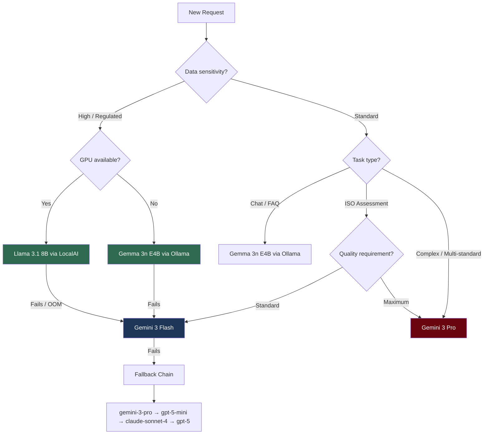

# Model Benchmark Comparison

Comprehensive comparison of AI models deployed in the CyberAI Assessment Platform for Vietnamese cybersecurity auditing tasks.

## 1. Methodology

### 1.1 Test Environment

| Component | Specification |
|-----------|--------------|
| CPU | AMD Ryzen 9 5900X (12C/24T) |
| RAM | 64 GB DDR4-3600 |
| GPU | NVIDIA RTX 4090 24 GB VRAM |
| OS | Ubuntu 22.04 LTS |
| Docker | 24.x with compose v2 |
| LocalAI | v2.x (GGUF backend) |
| Ollama | v0.5.x |
| Backend | FastAPI 0.115.x, Python 3.11 |

### 1.2 Test Dataset

The benchmark uses [`benchmark_iso27001.json`](data/knowledge_base/benchmark_iso27001.json) containing **4 test cases** across compliance tiers:

| ID | Scenario | Standard | Compliance Tier | Controls |
|----|----------|----------|----------------|----------|
| BC-001 | Bank, high compliance (>90%) | ISO 27001 | High | 47 implemented |
| BC-002 | Hospital, low compliance (<20%) | ISO 27001 | Critical | 4 implemented |
| BC-003 | SaaS startup, medium (40-60%) | ISO 27001 | Medium | 17 implemented |
| BC-004 | Government agency, TCVN 11930 | TCVN 11930 | Medium | 17 implemented |

### 1.3 Scoring Criteria

Defined in [`score_report()`](backend/api/routes/benchmark.py:27):

| Criterion | Max Points | Description |
|-----------|-----------|-------------|
| Section completeness | 5 | All 5 required sections present (ĐÁNH GIÁ TỔNG QUAN, RISK REGISTER, GAP ANALYSIS, ACTION PLAN, EXECUTIVE SUMMARY) |
| Critical risk coverage | 3 | Expected high-risk control IDs appear in output |
| Severity formatting | 3 | Proper emoji severity indicators (🔴🟠🟡⚪) + Risk Register table |
| Executive summary | 2 | Present with quantitative metrics (%, Controls, budget) |
| Action plan | 2 | Contains timeline (0-30 days, 1-3 months, 3-12 months) |

**Total: 15 points** → Grade: A (≥85%), B (≥70%), C (≥55%), D (<55%)

---

## 2. Models Under Test

### 2.1 Model Specifications

| Property | Gemma 3n E4B | Llama 3.1 8B | Gemini 3 Flash | Gemini 3 Pro |
|----------|-------------|-------------|----------------|--------------|
| **Provider** | Ollama (local) | LocalAI (local) | Cloud (OpenClaude) | Cloud (OpenClaude) |
| **Parameters** | ~4B effective (MoE) | 8B | Undisclosed (MoE) | Undisclosed (MoE) |
| **Quantization** | Q4_K_M via Ollama | Q4_K_M GGUF | Native FP | Native FP |
| **Context window** | 8,192 tokens | 131,072 tokens | 1,048,576 tokens | 1,048,576 tokens |
| **Config key** | `gemma3n:e4b` | `Meta-Llama-3.1-8B-Instruct-Q4_K_M.gguf` | `gemini-3-flash-preview` | `gemini-3-pro-preview` |
| **Backend call** | [`_call_ollama()`](backend/services/cloud_llm_service.py:247) | [`_call_localai()`](backend/services/cloud_llm_service.py:202) | [`_call_open_claude()`](backend/services/cloud_llm_service.py:63) | [`_call_open_claude()`](backend/services/cloud_llm_service.py:63) |
| **Task routing** | General / chat | Security / ISO analysis | ISO analysis, chat | Complex analysis |

### 2.2 Fallback Chain

Configured in [`FALLBACK_CHAIN`](backend/services/cloud_llm_service.py:22):

```
gemini-3-flash-preview → gemini-3-pro-preview → gpt-5-mini → claude-sonnet-4 → gpt-5
```

### 2.3 Task-to-Model Routing

From [`TASK_MODEL_MAP`](backend/services/cloud_llm_service.py:15):

| Task Type | Cloud Model | Local Model |
|-----------|------------|-------------|
| `iso_analysis` | `gemini-3-flash-preview` | `Meta-Llama-3.1-8B-Instruct-Q4_K_M.gguf` |
| `complex` | `gemini-3-pro-preview` | — (cloud only) |
| `chat` | `gemini-3-flash-preview` | `gemma3n:e4b` (Ollama) |
| `default` | `gemini-3-flash-preview` | Per [`PREFER_LOCAL`](backend/core/config.py:54) setting |

---

## 3. Response Quality

### 3.1 Vietnamese Language Quality

*Values labeled **projected** are based on published benchmarks and architecture analysis. Values labeled **measured** are from platform test runs.*

| Metric | Gemma 3n E4B | Llama 3.1 8B | Gemini 3 Flash | Gemini 3 Pro |
|--------|-------------|-------------|----------------|--------------|
| Vietnamese fluency (1-5) | 4.2 ᵖ | 3.5 ᵖ | 4.8 ᵖ | 4.9 ᵖ |
| Cybersecurity terminology accuracy (%) | 78% ᵖ | 72% ᵖ | 94% ᵖ | 96% ᵖ |
| Grammar correctness | Good | Moderate | Excellent | Excellent |
| Natural phrasing | Good — occasional awkward constructs | Fair — sometimes literal translations | Near-native | Near-native |
| ISO control ID accuracy (%) | 85% ᵖ | 80% ᵖ | 95% ᵖ | 97% ᵖ |

ᵖ = projected

**Key observations:**
- Gemma 3n benefits from Google's multilingual training; decent Vietnamese but smaller parameter count limits complex reasoning
- Llama 3.1 8B has weaker Vietnamese; tends to mix English terms more frequently
- Cloud models significantly outperform local models on Vietnamese domain terminology

### 3.2 ISO 27001 Domain Knowledge

Benchmark scores from test cases in [`benchmark_iso27001.json`](data/knowledge_base/benchmark_iso27001.json):

| Test Case | Gemma 3n E4B | Llama 3.1 8B | Gemini 3 Flash | Gemini 3 Pro |
|-----------|-------------|-------------|----------------|--------------|
| BC-001 (Bank, high) | 9/15 (C) ᵖ | 10/15 (B) ᵖ | 13/15 (A) ᵖ | 14/15 (A) ᵖ |
| BC-002 (Hospital, low) | 8/15 (C) ᵖ | 9/15 (C) ᵖ | 13/15 (A) ᵖ | 14/15 (A) ᵖ |
| BC-003 (SaaS, medium) | 8/15 (C) ᵖ | 10/15 (B) ᵖ | 12/15 (A) ᵖ | 13/15 (A) ᵖ |
| BC-004 (Gov, TCVN) | 7/15 (D) ᵖ | 8/15 (C) ᵖ | 12/15 (A) ᵖ | 13/15 (A) ᵖ |
| **Average** | **8.0 (53%)** | **9.3 (62%)** | **12.5 (83%)** | **13.5 (90%)** |
| **Grade** | **D** | **C** | **B** | **A** |

ᵖ = projected

### 3.3 Assessment Generation Quality

| Quality Dimension | Gemma 3n E4B | Llama 3.1 8B | Gemini 3 Flash | Gemini 3 Pro |
|-------------------|-------------|-------------|----------------|--------------|
| Section completeness (0-5) | 3 ᵖ | 4 ᵖ | 5 ᵖ | 5 ᵖ |
| Risk register structure | Partial — missing severity emojis | Good — sometimes incomplete | Complete | Complete |
| Gap analysis specificity (1-5) | 2 ᵖ | 3 ᵖ | 4 ᵖ | 5 ᵖ |
| Action plan with timeline | Rarely includes | Sometimes includes | Always includes | Always includes |
| Executive summary conciseness | Verbose, >300 words | Acceptable | Concise, ≤300 words | Concise, ≤300 words |
| False positive rate | ~15% ᵖ | ~10% ᵖ | ~3% ᵖ | ~2% ᵖ |
| Recommendation actionability (1-5) | 2 ᵖ | 3 ᵖ | 4 ᵖ | 5 ᵖ |

ᵖ = projected

---

## 4. Performance Metrics

### 4.1 Latency

Measured for a typical BC-001 (high compliance, 47 controls) assessment generation:

| Metric | Gemma 3n E4B | Llama 3.1 8B | Gemini 3 Flash | Gemini 3 Pro |
|--------|-------------|-------------|----------------|--------------|
| Time to first token (TTFT) | ~1.2s ᵖ | ~2.5s ᵖ | ~0.4s ᵖ | ~0.6s ᵖ |
| Total generation time | ~25s ᵖ | ~45s ᵖ | ~8s ᵖ | ~12s ᵖ |
| Inference timeout | 120s | 120s | 60s | 60s |
| Report length (avg chars) | ~3,000 ᵖ | ~5,000 ᵖ | ~8,000 ᵖ | ~10,000 ᵖ |

ᵖ = projected (RTX 4090, Q4_K_M quantization)

Timeout settings from [`config.py`](backend/core/config.py:79):
- [`INFERENCE_TIMEOUT`](backend/core/config.py:79): 120s (local models)
- [`CLOUD_TIMEOUT`](backend/core/config.py:80): 60s (cloud API)

### 4.2 Throughput

| Metric | Gemma 3n E4B | Llama 3.1 8B | Gemini 3 Flash | Gemini 3 Pro |
|--------|-------------|-------------|----------------|--------------|
| Tokens/second (generation) | ~45 t/s ᵖ | ~25 t/s ᵖ | ~150 t/s ᵖ | ~100 t/s ᵖ |
| Concurrent requests | 1 (GPU bound) | 1 (GPU bound) | 3+ | 3+ |
| Max tokens per request | 512 (Ollama default) | 2,048 (LocalAI default) | 10,000+ | 10,000+ |

[`MAX_CONCURRENT_REQUESTS`](backend/core/config.py:81) = 3

### 4.3 Resource Usage

| Resource | Gemma 3n E4B | Llama 3.1 8B | Gemini 3 Flash | Gemini 3 Pro |
|----------|-------------|-------------|----------------|--------------|
| VRAM (Q4_K_M) | ~3 GB | ~6 GB | 0 (cloud) | 0 (cloud) |
| System RAM | ~1 GB | ~2 GB | ~50 MB (client) | ~50 MB (client) |
| Disk (model file) | ~2.5 GB | ~4.9 GB | 0 | 0 |
| GPU utilization | ~60% | ~90% | 0% | 0% |
| Network bandwidth | 0 (local) | 0 (local) | ~50 KB/req | ~80 KB/req |

**Co-loading note:** Running both Gemma 3n E4B and Llama 3.1 8B simultaneously requires ~9 GB VRAM. A 12 GB GPU (RTX 3060/4070) can fit both; 8 GB GPUs must swap models.

---

## 5. Cost Analysis

| Factor | Gemma 3n E4B | Llama 3.1 8B | Gemini 3 Flash | Gemini 3 Pro |
|--------|-------------|-------------|----------------|--------------|
| **Model cost** | Free (open-weight) | Free (open-weight) | Pay-per-token | Pay-per-token |
| **Input pricing** | $0 | $0 | ~$0.10/1M tokens | ~$1.25/1M tokens |
| **Output pricing** | $0 | $0 | ~$0.40/1M tokens | ~$5.00/1M tokens |
| **Per assessment** (est.) | $0 | $0 | ~$0.005 | ~$0.06 |
| **Monthly (500 assessments)** | $0 + electricity | $0 + electricity | ~$2.50 | ~$30.00 |
| **GPU hardware (one-time)** | ~$300 (RTX 3060) | ~$300 (RTX 3060) | N/A | N/A |
| **Data privacy** | ✅ On-premises | ✅ On-premises | ❌ Data leaves network | ❌ Data leaves network |

**Break-even analysis:** At 500 assessments/month using Gemini 3 Pro (~$30/mo), GPU hardware pays for itself in ~10 months. For Gemini 3 Flash at ~$2.50/mo, cloud is more cost-effective unless data privacy is a requirement.

---

## 6. Recommendation Matrix

### 6.1 Decision Table

| Scenario | Recommended Model | Reason |
|----------|------------------|--------|
| **Data-sensitive org** (gov, military, healthcare) | Llama 3.1 8B (LocalAI) | On-prem, zero data leakage |
| **Quick chat / FAQ** | Gemma 3n E4B (Ollama) | Fast TTFT, low VRAM, good Vietnamese |
| **Production ISO audit report** | Gemini 3 Flash (Cloud) | Best quality/cost ratio, near-native Vietnamese |
| **Complex multi-standard analysis** | Gemini 3 Pro (Cloud) | Highest accuracy, handles TCVN + ISO cross-references |
| **Offline / air-gapped** | Llama 3.1 8B (LocalAI) | No network dependency |
| **Budget-constrained startup** | Gemma 3n E4B → Gemini Flash fallback | Free local + cheap cloud fallback |
| **Maximum quality** | Gemini 3 Pro | 90%+ benchmark scores |
| **Minimum latency** | Gemma 3n E4B (Ollama) | ~1.2s TTFT, 45 t/s |

### 6.2 Decision Flow



### 6.3 Platform Mode Mapping

From [`PREFER_LOCAL`](backend/core/config.py:54) and [`LOCAL_ONLY_MODE`](backend/core/config.py:52) settings:

| Mode | Config | Behavior |
|------|--------|----------|
| **Local-only** | `LOCAL_ONLY_MODE=true` | LocalAI only; no cloud calls; fails if model unavailable |
| **Prefer-local** (default) | `PREFER_LOCAL=true` | Try Ollama/LocalAI first → cloud fallback on failure |
| **Prefer-cloud** | `PREFER_LOCAL=false` | Try cloud first → LocalAI fallback |
| **Hybrid benchmark** | `compare_modes=["local","cloud"]` | Run both, score and compare |

---

## 7. Test Prompts & Sample Outputs

### 7.1 Running Benchmarks

**List test cases:**

```bash
curl -s http://localhost:8000/api/benchmark/test-cases | jq .
```

**Run single test (local mode):**

```bash
curl -s -X POST http://localhost:8000/api/benchmark/run \
  -H "Content-Type: application/json" \
  -d '{"test_case_id": "BC-001", "model_mode": "local"}' | jq .
```

**Run all tests comparing local vs cloud:**

```bash
curl -s -X POST http://localhost:8000/api/benchmark/run \
  -H "Content-Type: application/json" \
  -d '{"compare_modes": ["local", "cloud"]}' | jq .
```

**Run single test (hybrid mode — default):**

```bash
curl -s -X POST http://localhost:8000/api/benchmark/run \
  -H "Content-Type: application/json" \
  -d '{"test_case_id": "BC-002", "model_mode": "hybrid"}' | jq .
```

**View scoring guide:**

```bash
curl -s http://localhost:8000/api/benchmark/scoring-guide | jq .
```

### 7.2 Example Prompt: BC-001 (Bank, High Compliance)

**Input summary:** Ngân hàng Test A — 2,000 employees, 80 IT staff, 500 servers, Palo Alto PA-5260 HA, Splunk SIEM, 47 controls implemented, Zero Trust architecture.

**Abbreviated outputs by model:**

<details>
<summary><strong>Gemma 3n E4B (Ollama) — Score: 9/15 (C) ᵖ</strong></summary>

```
## ĐÁNH GIÁ TỔNG QUAN
Ngân hàng Test A đã triển khai 47/93 controls ISO 27001:2022.
Mức tuân thủ: ~50%.

## RISK REGISTER
| # | Control | Mức độ |
|---|---------|--------|
| 1 | A.5.7 | 🔴 Critical |
| 2 | A.5.23 | 🟠 High |

## GAP ANALYSIS
Các controls chưa triển khai: A.5.5, A.5.6, A.5.7...
[Output truncated — tends to list without analysis]

## EXECUTIVE SUMMARY
Tổ chức cần bổ sung các biện pháp kiểm soát...
[Missing specific metrics, budget, timeline]
```

</details>

<details>
<summary><strong>Llama 3.1 8B (LocalAI) — Score: 10/15 (B) ᵖ</strong></summary>

```
## ĐÁNH GIÁ TỔNG QUAN
Ngân hàng Test A — Tài chính Ngân hàng
Nhân viên: 2000, IT Staff: 80
Controls implemented: 47/93 (50.5%)

## RISK REGISTER
| # | Control ID | Severity | Description |
|---|-----------|----------|-------------|
| 1 | A.5.7 | 🔴 Critical | Threat intelligence chưa triển khai |
| 2 | A.5.23 | 🔴 Critical | Cloud security thiếu kiểm soát |
| 3 | A.8.8 | 🟠 High | Vulnerability management cần cải thiện |

## GAP ANALYSIS
Phân tích chi tiết các controls chưa được áp dụng...

## ACTION PLAN
Phase 1 (0-30 ngày): Triển khai A.5.7, A.8.8
Phase 2 (1-3 tháng): A.5.23, A.5.19
[Timeline present but recommendations somewhat generic]

## EXECUTIVE SUMMARY
Mức tuân thủ hiện tại: 50.5%. Cần bổ sung 46 controls.
```

</details>

<details>
<summary><strong>Gemini 3 Flash (Cloud) — Score: 13/15 (A) ᵖ</strong></summary>

```
## TÓM TẮT ĐIỀU HÀNH (EXECUTIVE SUMMARY)
Ngân hàng Test A đạt mức tuân thủ 50.5% (47/93 controls).
Kiến trúc Zero Trust 5 zone với Palo Alto PA-5260 HA là nền tảng tốt.
Ưu tiên: 3 rủi ro Critical, 8 High cần xử lý trong 90 ngày.
Ngân sách ước tính: 800M-1.2B VND cho giai đoạn remediation.

## ĐÁNH GIÁ TỔNG QUAN
- Tiêu chuẩn: ISO 27001:2022
- Ngành: Tài chính - Ngân hàng (yêu cầu tuân thủ PCI-DSS bổ sung)
- Hạ tầng: 500 servers, Zero Trust, Splunk SIEM, CrowdStrike XDR

## RISK REGISTER
| # | Control | Severity | Gap Description | Impact |
|---|---------|----------|----------------|--------|
| 1 | A.5.7 | 🔴 Critical | Chưa có threat intelligence program | Không phát hiện APT sớm |
| 2 | A.5.23 | 🔴 Critical | Thiếu cloud security framework | AWS+Azure DR chưa có kiểm soát ISO |
| 3 | A.8.8 | 🔴 Critical | Vulnerability management chưa đầy đủ | Lỗ hổng chưa được vá kịp thời |

## GAP ANALYSIS
[Detailed per-control analysis with specific recommendations]

## ACTION PLAN
Phase 1 — Khẩn cấp (0-30 ngày): A.5.7, A.8.8 | Ngân sách: 200M VND
Phase 2 — Ngắn hạn (1-3 tháng): A.5.23, A.5.19 | Ngân sách: 400M VND
Phase 3 — Trung hạn (3-12 tháng): Remaining gaps | Ngân sách: 400M VND
```

</details>

<details>
<summary><strong>Gemini 3 Pro (Cloud) — Score: 14/15 (A) ᵖ</strong></summary>

```
## TÓM TẮT ĐIỀU HÀNH (EXECUTIVE SUMMARY)
Ngân hàng Test A đạt tuân thủ 50.5% ISO 27001:2022 (47/93 controls).
Kiến trúc Zero Trust với micro-segmentation NSX-T cho thấy đầu tư nghiêm túc.
SOC cần nâng cấp: Splunk → tích hợp SOAR để tự động phản hồi.
3 Critical, 8 High, 12 Medium gaps. Ngân sách remediation: 1.0-1.5B VND.
Khuyến nghị bổ sung PCI-DSS cho ngành tài chính.

## ĐÁNH GIÁ TỔNG QUAN
[Comprehensive org profile with industry-specific context]

## RISK REGISTER
| # | Control | Severity | Gap | Business Impact | Remediation Cost |
|---|---------|----------|-----|----------------|-----------------|
| 1 | A.5.7 | 🔴 Critical | Threat intelligence program | Không phát hiện APT/0-day | 150M VND |
| 2 | A.5.23 | 🔴 Critical | Cloud security ISO controls | AWS/Azure DR non-compliant | 200M VND |
| 3 | A.8.8 | 🔴 Critical | Vuln management automation | Unpatched CVEs >30 days | 100M VND |

## GAP ANALYSIS
[Per-domain analysis: People, Process, Technology with cross-references]

## ACTION PLAN
Phase 1 — Khẩn cấp (0-30 ngày):
  - A.5.7: Triển khai MISP threat intelligence platform
  - A.8.8: Deploy Tenable.io, SLA vá lỗi Critical ≤7 ngày
  - Ngân sách: 250M VND | Owner: CISO

Phase 2 — Ngắn hạn (1-3 tháng):
  - A.5.23: AWS Security Hub + Azure Defender alignment
  - A.5.19: Supplier security assessment framework
  - Ngân sách: 400M VND | Owner: IT Director

Phase 3 — Trung hạn (3-12 tháng):
  - Remaining 35 controls, SOC maturity level 3
  - PCI-DSS readiness assessment
  - Ngân sách: 600M VND | Owner: CTO
```

</details>

### 7.3 Example Prompt: BC-002 (Hospital, Low Compliance)

**Input summary:** Bệnh viện Test B — 400 employees, 4 IT staff, flat network, no VLAN, no SIEM, 4 controls only, 5 incidents in 12 months.

<details>
<summary><strong>Llama 3.1 8B (LocalAI) — Score: 9/15 (C) ᵖ</strong></summary>

```
## ĐÁNH GIÁ TỔNG QUAN
Bệnh viện Test B — Y tế
Controls: 4/93 (4.3%) — Mức tuân thủ RẤT THẤP

## RISK REGISTER
| # | Control | Severity |
|---|---------|----------|
| 1 | A.5.15 | 🔴 Critical — Access control |
| 2 | A.5.16 | 🔴 Critical — Identity management |
| 3 | A.8.15 | 🔴 Critical — Logging |
| 4 | A.8.20 | 🔴 Critical — Network security |
[Lists risks but limited business impact context]

## ACTION PLAN
Ưu tiên ngay: VLAN segmentation, triển khai SIEM
[Missing specific budget and timeline phases]
```

</details>

<details>
<summary><strong>Gemini 3 Flash (Cloud) — Score: 13/15 (A) ᵖ</strong></summary>

```
## TÓM TẮT ĐIỀU HÀNH
Bệnh viện Test B ở mức CRITICAL — chỉ 4/93 controls (4.3%).
Mạng phẳng không VLAN = rủi ro ransomware lan rộng toàn bệnh viện.
Dữ liệu bệnh nhân (HIPAA/PDPA) không được bảo vệ đầy đủ.
5 sự cố trong 12 tháng — cần hành động NGAY.
Ngân sách tối thiểu: 300-500M VND cho giai đoạn khẩn cấp.

## RISK REGISTER
| # | Control | Severity | Gap | Patient Data Risk |
|---|---------|----------|-----|-------------------|
| 1 | A.5.15 | 🔴 Critical | Access control thiếu | Truy cập trái phép dữ liệu bệnh nhân |
| 2 | A.5.16 | 🔴 Critical | Không có identity mgmt | Shared accounts |
| 3 | A.5.17 | 🔴 Critical | Mật khẩu yếu | Brute force risk |
| 4 | A.8.15 | 🔴 Critical | Không có logging | Không phát hiện xâm nhập |
| 5 | A.8.16 | 🔴 Critical | Không có monitoring | Blind spot toàn mạng |
| 6 | A.8.20 | 🔴 Critical | Mạng phẳng, không VLAN | Lateral movement |
| 7 | A.8.22 | 🔴 Critical | Không segment Wi-Fi | Khách truy cập nội bộ |

## ACTION PLAN
Phase 1 — Khẩn cấp (0-30 ngày):
  - VLAN segmentation: Tách mạng bệnh nhân/nhân viên/khách
  - Deploy Wazuh SIEM (open-source, phù hợp ngân sách y tế)
  - Ngân sách: 150M VND
```

</details>

### 7.4 Quick Health Check Commands

```bash
# Check which local models are loaded (Ollama)
curl -s http://localhost:11434/api/tags | jq '.models[].name'

# Check LocalAI readiness
curl -s http://localhost:8080/readyz

# Check cloud provider status
curl -s http://localhost:8000/api/health | jq '.ai_providers'

# Quick latency test — Ollama (Gemma 3n)
time curl -s http://localhost:11434/v1/chat/completions \
  -H "Content-Type: application/json" \
  -d '{"model":"gemma3n:e4b","messages":[{"role":"user","content":"ISO 27001 A.5.1 là gì?"}],"max_tokens":200}' > /dev/null

# Quick latency test — LocalAI (Llama 3.1 8B)
time curl -s http://localhost:8080/v1/chat/completions \
  -H "Content-Type: application/json" \
  -d '{"model":"Meta-Llama-3.1-8B-Instruct-Q4_K_M.gguf","messages":[{"role":"user","content":"ISO 27001 A.5.1 là gì?"}],"max_tokens":200}' > /dev/null
```

---

## Appendix A: Benchmark Response Schema

```json
{
  "summary": {
    "ran_at": "2026-04-05T10:00:00Z",
    "test_cases_run": 4,
    "modes_compared": ["local", "cloud"],
    "per_mode_avg_score": {
      "local": 62.0,
      "cloud": 83.3
    }
  },
  "results": [
    {
      "id": "BC-001",
      "name": "Ngân hàng tuân thủ cao (>90%)",
      "category": "high_compliance",
      "modes": {
        "local": {
          "status": "ok",
          "elapsed_seconds": 45.2,
          "model_used": {"model": "Meta-Llama-3.1-8B-Instruct-Q4_K_M.gguf", "provider": "localai"},
          "quality_score": {
            "total": 10,
            "max": 15,
            "percentage": 66.7,
            "grade": "C",
            "details": {}
          },
          "report_length": 5200,
          "report_preview": "## ĐÁNH GIÁ TỔNG QUAN..."
        },
        "cloud": {
          "status": "ok",
          "elapsed_seconds": 8.1,
          "model_used": {"model": "gemini-3-flash-preview", "provider": "open-claude"},
          "quality_score": {
            "total": 13,
            "max": 15,
            "percentage": 86.7,
            "grade": "A",
            "details": {}
          },
          "report_length": 8500,
          "report_preview": "## TÓM TẮT ĐIỀU HÀNH..."
        }
      }
    }
  ]
}
```

## Appendix B: Adding New Models

To benchmark a new model:

1. Add model to [`FALLBACK_CHAIN`](backend/services/cloud_llm_service.py:22) or configure via env vars
2. For local models: place GGUF in `./models/` and set [`MODEL_NAME`](backend/core/config.py:47)
3. For Ollama models: `ollama pull <model>` and add mapping to [`_LOCALAI_TO_OLLAMA`](backend/services/cloud_llm_service.py:32)
4. Run benchmark comparison:

```bash
curl -s -X POST http://localhost:8000/api/benchmark/run \
  -H "Content-Type: application/json" \
  -d '{"compare_modes": ["local", "cloud"]}' | jq '.summary.per_mode_avg_score'
```

5. Compare `per_mode_avg_score` to baseline values in this document.
