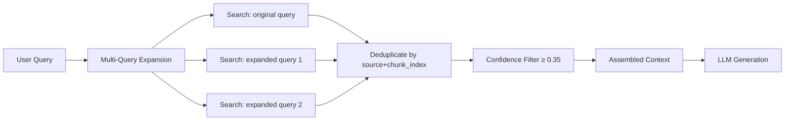
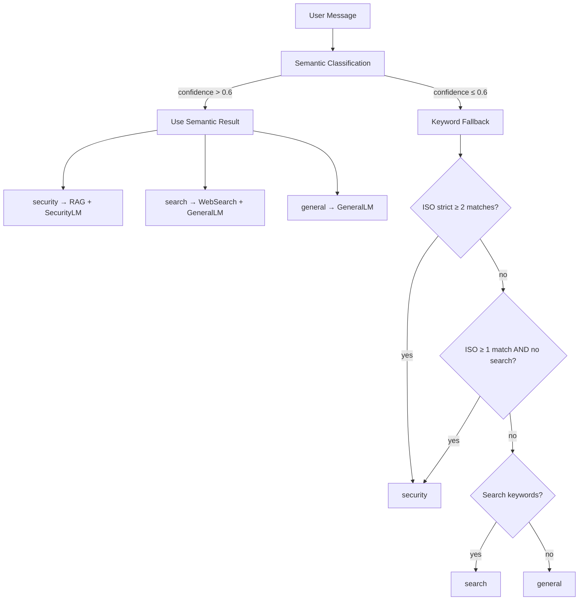
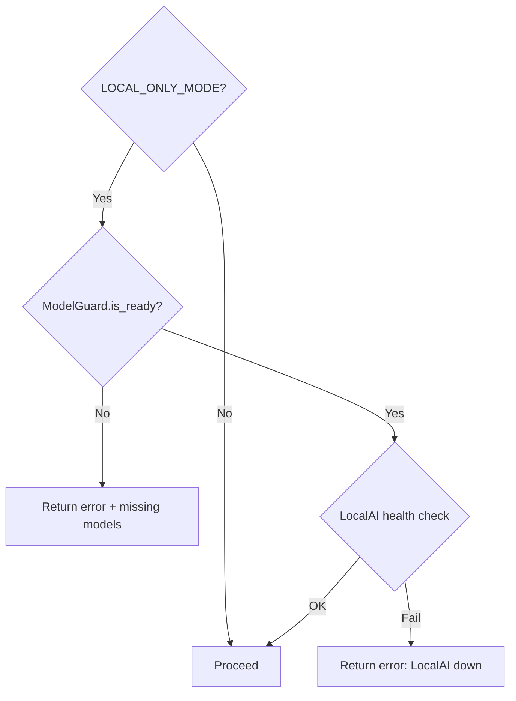
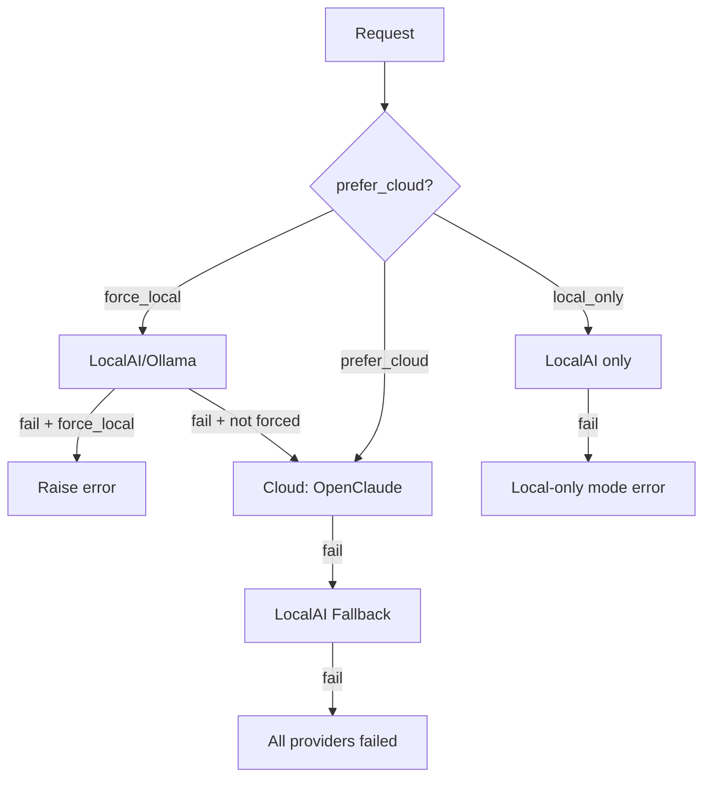

# Tham chiếu thuật toán

Tài liệu kỹ thuật về tất cả các thuật toán quan trọng trong Nền tảng đánh giá CyberAI, được trích xuất từ mã nguồn.

## Mục lục

- [1. Truy xuất RAG](#1-truy-xuất-rag)
- [2. Định tuyến mô hình](#2-định-tuyến-mô-hình)
- [3. Chấm điểm tuân thủ có trọng số](#3-chấm-điểm-tuân-thủ-có-trọng-số)
- [4. Chấm điểm sổ đăng ký rủi ro](#4-chấm-điểm-sổ-đăng-ký-rủi-ro)
- [5. Chuẩn hóa mức độ nghiêm trọng](#5-chuẩn-hóa-mức-độ-nghiêm-trọng)
- [6. Bảo vệ đầu vào an toàn](#6-bảo-vệ-đầu-vào-an-toàn)
- [7. Chuỗi dự phòng Cloud LLM](#7-chuỗi-dự-phòng-cloud-llm)

---

## 1. Truy xuất RAG

Nguồn: [`rag_service.py`](backend/services/rag_service.py), [`vector_store.py`](backend/repositories/vector_store.py)

### 1.1 Cơ chế hoạt động

Pipeline RAG (Truy xuất tăng cường sinh - Retrieval Augmented Generation) hoạt động qua ba giai đoạn:

1. **Chia đoạn (Chunking)** — Tài liệu Markdown được chia thành các đoạn chồng lấp, kèm theo ngữ cảnh phân cấp tiêu đề.
2. **Truy xuất (Retrieval)** — Tìm kiếm bằng độ tương đồng cosine trên ChromaDB với chỉ mục HNSW, hỗ trợ mở rộng đa truy vấn (multi-query expansion).
3. **Lọc theo độ tin cậy (Confidence Filtering)** — Các đoạn có độ tương đồng thấp bị loại bỏ trước khi ghép ngữ cảnh.



### 1.2 Chiến lược chia đoạn

Được định nghĩa trong [`VectorStore._chunk_text()`](backend/repositories/vector_store.py:30):

| Tham số | Giá trị | Mô tả |
|---------|---------|-------|
| `chunk_size` | **600** ký tự | Kích thước đoạn mục tiêu trước khi tách |
| `overlap` | **150** ký tự | Cửa sổ chồng lấp từ cuối đoạn trước |
| Điều kiện tách | Điểm ngắt tự nhiên | Chỉ tách khi không nằm trong dòng bảng (`\|`), mục danh sách (`- `), hoặc khối thụt lề |

**Chèn phân cấp tiêu đề**: mỗi đoạn không bắt đầu bằng tiêu đề sẽ được thêm tiền tố `[Context: # H1 > ## H2 > ### H3]` để bảo toàn cấu trúc tài liệu.

```python
# Pseudocode: _chunk_text()
current_headers = []
for line in lines:
    track_header_hierarchy(line)  # H1 resets, H2 appends, H3 appends
    current_chunk.append(line)
    current_length += len(line)

    if current_length >= 600 and is_natural_break(line):
        prepend_header_context(current_chunk, current_headers)
        chunks.append(current_chunk)
        # Overlap: keep last ~150 chars as start of next chunk
        current_chunk = tail_lines(current_chunk, 150)
```

### 1.3 Mở rộng đa truy vấn (Multi-Query Expansion)

Được định nghĩa trong [`VectorStore.multi_query_search()`](backend/repositories/vector_store.py:158):

Quy tắc mở rộng truy vấn:

| Điều kiện | Truy vấn mở rộng |
|-----------|-------------------|
| Truy vấn chứa `"iso"` hoặc `"tcvn"` | `"tiêu chuẩn {query}"` |
| Truy vấn chứa `"đánh giá"` | `query.replace("đánh giá", "kiểm toán")` |

Kết quả được loại trùng theo khóa tổ hợp `{source}_{chunk_index}`, sắp xếp theo điểm giảm dần, và giới hạn tối đa `top_k` (mặc định: **5**).

### 1.4 Lọc theo ngưỡng độ tin cậy

Được định nghĩa trong [`_filter_by_confidence()`](backend/services/rag_service.py:18):

```
RAG_CONFIDENCE_THRESHOLD = 0.35
```

ChromaDB trả về **khoảng cách** cosine. Chuyển đổi sang độ tương đồng:

```
similarity_score = 1 - cosine_distance
```

Chỉ các đoạn có `score >= 0.35` (tức `distance <= 0.65`) mới vượt qua bộ lọc. Bộ đếm Prometheus `cyberai_rag_queries_total` được tăng với `result="hit"` hoặc `result="miss"`.

### 1.5 Tham số cấu hình

| Tham số | Giá trị | Nguồn |
|---------|---------|-------|
| `RAG_CONFIDENCE_THRESHOLD` | `0.35` | [`rag_service.py:15`](backend/services/rag_service.py:15) |
| `chunk_size` | `600` | [`vector_store.py:30`](backend/repositories/vector_store.py:30) |
| `overlap` | `150` | [`vector_store.py:30`](backend/repositories/vector_store.py:30) |
| `top_k` | `5` | [`rag_service.py:49`](backend/services/rag_service.py:49) |
| Chỉ số khoảng cách ChromaDB | `cosine` | [`vector_store.py:26`](backend/repositories/vector_store.py:26) |
| Thuật toán đánh chỉ mục | HNSW | Mặc định của ChromaDB (qua metadata `hnsw:space`) |
| Kích thước lô đánh chỉ mục | `100` | [`vector_store.py:113`](backend/repositories/vector_store.py:113) |

### 1.6 Các phương pháp thay thế

| Phương pháp | Ưu điểm | Nhược điểm | Trạng thái |
|-------------|---------|------------|------------|
| **Cosine similarity (hiện tại)** | Nhanh, hoạt động tốt với embedding đã chuẩn hóa | Nhạy cảm với chất lượng embedding | ✅ Đã triển khai |
| Tìm kiếm từ khóa BM25 | Không cần mô hình embedding | Bỏ sót từ đồng nghĩa ngữ nghĩa | Chưa triển khai |
| Kết hợp BM25 + vector | Tận dụng ưu điểm cả hai | Độ phức tạp cao, chỉ mục kép | Chưa triển khai |
| Xếp hạng lại (cross-encoder) | Độ chính xác cao hơn trên top-k | Chậm hơn, cần mô hình riêng | Chưa triển khai |

### 1.7 Ví dụ tính toán

```
Query: "ISO 27001 access control policy"
ChromaDB returns 5 chunks:

Chunk A: distance=0.25 → score=0.75 ✅ (≥ 0.35)
Chunk B: distance=0.40 → score=0.60 ✅
Chunk C: distance=0.55 → score=0.45 ✅
Chunk D: distance=0.70 → score=0.30 ❌ (< 0.35, filtered)
Chunk E: distance=0.80 → score=0.20 ❌

Result: 3 chunks assembled into context, 2 discarded.
Context = ChunkA + "\n\n---\n\n" + ChunkB + "\n\n---\n\n" + ChunkC
```

---

## 2. Định tuyến mô hình

Nguồn: [`model_router.py`](backend/services/model_router.py)

### 2.1 Cơ chế hoạt động

Phân loại ý định kết hợp hai giai đoạn: **ngữ nghĩa trước**, sau đó **dự phòng từ khóa** nếu độ tin cậy quá thấp.



### 2.2 Phân loại ngữ nghĩa (Semantic Classification)

Được định nghĩa trong [`_semantic_classify()`](backend/services/model_router.py:146):

Sử dụng bộ sưu tập ChromaDB trong bộ nhớ (`intent_classifier`, không gian cosine) được khởi tạo với các mẫu ý định từ [`INTENT_TEMPLATES`](backend/services/model_router.py:14).

| Ý định | Số lượng mẫu | Ví dụ |
|--------|-------------|-------|
| `security` | ~34 | `"đánh giá rủi ro bảo mật"`, `"iso 27001"`, `"risk assessment"` |
| `search` | ~19 | `"tin tức mới nhất"`, `"latest news"`, `"stock price today"` |
| `general` | ~15 | `"xin chào"`, `"hello"`, `"what can you do"` |

**Thuật toán bỏ phiếu**:

```python
# Query top-3 nearest templates
results = collection.query(query_texts=[message], n_results=3)

# Weighted vote: sum similarities per intent
for i, meta in enumerate(metadatas):
    intent = meta["intent"]
    similarity = 1 - distances[i]
    votes[intent] += similarity

# Winner = highest total vote, normalized by result count
best_intent = max(votes, key=votes.get)
confidence = votes[best_intent] / len(metadatas)  # normalized by 3
```

### 2.3 Dự phòng từ khóa (Keyword Fallback)

Ba mẫu regex được biên dịch sẵn:

| Mẫu | Từ khóa | Ngưỡng khớp |
|-----|---------|-------------|
| [`_iso_pattern`](backend/services/model_router.py:112) | 34 thuật ngữ ISO/tuân thủ | `≥ 1` lần khớp |
| [`_iso_strict_pattern`](backend/services/model_router.py:113) | 30 thuật ngữ bảo mật nghiêm ngặt (ranh giới từ) | `≥ 2` lần khớp |
| [`_search_pattern`](backend/services/model_router.py:114) | 31 thuật ngữ ý định tìm kiếm | `≥ 1` lần khớp |

**Ma trận quyết định** (khi `confidence ≤ 0.6`):

| `has_search` | `has_iso` | `has_iso_strict` | Tuyến |
|:---:|:---:|:---:|---|
| ✅ | ✅ | ❌ | `search` |
| any | any | ✅ | `security` |
| ❌ | ✅ | ❌ | `security` |
| ✅ | ❌ | ❌ | `search` |
| ❌ | ❌ | ❌ | `general` |

### 2.4 Kết quả định tuyến

[`route_model()`](backend/services/model_router.py:173) trả về:

```python
{
    "model": str,           # SECURITY_MODEL or GENERAL_MODEL
    "use_rag": bool,        # True only for "security" route
    "use_search": bool,     # True only for "search" route
    "matched_keywords": [],
    "route": str,           # "security" | "search" | "general"
    "confidence": float,
    "classification_method": str,  # "semantic" | "keyword"
}
```

### 2.5 Các phương pháp thay thế

| Phương pháp | Ưu điểm | Nhược điểm | Trạng thái |
|-------------|---------|------------|------------|
| **Kết hợp ngữ nghĩa + từ khóa (hiện tại)** | Độ chính xác cao, suy giảm nhẹ nhàng | Cần ChromaDB cho phần ngữ nghĩa | ✅ Đã triển khai |
| Phân loại dựa trên LLM | Linh hoạt nhất | Chậm, tốn chi phí cho mỗi yêu cầu | Chưa triển khai |
| Bộ phân loại tinh chỉnh (BERT) | Nhanh, độ chính xác cao | Cần dữ liệu huấn luyện | Chưa triển khai |
| Chỉ dùng quy tắc (từ khóa) | Đơn giản nhất, không phụ thuộc | Bỏ sót ý nghĩa ngữ nghĩa | Dùng làm dự phòng |

### 2.6 Ví dụ tính toán

```
Input: "đánh giá rủi ro ISO 27001 cho hệ thống"

Semantic phase:
  Top-3 templates: "đánh giá rủi ro bảo mật" (d=0.15), "iso 27001" (d=0.20), "risk assessment" (d=0.35)
  Votes: security = (0.85 + 0.80 + 0.65) = 2.30
  Confidence = 2.30 / 3 = 0.767 > 0.6 → USE SEMANTIC

Result: route="security", use_rag=True, model=SECURITY_MODEL, method="semantic"
```

---

## 3. Chấm điểm tuân thủ có trọng số

Nguồn: [`controls_catalog.py`](backend/services/controls_catalog.py), [`assessment_helpers.py`](backend/services/assessment_helpers.py)

### 3.1 Cơ chế hoạt động

Các biện pháp kiểm soát được gán trọng số theo mức độ nghiêm trọng. Tỷ lệ tuân thủ được tính bằng tỷ số giữa **điểm trọng số đạt được** và **điểm trọng số tối đa**, không phải đơn thuần đếm số lượng.

### 3.2 Bảng ánh xạ trọng số

Được định nghĩa trong [`WEIGHT_SCORE`](backend/services/controls_catalog.py:159):

| Mức độ nghiêm trọng | Trọng số | Mô tả |
|---------------------|---------|-------|
| `critical` | **4** | Biện pháp bắt buộc (ví dụ: kiểm soát truy cập, mã hóa, ứng phó sự cố) |
| `high` | **3** | Biện pháp quan trọng (ví dụ: kiểm tra lý lịch, SDLC) |
| `medium` | **2** | Biện pháp tiêu chuẩn (ví dụ: liên hệ cơ quan chức năng, lọc web) |
| `low` | **1** | Biện pháp bổ sung (ví dụ: đồng bộ NTP, chính sách bàn làm việc) |

### 3.3 Công thức

Được định nghĩa trong [`calc_compliance()`](backend/services/controls_catalog.py:173):

```
weight_map = { control_id: WEIGHT_SCORE[control.weight] for each control }

max_weighted    = Σ weight_map[all_controls]
achieved_weighted = Σ weight_map[implemented_controls]

percentage = (achieved_weighted / max_weighted) × 100
```

```python
# Pseudocode
flat = get_flat_controls(standard)
weight_map = {c["id"]: WEIGHT_SCORE[c["weight"]] for c in flat}
max_w = sum(weight_map.values())
achieved_w = sum(weight_map[cid] for cid in implemented if cid in weight_map)
percentage = round(achieved_w / max_w * 100, 1)
```

### 3.4 Phân loại mức tuân thủ

Được định nghĩa trong [`_build_structured_json()`](backend/services/chat_service.py:731):

| Tỷ lệ phần trăm | Mức | Nhãn |
|-----------------|-----|------|
| `≥ 80%` | `high` | Tuân thủ cao |
| `≥ 50%` | `medium` | Tuân thủ một phần |
| `≥ 25%` | `low` | Tuân thủ thấp |
| `< 25%` | `critical` | Không tuân thủ |

### 3.5 Phân tích chi tiết trọng số

Được định nghĩa trong [`build_weight_breakdown()`](backend/services/controls_catalog.py:192):

Với mỗi mức độ nghiêm trọng, theo dõi:
- `total`: số lượng biện pháp trong mức đó
- `implemented`: số lượng đã đạt
- Danh sách các biện pháp còn thiếu theo ID + nhãn

### 3.6 Phân bổ biện pháp kiểm soát ISO 27001:2022

Từ [`ISO_27001_CATEGORIES`](backend/services/controls_catalog.py:3):

| Danh mục | Biện pháp | Critical | High | Medium | Low |
|----------|-----------|----------|------|--------|-----|
| A.5 Tổ chức | 37 | 10 | 14 | 10 | 3 |
| A.6 Con người | 8 | 1 | 5 | 2 | 0 |
| A.7 Vật lý | 14 | 0 | 5 | 7 | 2 |
| A.8 Công nghệ | 34 | 14 | 12 | 7 | 1 |
| **Tổng** | **93** | **25** | **36** | **26** | **6** |

### 3.7 Ví dụ tính toán

```
Organization has implemented: [A.5.1, A.5.15, A.8.1, A.7.7]

Control weights:
  A.5.1  (critical) = 4
  A.5.15 (critical) = 4
  A.8.1  (critical) = 4
  A.7.7  (low)      = 1

achieved_weighted = 4 + 4 + 4 + 1 = 13

max_weighted (all 93 controls):
  25 critical × 4 = 100
  36 high     × 3 = 108
  26 medium   × 2 =  52
   6 low      × 1 =   6
  total           = 266

percentage = (13 / 266) × 100 = 4.9%
tier = "critical" (< 25%)
```

---

## 4. Chấm điểm sổ đăng ký rủi ro

Nguồn: [`assessment_helpers.py`](backend/services/assessment_helpers.py), [`chat_service.py`](backend/services/chat_service.py)

### 4.1 Cơ chế hoạt động

Mỗi biện pháp kiểm soát chưa được triển khai được gán điểm rủi ro **Khả năng xảy ra × Mức độ ảnh hưởng** bởi mô hình SecurityLM trong Giai đoạn 1 đánh giá. Khi LLM (Mô hình ngôn ngữ lớn) thất bại, hệ thống sẽ suy luận rủi ro theo phương pháp tất định từ metadata trọng số của biện pháp.

### 4.2 Công thức điểm rủi ro

```
Risk = Likelihood × Impact
```

| Tham số | Phạm vi | Mô tả |
|---------|---------|-------|
| Likelihood (Khả năng xảy ra - L) | 1–5 | Xác suất bị khai thác |
| Impact (Mức độ ảnh hưởng - I) | 1–5 | Tác động kinh doanh nếu bị khai thác |
| Risk (Rủi ro) | 1–25 | Điểm rủi ro tổng hợp |

### 4.3 Sổ đăng ký rủi ro do LLM tạo

Mô hình SecurityLM xuất JSON cho mỗi danh mục biện pháp:

```json
[
  {
    "id": "A.5.1",
    "severity": "critical",
    "likelihood": 4,
    "impact": 5,
    "risk": 20,
    "gap": "Chính sách ATTT chưa được ban hành",
    "recommendation": "Ban hành chính sách ATTT ngay trong 30 ngày"
  }
]
```

Kiểm tra hợp lệ trong [`validate_chunk_output()`](backend/services/assessment_helpers.py:67):
- Likelihood được giới hạn trong `[1, 5]`
- Impact được giới hạn trong `[1, 5]`
- Risk được giới hạn trong `[1, 25]`
- Văn bản Gap bị cắt ngắn tối đa **200** ký tự
- Recommendation bị cắt ngắn tối đa **200** ký tự
- **Chống ảo giác**: các mã biện pháp không thuộc tập hợp lệ sẽ bị từ chối

### 4.4 Dự phòng tất định (khi LLM thất bại)

Được định nghĩa trong [`infer_gap_from_control()`](backend/services/assessment_helpers.py:46):

Khi cả 3 lần thử gọi LLM đều thất bại cho một danh mục, hệ thống suy luận gap (lỗ hổng) từ metadata biện pháp:

| Trọng số biện pháp | Likelihood | Impact | Risk |
|--------------------|------------|--------|------|
| `critical` | 4 | 4 | 16 |
| `high` | 3 | 3 | 9 |
| `medium` | 2 | 2 | 4 |
| `low` | 1 | 1 | 1 |

Tối đa **10** biện pháp được suy luận cho mỗi danh mục thất bại.

### 4.5 Sắp xếp sổ đăng ký rủi ro

Được định nghĩa trong [`gap_items_to_markdown()`](backend/services/assessment_helpers.py:113):

```python
sorted_items = sorted(
    all_gap_items,
    key=lambda x: (SEV_ORDER[x["severity"]], -x["risk"])
)
```

Sắp xếp chính: theo thứ tự mức độ nghiêm trọng (`critical=0 > high=1 > medium=2 > low=3`).
Sắp xếp phụ: điểm rủi ro giảm dần.

### 4.6 Các phương pháp thay thế

| Phương pháp | Ưu điểm | Nhược điểm | Trạng thái |
|-------------|---------|------------|------------|
| **LLM đánh giá L×I (hiện tại)** | Nhận biết ngữ cảnh, xét đến hạ tầng | Phụ thuộc mô hình, kết quả không ổn định | ✅ Đã triển khai |
| **Tất định từ trọng số (dự phòng)** | Nhất quán, không cần LLM | Không có ngữ cảnh hạ tầng | ✅ Đã triển khai (dự phòng) |
| Chấm điểm dựa trên CVSS | Tiêu chuẩn ngành | Cần ánh xạ CVE | Chưa triển khai |
| Dữ liệu sự cố lịch sử | Chính xác nhất | Cần cơ sở dữ liệu sự cố | Chưa triển khai |

### 4.7 Ví dụ tính toán

```
Category: A.8 Công nghệ
Missing control: A.8.8 "Quản lý lỗ hổng kỹ thuật" (weight=critical)

LLM assessment:
  Likelihood = 4 (high probability — no vulnerability scanning)
  Impact = 5 (critical — could lead to data breach)
  Risk = 4 × 5 = 20

Fallback (if LLM fails):
  Weight = critical → L=4, I=4, Risk=16
```

---

## 5. Chuẩn hóa mức độ nghiêm trọng

Nguồn: [`assessment_helpers.py`](backend/services/assessment_helpers.py)

### 5.1 Cơ chế hoạt động

Mô hình SecurityLM 7B có xu hướng phân loại quá mức các gap thành "critical". Thuật toán chuẩn hóa phát hiện thiên lệch này và phân bổ lại nhãn mức độ nghiêm trọng theo tỷ lệ dựa trên điểm rủi ro.

### 5.2 Điều kiện kích hoạt

Được định nghĩa trong [`normalize_severity_distribution()`](backend/services/assessment_helpers.py:137):

```
Trigger: (critical_count / total_gaps) > 0.70 AND total_gaps >= 3
```

Nếu hơn **70%** gap được đánh dấu `critical`, quá trình chuẩn hóa sẽ được kích hoạt.

### 5.3 Phân bổ mục tiêu

Dựa trên phân bổ thực tế trong các cuộc kiểm toán ISO:

| Mức độ nghiêm trọng | Tỷ lệ mục tiêu | Chỉ số cắt |
|---------------------|----------------|------------|
| `critical` | ~25% | `[0, n × 0.25)` |
| `high` | ~25% | `[n × 0.25, n × 0.50)` |
| `medium` | ~30% | `[n × 0.50, n × 0.80)` |
| `low` | ~20% | `[n × 0.80, n)` |

### 5.4 Thuật toán

```python
def normalize_severity_distribution(gap_items):
    if len(gap_items) < 3:
        return gap_items  # too few to normalize

    critical_ratio = count(severity=="critical") / len(gap_items)
    if critical_ratio <= 0.70:
        return gap_items  # distribution is acceptable

    # Sort by risk score descending (highest risk keeps "critical")
    sorted_items = sorted(gap_items, key=lambda x: -x["risk"])
    n = len(sorted_items)

    for i, item in enumerate(sorted_items):
        if   i < n * 0.25:  item["severity"] = "critical"
        elif i < n * 0.50:  item["severity"] = "high"
        elif i < n * 0.80:  item["severity"] = "medium"
        else:                item["severity"] = "low"

    return sorted_items
```

### 5.5 Hằng số

| Hằng số | Giá trị | Nguồn |
|---------|---------|-------|
| `WEIGHT_SCORE` | `{"critical": 4, "high": 3, "medium": 2, "low": 1}` | [`assessment_helpers.py:10`](backend/services/assessment_helpers.py:10) |
| `SEV_EMOJI` | `{"critical": "🔴", "high": "🟠", "medium": "🟡", "low": "⚪"}` | [`assessment_helpers.py:11`](backend/services/assessment_helpers.py:11) |
| `SEV_ORDER` | `{"critical": 0, "high": 1, "medium": 2, "low": 3}` | [`assessment_helpers.py:12`](backend/services/assessment_helpers.py:12) |
| Ngưỡng kích hoạt chuẩn hóa | `> 70%` critical | [`assessment_helpers.py:147`](backend/services/assessment_helpers.py:147) |
| Số mục tối thiểu để chuẩn hóa | `3` | [`assessment_helpers.py:143`](backend/services/assessment_helpers.py:143) |

### 5.6 Ánh xạ mức độ nghiêm trọng đa framework

Ánh xạ [`WEIGHT_SCORE`](backend/services/controls_catalog.py:159) được dùng chung cho các framework:

| Framework | Dùng chung trọng số | Ghi chú |
|-----------|:---:|---------|
| ISO 27001:2022 | ✅ | 93 biện pháp với trọng số riêng cho từng biện pháp |
| TCVN 11930:2017 | ✅ | 34 biện pháp, cùng thang `critical/high/medium/low` |
| Tiêu chuẩn tùy chỉnh | ✅ | Qua [`standard_service.load_standard()`](backend/services/chat_service.py:404) |

### 5.7 Các phương pháp thay thế

| Phương pháp | Ưu điểm | Nhược điểm | Trạng thái |
|-------------|---------|------------|------------|
| **Phân bổ lại hậu kỳ (hiện tại)** | Đơn giản, giữ thứ tự tương đối theo rủi ro | Tỷ lệ cố định có thể không phù hợp mọi tổ chức | ✅ Đã triển khai |
| Giải mã ràng buộc (ép đầu ra LLM) | Ngăn thiên lệch từ gốc | Phức tạp, phụ thuộc mô hình | Chưa triển khai |
| Hiệu chỉnh qua temperature | Đầu ra ít cực đoan hơn | Khó dự đoán | Chưa triển khai |
| Ensemble (nhiều lần chạy LLM) | Đáng tin cậy hơn | Gấp 3 lần chi phí và độ trễ | Chưa triển khai |

### 5.8 Ví dụ tính toán

```
Input: 10 gap items, 8 marked "critical" (80% > 70% threshold)

Sorted by risk descending:
  [Risk=20, Risk=18, Risk=16, Risk=15, Risk=12, Risk=10, Risk=9, Risk=8, Risk=6, Risk=4]

After normalization (n=10):
  Index 0-1 (< 2.5): critical  → Risk 20, 18
  Index 2-4 (< 5.0): high      → Risk 16, 15, 12
  Index 5-7 (< 8.0): medium    → Risk 10, 9, 8
  Index 8-9 (≥ 8.0): low       → Risk 6, 4

Result: 2 critical, 3 high, 3 medium, 2 low
```

---

## 6. Bảo vệ đầu vào an toàn

Nguồn: [`chat_service.py`](backend/services/chat_service.py), [`model_guard.py`](backend/services/model_guard.py)

### 6.1 Phát hiện Prompt Injection (tiêm lệnh vào prompt)

Được định nghĩa trong [`sanitize_user_input()`](backend/services/chat_service.py:43):

Hai mẫu regex phát hiện các nỗ lực tiêm lệnh vào prompt:

**Mẫu 1 — Cụm từ tiêm lệnh** ([`_INJECTION_PATTERNS`](backend/services/chat_service.py:29)):

```regex
ignore\s+previous\s+instructions
|disregard\s+all\s+prior
|you\s+are\s+now\b
|act\s+as\b
|forget\s+everything
|<\|im_start\|>
|<\|im_end\|>
```

**Mẫu 2 — Tiền tố system** ([`_SYSTEM_PREFIX_RE`](backend/services/chat_service.py:40)):

```regex
^\s*system\s*:
```

Khớp `system:` chỉ ở **đầu** tin nhắn (để tránh dương tính giả trong văn bản thông thường).

### 6.2 Thuật toán phát hiện

```python
def sanitize_user_input(text):
    if _INJECTION_PATTERNS.search(text) or _SYSTEM_PREFIX_RE.match(text):
        log_warning("Prompt injection attempt blocked")
        raise HTTPException(400, "Invalid input: message contains disallowed content.")
    return text
```

**Hành động**: trả về HTTP 400 ngay lập tức — không làm sạch/xóa, từ chối hoàn toàn.

### 6.3 Loại bỏ token đặc biệt

Được định nghĩa trong [`SPECIAL_TOKENS`](backend/services/chat_service.py:22):

Đầu ra LLM được làm sạch các token đặc biệt bị rò rỉ:

```regex
<\|eot_id\|>|<\|start_header_id\|>|<\|end_header_id\|>|
<\|begin_of_text\|>|<\|end_of_text\|>|<\|finetune_right_pad_id\|>|
<\|reserved_special_token_\d+\|>
```

Được áp dụng qua [`ChatService.clean_response()`](backend/services/chat_service.py:82).

### 6.4 Kiểm tra khả dụng mô hình (Model Availability Guard)

Được định nghĩa trong [`ModelGuard`](backend/services/model_guard.py:10):

Kiểm tra trước khi chạy để xác nhận file mô hình cục bộ có sẵn:

```python
class ModelGuard:
    def refresh():
        for model_id in settings.required_model_ids:
            path = _resolve_model_path(MODELS_PATH, model_id)
            summary[model_id] = "present" if path else "missing"

    def is_ready():
        return all(status == "present" for status in state.values())
```

**Chiến lược phân giải đường dẫn**: kiểm tra hai đường dẫn ứng viên cho mỗi mô hình:
1. `{MODELS_PATH}/{model_id}` (đường dẫn đầy đủ)
2. `{MODELS_PATH}/{basename(model_id)}` (chỉ tên file)

### 6.5 Bảo vệ chế độ chỉ dùng cục bộ (Local-Only Mode Guard)

Được định nghĩa trong [`ChatService._local_only_guard()`](backend/services/chat_service.py:326):



Kiểm tra sức khỏe: gửi yêu cầu suy luận tối thiểu (`"hi"`, `max_tokens=5`) với thời gian chờ có thể cấu hình (mặc định **8s**).

### 6.6 Các phương pháp thay thế

| Phương pháp | Ưu điểm | Nhược điểm | Trạng thái |
|-------------|---------|------------|------------|
| **Khớp mẫu regex (hiện tại)** | Nhanh, không có độ trễ, tất định | Giới hạn ở các mẫu đã biết | ✅ Đã triển khai |
| Bộ phân loại injection dựa trên ML | Phát hiện tấn công mới | Cần dữ liệu huấn luyện, tăng độ trễ | Chưa triển khai |
| Tự kiểm tra bằng LLM | Độ chính xác cao | Tốn kém, rủi ro đệ quy | Chưa triển khai |
| Phân tích perplexity cấp token | Phát hiện đầu vào bất thường | Phức tạp, phụ thuộc mô hình | Chưa triển khai |

---

## 7. Chuỗi dự phòng Cloud LLM

Nguồn: [`cloud_llm_service.py`](backend/services/cloud_llm_service.py)

### 7.1 Cơ chế hoạt động

Dự phòng đa tầng theo nhà cung cấp với theo dõi giới hạn tốc độ theo từng khóa API và dự phòng khả dụng theo từng mô hình.



### 7.2 Ánh xạ tác vụ - mô hình

Được định nghĩa trong [`TASK_MODEL_MAP`](backend/services/cloud_llm_service.py:15):

| Loại tác vụ | Mô hình |
|-------------|---------|
| `iso_analysis` | `gemini-3-flash-preview` |
| `complex` | `gemini-3-pro-preview` |
| `chat` | `gemini-3-flash-preview` |
| `default` | `gemini-3-flash-preview` |

### 7.3 Chuỗi dự phòng mô hình

Được định nghĩa trong [`FALLBACK_CHAIN`](backend/services/cloud_llm_service.py:22):

```
gemini-3-flash-preview → gemini-3-pro-preview → gpt-5-mini → claude-sonnet-4 → gpt-5
```

Với mỗi mô hình trong chuỗi, **tất cả các khóa API** được thử luân phiên (round-robin) trước khi chuyển sang mô hình tiếp theo.

### 7.4 Xử lý giới hạn tốc độ (Rate Limit)

Được định nghĩa trong [`CloudLLMService`](backend/services/cloud_llm_service.py:39):

| Tham số | Giá trị |
|---------|---------|
| `RATE_LIMIT_COOLDOWN` | **30** giây |
| Điều kiện kích hoạt | Phản hồi HTTP 429 |
| Xoay vòng khóa | Luân phiên qua `_key_index` |

```python
# Per-key cooldown tracking
_rate_limit_cooldowns: Dict[int, float] = {}

def _is_rate_limited(key_idx):
    elapsed = time.time() - _rate_limit_cooldowns.get(key_idx, 0)
    return elapsed < 30  # RATE_LIMIT_COOLDOWN
```

### 7.5 Tích hợp Ollama

Được định nghĩa trong [`_call_ollama()`](backend/services/cloud_llm_service.py:247):

Mã mô hình LocalAI được ánh xạ sang tag mô hình Ollama qua [`_LOCALAI_TO_OLLAMA`](backend/services/cloud_llm_service.py:32):

| LocalAI ID | Ollama Tag |
|------------|------------|
| `gemma-3-4b-it` | `gemma3:4b` |
| `gemma-3-12b-it` | `gemma3:12b` |
| `gemma-4-31b-it` | `gemma4:31b` |

Ollama được chọn khi mô hình có tiền tố đã biết: `gemma3:`, `gemma3n:`, `gemma4:`, `phi4:`, `llama3:`, `mistral:`, `qwen3:`.

### 7.6 Dự phòng chế độ đánh giá

Được định nghĩa trong [`ChatService.assess_system()`](backend/services/chat_service.py:368):

| Chế độ yêu cầu | LocalAI khả dụng | Chế độ thực tế |
|----------------|:-:|----------------|
| `local` | ✅ | `local` |
| `local` | ❌ (+ có khóa cloud) | `hybrid` |
| `local` | ❌ (không có khóa cloud) | **Lỗi** |
| `hybrid` | ✅ | `hybrid` |
| `hybrid` | ❌ | `cloud` |
| `cloud` | bất kỳ | `cloud` |

**Pipeline đánh giá hai giai đoạn**:

| Giai đoạn | Chế độ Local | Chế độ Hybrid | Chế độ Cloud |
|-----------|-------------|---------------|-------------|
| P1: Phân tích Gap | SecurityLM (LocalAI) | SecurityLM (LocalAI) | OpenClaude |
| P2: Định dạng báo cáo | Meta-Llama (LocalAI) | OpenClaude | OpenClaude |

Mỗi giai đoạn có **3 lần thử lại** với kiểm tra JSON hợp lệ giữa các lần.

### 7.7 Hằng số

| Hằng số | Giá trị | Nguồn |
|---------|---------|-------|
| `MIN_MAX_TOKENS` | `10000` | [`cloud_llm_service.py:13`](backend/services/cloud_llm_service.py:13) |
| `RATE_LIMIT_COOLDOWN` | `30` giây | [`cloud_llm_service.py:42`](backend/services/cloud_llm_service.py:42) |
| `CLOUD_TIMEOUT` | Từ `settings` | Cấu hình qua biến môi trường |
| `INFERENCE_TIMEOUT` | Từ `settings` | Cấu hình qua biến môi trường |
| Temperature Giai đoạn 1 | `0.1` | [`chat_service.py:560`](backend/services/chat_service.py:560) |
| Temperature Giai đoạn 2 | `0.5` | [`chat_service.py:642`](backend/services/chat_service.py:642) |
| Temperature Chat | `0.7` | [`chat_service.py:194`](backend/services/chat_service.py:194) |
| Nén tối đa Giai đoạn 2 | `2500` ký tự | [`assessment_helpers.py:208`](backend/services/assessment_helpers.py:208) |

### 7.8 Các phương pháp thay thế

| Phương pháp | Ưu điểm | Nhược điểm | Trạng thái |
|-------------|---------|------------|------------|
| **Chuỗi đa nhà cung cấp (hiện tại)** | Khả dụng cao, tự phục hồi | Quản lý trạng thái phức tạp | ✅ Đã triển khai |
| Nhà cung cấp đơn lẻ | Đơn giản | Điểm lỗi duy nhất | Chưa triển khai |
| Cân bằng tải (bên ngoài) | Minh bạch với ứng dụng | Cần hạ tầng bổ sung | Chưa triển khai |
| Streaming với thử lại từng phần | UX tốt hơn cho yêu cầu dài | Khó kiểm tra đầu ra từng phần | Chưa triển khai |
