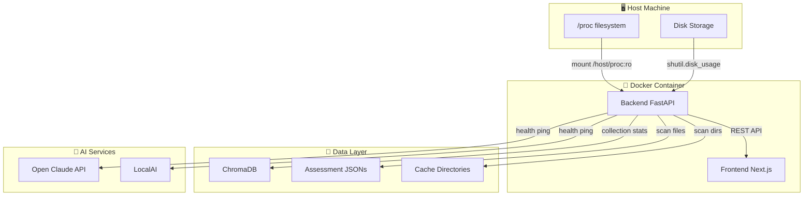
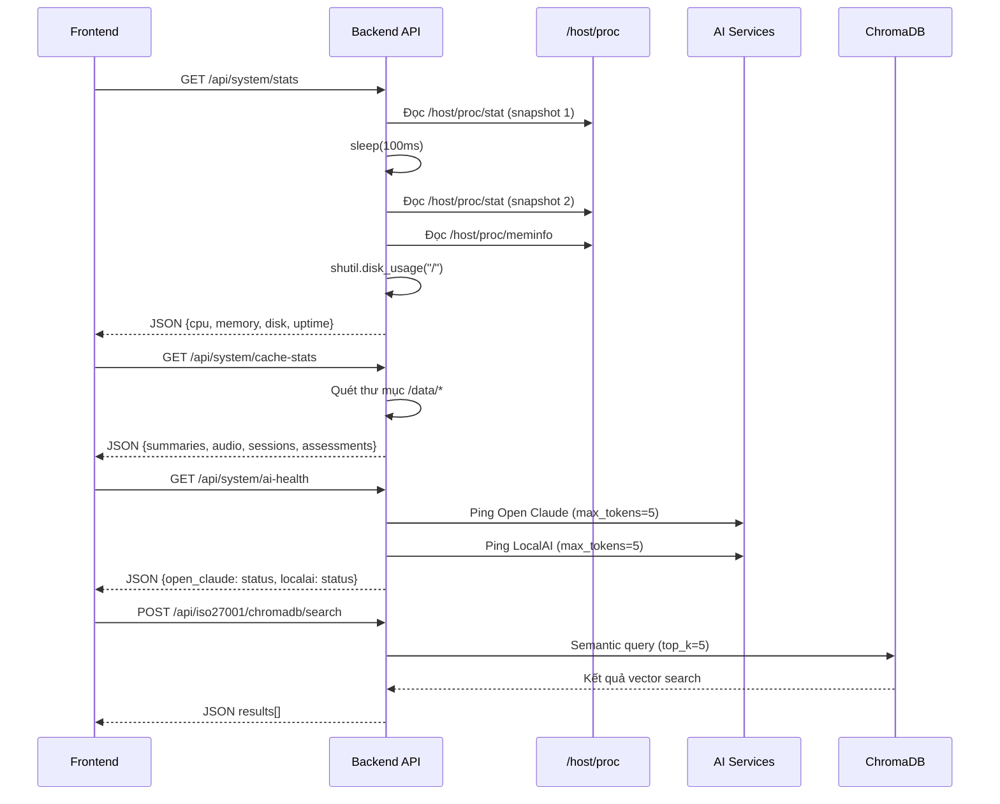
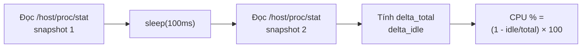
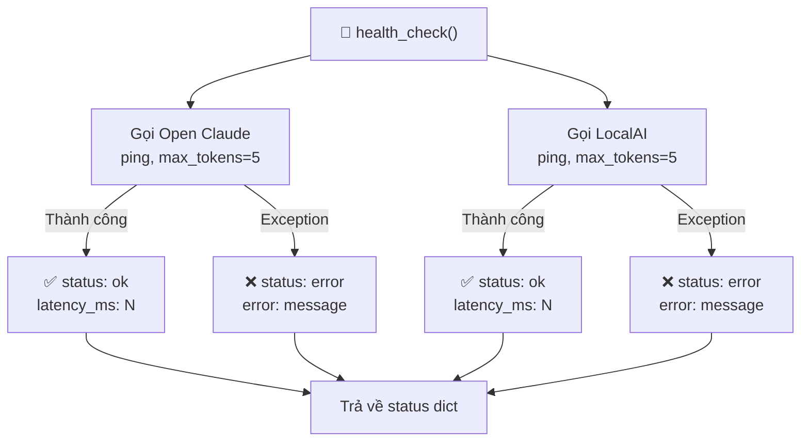
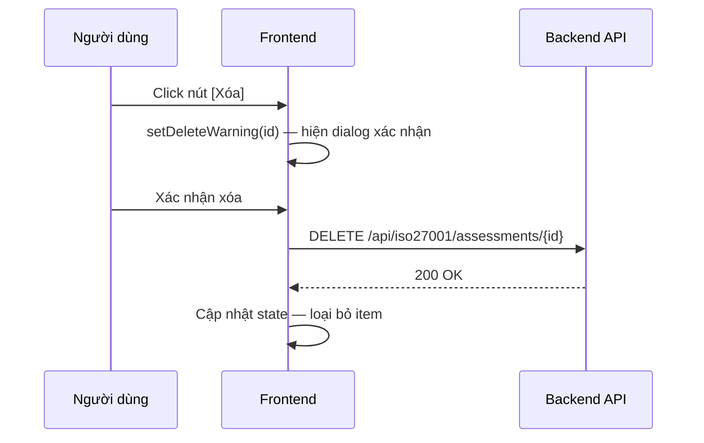
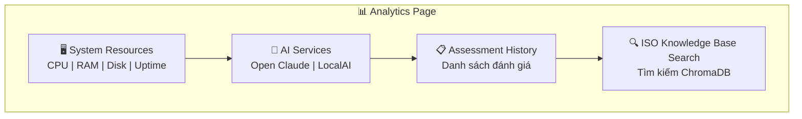
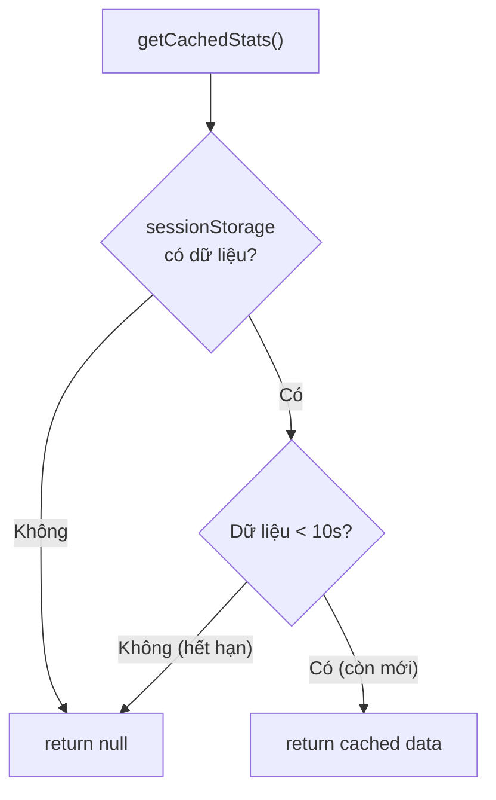

# 📊 Analytics (Phân Tích) & Monitoring (Giám Sát) — Phân Tích Kỹ Thuật Chuyên Sâu

<div align="center">

[](../en/analytics_monitoring.md)
[](analytics_monitoring.md)

</div>

---

## 📑 Mục Lục

1. [Tổng Quan](#-1-tổng-quan)
2. [System Stats (Thống Kê Hệ Thống) — Giám Sát Thời Gian Thực](#-2-system-stats-thống-kê-hệ-thống--giám-sát-thời-gian-thực)
3. [Chi Tiết Tính Toán CPU](#-3-chi-tiết-tính-toán-cpu)
4. [Memory (Bộ Nhớ) & Disk (Đĩa) Stats](#-4-memory-bộ-nhớ--disk-đĩa-stats)
5. [Cache Stats (Thống Kê Bộ Nhớ Đệm)](#-5-cache-stats-thống-kê-bộ-nhớ-đệm)
6. [AI Health Check (Kiểm Tra Sức Khỏe AI)](#-6-ai-health-check-kiểm-tra-sức-khỏe-ai)
7. [Assessment History Dashboard (Bảng Điều Khiển Lịch Sử Đánh Giá)](#-7-assessment-history-dashboard-bảng-điều-khiển-lịch-sử-đánh-giá)
8. [ChromaDB Explorer](#-8-chromadb-explorer)
9. [Frontend — Trang Analytics](#-9-frontend--trang-analytics)
10. [Frontend — Widget SystemStats](#-10-frontend--widget-systemstats)

---

## 🔭 1. Tổng Quan

Module Analytics (Phân Tích) & Monitoring (Giám Sát) cung cấp:

| Tính năng | Nguồn | Mô tả |
|-----------|--------|--------|
| CPU / RAM / Disk / Uptime (Thời gian hoạt động) thời gian thực | `/host/proc/` (filesystem host OS) | Đọc trực tiếp từ procfs của máy host |
| Cache (Bộ nhớ đệm) stats | Kích thước thư mục `/data/` | Quét thư mục đếm file & dung lượng |
| AI model health check (Kiểm tra sức khỏe) | Open Claude + LocalAI ping | Gọi thử API với token nhỏ |
| Lịch sử đánh giá ISO | `/data/assessments/*.json` | Liệt kê & parse JSON đánh giá |
| ChromaDB semantic explorer | ChromaDB collection `iso_documents` | Tìm kiếm ngữ nghĩa vector |

### 🏗️ Kiến Trúc Monitoring Tổng Thể



### 📊 Luồng Dữ Liệu Monitoring



---

## 🖥️ 2. System Stats (Thống Kê Hệ Thống) — Giám Sát Thời Gian Thực

File: [`backend/api/routes/system.py`](../../backend/api/routes/system.py)

### 🏗️ Kiến Trúc

Container backend mount **filesystem `/proc` của host** ở chế độ chỉ đọc (read-only):

```yaml
# docker-compose.yml
volumes:
  - /proc:/host/proc:ro
```

Mọi thống kê hệ thống được đọc trực tiếp từ `/host/proc/*` — báo cáo thống kê **máy host**, không phải container-isolated stats (thống kê cô lập của container).

```python
def read_proc_file(path: str) -> str:
    try:
        with open(path, "r") as f:
            return f.read()
    except Exception:
        return ""
```

### 🔌 Endpoint

```
GET /api/system/stats
```

**Response (Phản hồi):**

```json
{
  "cpu": {
    "percent": 23.5,
    "model": "Intel(R) Core(TM) i7-10700K CPU @ 3.80GHz",
    "cores": 8
  },
  "memory": {
    "total": 16777216000,
    "used":  8234567000,
    "free":  8542649000,
    "percent": 49.1
  },
  "disk": {
    "total": 512110190592,
    "used":  189234561024,
    "free":  322875629568,
    "percent": 36.9
  },
  "uptime": 432000
}
```

### 📋 Bảng Metrics (Chỉ Số)

| Metric (Chỉ số) | Nguồn | Đơn vị | Mô tả |
|------------------|--------|--------|--------|
| `cpu.percent` | `/host/proc/stat` | `%` | Tỷ lệ sử dụng CPU tính bằng delta 2 snapshot |
| `cpu.model` | `/host/proc/cpuinfo` | string | Tên model CPU |
| `cpu.cores` | `/host/proc/cpuinfo` | int | Số lõi CPU |
| `memory.total` | `/host/proc/meminfo` | bytes | Tổng RAM |
| `memory.used` | Tính toán | bytes | `total - free` |
| `memory.free` | `/host/proc/meminfo` → `MemAvailable` | bytes | RAM khả dụng |
| `memory.percent` | Tính toán | `%` | `used / total * 100` |
| `disk.total` | `shutil.disk_usage("/")` | bytes | Tổng dung lượng đĩa |
| `disk.percent` | Tính toán | `%` | `used / total * 100` |
| `uptime` | `/proc/uptime` | seconds | Uptime (Thời gian hoạt động) container |

---

## ⚙️ 3. Chi Tiết Tính Toán CPU

File: [`backend/api/routes/system.py`](../../backend/api/routes/system.py) — [`get_cpu_percent()`](../../backend/api/routes/system.py)

### Phương Pháp: Delta 2 snapshot từ `/host/proc/stat`



```python
def get_cpu_percent():
    def parse_cpu(content):
        line = [l for l in content.split("\n") if l.startswith("cpu ")][0]
        values = list(map(int, line.split()[1:]))
        total = sum(values)
        idle  = values[3]           # Trường thứ 4 = idle jiffies
        return total, idle

    stat1 = read_proc_file("/host/proc/stat")
    time.sleep(0.1)                 # Khoảng thời gian snapshot 100ms
    stat2 = read_proc_file("/host/proc/stat")

    total1, idle1 = parse_cpu(stat1)
    total2, idle2 = parse_cpu(stat2)

    delta_total = total2 - total1
    delta_idle  = idle2  - idle1

    if delta_total == 0:
        return 0.0
    return round((1 - delta_idle / delta_total) * 100, 1)
```

### CPU Model

Đọc từ `/host/proc/cpuinfo`:

```python
def get_cpu_info():
    content = read_proc_file("/host/proc/cpuinfo")
    for line in content.split("\n"):
        if "model name" in line:
            return line.split(":")[1].strip()   # vd: "Intel(R) Core(TM) i7..."
    return platform.processor()
```

---

## 💾 4. Memory (Bộ Nhớ) & Disk (Đĩa) Stats

### 🧠 Memory — `/host/proc/meminfo`

```python
def get_memory_info():
    content = read_proc_file("/host/proc/meminfo")
    data = {}
    for line in content.strip().split("\n"):
        key, val = line.split(":")[0].strip(), line.split(":")[1].strip()
        data[key] = int(val.replace(" kB", "")) * 1024  # kB → bytes

    total = data.get("MemTotal", 0)
    free  = data.get("MemAvailable", 0)
    used  = total - free
    return {
        "total": total,
        "used":  used,
        "free":  free,
        "percent": round(used / total * 100, 1) if total else 0
    }
```

### 💿 Disk — Python `shutil`

```python
def get_disk_info():
    usage = shutil.disk_usage("/")
    return {
        "total":   usage.total,
        "used":    usage.used,
        "free":    usage.free,
        "percent": round(usage.used / usage.total * 100, 1)
    }
```

### ⏱️ Uptime (Thời Gian Hoạt Động) — `/proc/uptime`

```python
def get_uptime():
    content = read_proc_file("/proc/uptime")
    return int(float(content.split()[0]))   # giây
```

> **⚠️ Lưu ý:** Uptime (Thời gian hoạt động) đọc từ `/proc/uptime` (namespace container), **không phải** `/host/proc/uptime`. Do đó giá trị này phản ánh thời gian hoạt động của container, không phải máy host.

---

## 🗄️ 5. Cache Stats (Thống Kê Bộ Nhớ Đệm)

```
GET /api/system/cache-stats
```

**Response (Phản hồi):**

```json
{
  "summaries": {
    "count": 54,
    "size_bytes": 2340000
  },
  "audio": {
    "count": 54,
    "size_bytes": 98000000
  },
  "sessions": {
    "count": 12,
    "size_bytes": 45000
  },
  "assessments": {
    "count": 3,
    "size_bytes": 12000
  }
}
```

### 📋 Bảng Cache Directories

| Thư mục | Key | Mô tả |
|---------|-----|--------|
| `SUMMARIES_DIR` | `summaries` | Tóm tắt đã tạo |
| `AUDIO_DIR` | `audio` | File audio đã tạo |
| `SESSIONS_DIR` | `sessions` | Phiên chat đã lưu |
| `ASSESSMENTS_DIR` | `assessments` | Kết quả đánh giá ISO |

**Triển khai (Implementation):**

```python
def get_dir_size(path: str) -> int:
    total = 0
    for entry in os.scandir(path):
        if entry.is_file():
            total += entry.stat().st_size
    return total

@router.get("/system/cache-stats")
def cache_stats():
    return {
        "summaries":   { "count": len(os.listdir(SUMMARIES_DIR)),
                         "size_bytes": get_dir_size(SUMMARIES_DIR) },
        "audio":       { "count": len(os.listdir(AUDIO_DIR)),
                         "size_bytes": get_dir_size(AUDIO_DIR) },
        "sessions":    { "count": len(os.listdir(SESSIONS_DIR)),
                         "size_bytes": get_dir_size(SESSIONS_DIR) },
        "assessments": { "count": len(os.listdir(ASSESSMENTS_DIR)),
                         "size_bytes": get_dir_size(ASSESSMENTS_DIR) },
    }
```

---

## 🤖 6. AI Health Check (Kiểm Tra Sức Khỏe AI)

File: [`backend/services/cloud_llm_service.py`](../../backend/services/cloud_llm_service.py) — [`health_check()`](../../backend/services/cloud_llm_service.py)

### 🔄 Quy Trình Health Check



<details>
<summary>📝 Mã nguồn đầy đủ <code>health_check()</code></summary>

```python
@classmethod
def health_check(cls) -> Dict[str, Any]:
    status = {
        "open_claude": { "status": "unknown", "latency_ms": None },
        "localai":     { "status": "unknown", "latency_ms": None },
    }

    # Test Open Claude
    try:
        t0 = time.time()
        cls._call_open_claude([{"role":"user","content":"ping"}], max_tokens=5)
        status["open_claude"] = {
            "status": "ok",
            "latency_ms": round((time.time()-t0)*1000)
        }
    except Exception as e:
        status["open_claude"] = {"status": "error", "error": str(e)}

    # Test LocalAI
    try:
        t0 = time.time()
        cls._call_localai(LOCAL_AI_MODEL, [{"role":"user","content":"ping"}], max_tokens=5)
        status["localai"] = {
            "status": "ok",
            "latency_ms": round((time.time()-t0)*1000)
        }
    except Exception as e:
        status["localai"] = {"status": "error", "error": str(e)}

    return status
```

</details>

**Response mẫu (Phản hồi mẫu):**

```json
{
  "open_claude": { "status": "ok",    "latency_ms": 342 },
  "localai":     { "status": "error", "error": "Connection refused" }
}
```

### 🚦 Bảng Trạng Thái Hiển Thị

| Status | Màu sắc | Icon | Ý nghĩa |
|--------|---------|------|----------|
| `ok` | 🟢 Xanh lá | ✅ | Service hoạt động bình thường |
| `error` | 🔴 Đỏ | ❌ | Service lỗi hoặc không khả dụng |
| `unknown` | 🟡 Vàng | ⚠️ | Chưa kiểm tra |

Dashboard (Bảng điều khiển) analytics hiển thị các chỉ báo trạng thái bằng màu sắc (xanh/đỏ) tương ứng.

---

## 📋 7. Assessment History Dashboard (Bảng Điều Khiển Lịch Sử Đánh Giá)

File: [`frontend-next/src/app/analytics/page.js`](../../frontend-next/src/app/analytics/page.js)

### 📥 Load Dữ Liệu

```js
useEffect(() => {
  async function fetchData() {
    // Load lịch sử đánh giá
    const histRes = await fetch('/api/iso27001/assessments')
    const histData = await histRes.json()
    setHistory(histData)

    // Load sức khỏe dịch vụ AI
    const svcRes = await fetch('/api/system/stats')
    const svcData = await svcRes.json()
    setServices({ cpu: svcData.cpu, memory: svcData.memory, ... })
  }
  fetchData()
}, [])
```

### 📄 Danh Sách Đánh Giá

Hiển thị tất cả đánh giá từ `/data/assessments/` dưới dạng thẻ (cards):

```
┌──────────────────────────────────────────────────────────┐
│  ACME Corp (Tài chính)                     ✅ done        │
│  Tiêu chuẩn: ISO 27001:2022               24/03/2025     │
│  Controls: A.5.1, A.9.1, A.9.2                          │
│  [Xem chi tiết] [Tái sử dụng] [Xóa]                    │
└──────────────────────────────────────────────────────────┘
```

### 🗑️ Xóa Có Xác Nhận



```js
const checkDeleteWarning = (id, e) => {
  e.stopPropagation()
  setDeleteWarning(id)      // hiện dialog xác nhận
}

const executeDelete = async (id) => {
  await fetch(`/api/iso27001/assessments/${id}`, { method: 'DELETE' })
  setHistory(prev => prev.filter(h => h.id !== id))
  setDeleteWarning(null)
}
```

---

## 🔍 8. ChromaDB Explorer

Trang analytics bao gồm giao diện tìm kiếm ngữ nghĩa (semantic search) cho cơ sở kiến thức ISO.

### 🔎 UI Tìm Kiếm

```
┌──────────────────────────────────────────────┐
│  Tìm kiếm Cơ Sở Kiến Thức ISO               │
│  [chính sách kiểm soát truy cập    ] [Tìm]  │
└──────────────────────────────────────────────┘
```

### 🌐 Gọi API

```js
const res = await fetch('/api/iso27001/chromadb/search', {
  method: 'POST',
  headers: { 'Content-Type': 'application/json' },
  body: JSON.stringify({ query: searchQuery, top_k: 5 })
})
const data = await res.json()
```

### 📊 Hiển Thị Kết Quả

Mỗi kết quả hiển thị:

```
Distance: 0.12  |  Source: iso27001_annex_a.md
──────────────────────────────────────────────────────
[Context: # ISO 27001 > ## Annex A > ### A.9]
A.9.1.1 Chính sách kiểm soát truy cập — Cần thiết lập
chính sách kiểm soát truy cập, được lập tài liệu...
```

### 📈 Hiển Thị Thống Kê Collection

```
ChromaDB Status (Trạng thái)
━━━━━━━━━━━━━━━━━━━━━━━━━━━━━━
Collection:    iso_documents
Documents:     312 chunks
Persist dir:   /data/vector_store
Distance:      cosine
```

### 📋 Bảng Cấu Hình ChromaDB

| Thuộc tính | Giá trị | Mô tả |
|-----------|---------|--------|
| Collection name | `iso_documents` | Tên collection vector store |
| Persist directory | `/data/vector_store` | Thư mục lưu trữ persistent |
| Distance metric | `cosine` | Hàm khoảng cách cho semantic search |
| Embedding model | Sentence Transformers | Model tạo vector embedding |

---

## 🖼️ 9. Frontend — Trang Analytics

File: [`frontend-next/src/app/analytics/page.js`](../../frontend-next/src/app/analytics/page.js)

### 📐 Bố Cục Trang (Page Layout)



### Các Phần Trang

```
┌──────────────────────────────────────────────────────────┐
│  🖥️ Tài Nguyên Hệ Thống                                 │
│  [CPU: 23%] [RAM: 49%] [Disk: 37%] [Uptime: 5n 2g]      │
├──────────────────────────────────────────────────────────┤
│  🤖 Dịch Vụ AI                                           │
│  [Open Claude: ✅ 342ms] [LocalAI: ❌ offline]            │
├──────────────────────────────────────────────────────────┤
│  📋 Lịch Sử Đánh Giá              [3 đánh giá]           │
│  ┌──────────────────────────────────────────────────┐    │
│  │ ACME Corp — ISO 27001:2022 — done — 24/03        │    │
│  │ Test Corp — TCVN 14423    — done — 23/03         │    │
│  └──────────────────────────────────────────────────┘    │
├──────────────────────────────────────────────────────────┤
│  🔍 Tìm Kiếm Cơ Sở Kiến Thức ISO                        │
│  [ô nhập query] [Tìm]                                    │
│  Kết quả: 5 kết quả ngữ nghĩa                            │
└──────────────────────────────────────────────────────────┘
```

---

## 🧩 10. Frontend — Widget SystemStats

File: [`frontend-next/src/components/SystemStats.js`](../../frontend-next/src/components/SystemStats.js)

Widget có thể tái sử dụng, nhúng vào bất kỳ trang nào. Cache (Bộ nhớ đệm) thống kê 10 giây để tránh polling quá mức.

### 🔄 Logic Cache



```js
function getCachedStats() {
  try {
    const s = sessionStorage.getItem("sys_stats")
    if (!s) return null
    const { data, ts } = JSON.parse(s)
    if (Date.now() - ts < 10000) return data    // cache 10s
    return null
  } catch { return null }
}
```

### 📊 Metric Items (Các Chỉ Số)

```js
const items = [
  { label: "CPU",    value: `${stats.cpu?.percent}%`,   color: getColor(stats.cpu?.percent) },
  { label: "RAM",    value: `${stats.memory?.percent}%`,color: getColor(stats.memory?.percent) },
  { label: "Disk",   value: `${stats.disk?.percent}%`,  color: getColor(stats.disk?.percent) },
  { label: "Uptime", value: formatUptime(stats.uptime),  color: "var(--accent-blue)" },
]
```

### 🚦 Color Thresholds (Ngưỡng Màu Sắc)

| Ngưỡng | Màu | CSS Variable | Ý nghĩa |
|--------|-----|--------------|----------|
| `< 50%` | 🟢 Xanh lá | `var(--accent-green)` | Healthy (Bình thường) |
| `50% – 80%` | 🟡 Vàng | `var(--accent-yellow)` | Warning (Cảnh báo) |
| `≥ 80%` | 🔴 Đỏ | `var(--accent-red)` | Critical (Nghiêm trọng) |

```js
const getColor = (percent, thresholds = [50, 80]) => {
  if (percent < thresholds[0]) return "var(--accent-green)"   // bình thường
  if (percent < thresholds[1]) return "var(--accent-yellow)"  // cảnh báo
  return "var(--accent-red)"                                   // nghiêm trọng
}
```

### 🔧 Formatting Helpers (Hàm Định Dạng)

```js
const formatBytes = (bytes) => {
  if (bytes > 1e9) return `${(bytes/1e9).toFixed(1)} GB`
  if (bytes > 1e6) return `${(bytes/1e6).toFixed(1)} MB`
  return `${(bytes/1e3).toFixed(0)} KB`
}

const formatUptime = (seconds) => {
  const d = Math.floor(seconds / 86400)
  const h = Math.floor((seconds % 86400) / 3600)
  const m = Math.floor((seconds % 3600) / 60)
  if (d > 0) return `${d}n ${h}g`    // n = ngày, g = giờ
  if (h > 0) return `${h}g ${m}p`    // p = phút
  return `${m}p`
}
```

---

## 📝 Tổng Kết API Endpoints

| Endpoint | Method | Mô tả | Response chính |
|----------|--------|--------|----------------|
| `/api/system/stats` | `GET` | Thống kê CPU, RAM, Disk, Uptime | `{cpu, memory, disk, uptime}` |
| `/api/system/cache-stats` | `GET` | Kích thước các thư mục cache | `{summaries, audio, sessions, assessments}` |
| `/api/system/ai-health` | `GET` | Kiểm tra sức khỏe AI services | `{open_claude, localai}` |
| `/api/iso27001/assessments` | `GET` | Lịch sử đánh giá | `Assessment[]` |
| `/api/iso27001/assessments/{id}` | `DELETE` | Xóa đánh giá | `200 OK` |
| `/api/iso27001/chromadb/search` | `POST` | Tìm kiếm ngữ nghĩa | `{results[]}` |

---

> 📌 **Tài liệu liên quan:** [`architecture.md`](architecture.md) · [`api.md`](api.md) · [`chatbot_rag.md`](chatbot_rag.md) · [`chromadb_guide.md`](chromadb_guide.md) · [`deployment.md`](deployment.md)
