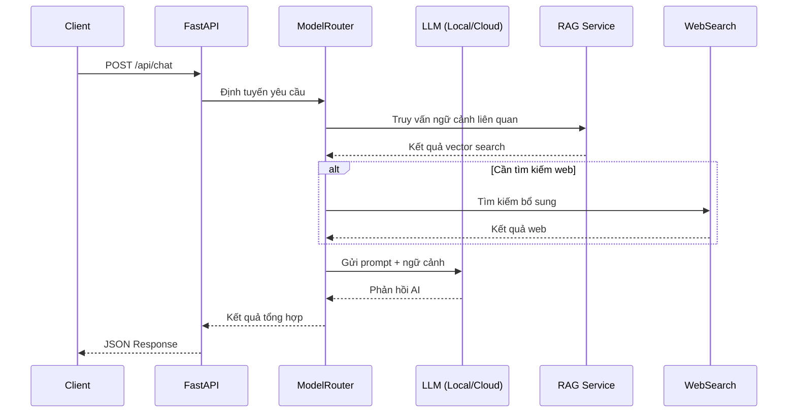
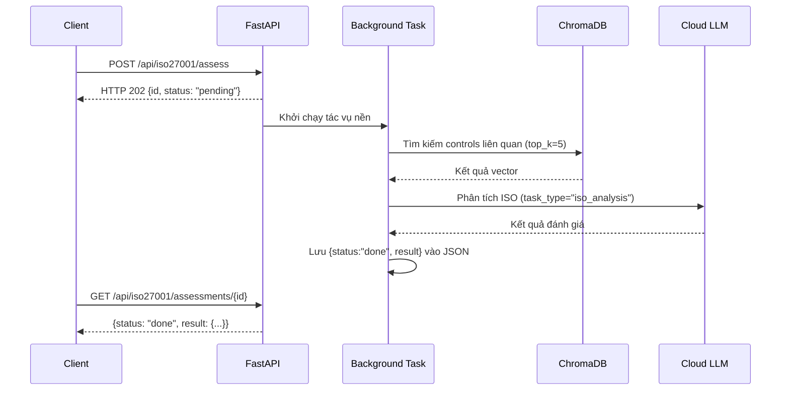
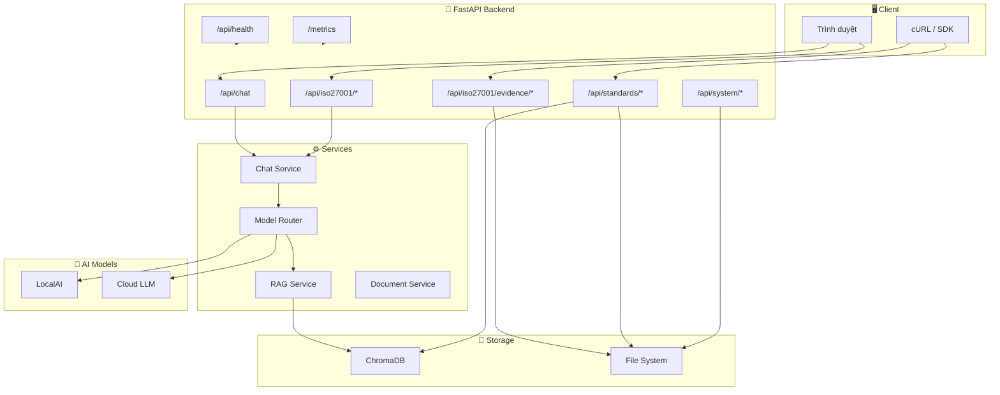

# 📡 CyberAI Platform — Tài Liệu Tham Chiếu API

<div align="center">

[](../en/api.md)
[](api.md)

</div>

> Tất cả các Endpoint (Điểm cuối API) đều có sẵn tại cả **`/api/v1/...`** (có phiên bản) và **`/api/...`** (tương thích ngược legacy).

**Base URL:** `http://localhost:8000` (mặc định cho môi trường phát triển)

---

## 📑 Mục Lục

- [1. 💬 Endpoint Chat](#1--endpoint-chat)
- [2. 🛡️ Endpoint Đánh Giá ISO 27001](#2-️-endpoint-đánh-giá-iso-27001)
- [3. 📎 Endpoint Bằng Chứng (Evidence)](#3--endpoint-bằng-chứng-evidence)
- [4. 📚 Endpoint Tiêu Chuẩn (Standards)](#4--endpoint-tiêu-chuẩn-standards)
- [5. 📄 Endpoint Tài Liệu (Documents)](#5--endpoint-tài-liệu-documents)
- [6. 🖥️ Endpoint Hệ Thống (System)](#6-️-endpoint-hệ-thống-system)
- [7. 🩺 Endpoint Kiểm Tra Sức Khỏe (Health)](#7--endpoint-kiểm-tra-sức-khỏe-health)
- [8. 📊 Metrics (Số liệu giám sát)](#8--metrics-số-liệu-giám-sát)
- [9. 🧪 Endpoint Benchmark & Dataset](#9--endpoint-benchmark--dataset)
- [10. ⚠️ Xử Lý Lỗi (Error Handling)](#10-️-xử-lý-lỗi-error-handling)
- [11. 🚀 Ví Dụ Sử Dụng (Examples)](#11--ví-dụ-sử-dụng-examples)

---

## 1. 💬 Endpoint Chat

| Method | Path | Mô tả | Rate Limiting (Giới hạn tốc độ) |
|--------|------|--------|----------------------------------|
| POST | `/api/chat` | Gửi tin nhắn, nhận phản hồi | 10/phút |
| POST | `/api/chat/stream` | Phản hồi Streaming (Truyền trực tuyến) qua SSE | 10/phút |
| GET | `/api/chat/history/{session_id}` | Lấy lịch sử hội thoại | — |
| DELETE | `/api/chat/history/{session_id}` | Xóa lịch sử session | — |
| GET | `/api/chat/health` | Kiểm tra sức khỏe dịch vụ Chat + trạng thái ModelGuard | — |

### 📥 Request Body (Dữ liệu yêu cầu)

Được định nghĩa tại [`ChatRequest`](../../backend/api/schemas/chat.py):

```json
{
  "message": "string (bắt buộc)",
  "session_id": "string (tùy chọn, tự tạo uuid4)",
  "model": "string (tùy chọn, mặc định từ biến môi trường MODEL_NAME)",
  "mode": "string (tùy chọn: 'local' | 'cloud' | 'hybrid')"
}
```

### 📤 Các Trường Response (Phản hồi)

| Trường | Kiểu | Mô tả |
|--------|------|--------|
| `response` | string | Câu trả lời do LLM tạo ra |
| `session_id` | string | Định danh session (sử dụng lại để duy trì hội thoại) |
| `model_used` | string | Model thực tế đã phục vụ yêu cầu |
| `source` | string | `"local"` hoặc `"cloud"` |
| `rag_used` | bool | Ngữ cảnh RAG có được đưa vào hay không |
| `search_used` | bool | Tìm kiếm web có được kích hoạt hay không |
| `processing_time` | float | Độ trễ end-to-end tính bằng giây |

### 🌊 Định Dạng SSE Stream (Truyền trực tuyến)

`POST /api/chat/stream` trả về `text/event-stream`:

```
data: {"token": "The ", "done": false}
data: {"token": "answer ", "done": false}
data: {"token": "is...", "done": false}
data: {"token": "", "done": true, "metadata": {"model_used": "...", "source": "local", "rag_used": true, "search_used": false, "processing_time": 1.23}}
```

<details>
<summary>📊 Sơ đồ luồng Request/Response (Yêu cầu/Phản hồi) Chat</summary>



</details>

---

## 2. 🛡️ Endpoint Đánh Giá ISO 27001

| Method | Path | Mô tả |
|--------|------|--------|
| POST | `/api/iso27001/assess` | Gửi đánh giá (background task - tác vụ nền) |
| GET | `/api/iso27001/assessments` | Liệt kê tất cả đánh giá (có phân trang) |
| GET | `/api/iso27001/assessments/{id}` | Lấy đánh giá theo ID |
| DELETE | `/api/iso27001/assessments/{id}` | Xóa đánh giá |
| POST | `/api/iso27001/reindex` | Tái lập chỉ mục tất cả tài liệu ISO vào collection mặc định |
| POST | `/api/iso27001/reindex-domains` | Tái lập chỉ mục các domain collection theo từng tiêu chuẩn |
| GET | `/api/iso27001/chromadb/stats` | Thống kê ChromaDB (tất cả domain collection) |
| POST | `/api/iso27001/chromadb/search` | Tìm kiếm ChromaDB `{query, top_k}` |
| POST | `/api/iso27001/assessments/{id}/export-pdf` | Xuất PDF (weasyprint) hoặc HTML dự phòng |

### 📄 Phân Trang — Danh Sách Đánh Giá

```
GET /api/iso27001/assessments?page=1&page_size=50&flat=false
```

| Tham số | Mặc định | Mô tả |
|---------|----------|--------|
| `page` | 1 | Số trang |
| `page_size` | 50 | Số kết quả mỗi trang |
| `flat` | false | Làm phẳng cấu trúc lồng nhau |

<details>
<summary>📊 Sơ đồ luồng đánh giá ISO 27001</summary>



</details>

---

## 3. 📎 Endpoint Bằng Chứng (Evidence)

| Method | Path | Mô tả |
|--------|------|--------|
| POST | `/api/iso27001/evidence/{control_id}` | Tải lên file bằng chứng (tối đa 10 MB) |
| GET | `/api/iso27001/evidence/{control_id}` | Liệt kê file bằng chứng cho control |
| GET | `/api/iso27001/evidence/{control_id}/{filename}` | Tải xuống file bằng chứng |
| DELETE | `/api/iso27001/evidence/{control_id}/{filename}` | Xóa file bằng chứng |
| GET | `/api/iso27001/evidence/{control_id}/{filename}/preview` | Xem trước nội dung bằng chứng |
| GET | `/api/iso27001/evidence-summary` | Tóm tắt tất cả bằng chứng trên các controls |

### 📋 Loại File Được Phép

`PDF`, `PNG`, `JPG`, `DOC`, `DOCX`, `XLSX`, `CSV`, `TXT`, `LOG`, `CONF`, `XML`, `JSON`

---

## 4. 📚 Endpoint Tiêu Chuẩn (Standards)

| Method | Path | Mô tả |
|--------|------|--------|
| GET | `/api/standards` | Liệt kê tất cả tiêu chuẩn (tích hợp sẵn + tùy chỉnh) |
| GET | `/api/standards/sample` | Tải mẫu JSON template tiêu chuẩn |
| GET | `/api/standards/{id}` | Chi tiết tiêu chuẩn (tương thích frontend) |
| POST | `/api/standards/upload` | Tải lên tiêu chuẩn JSON/YAML (tối đa 2 MB) |
| POST | `/api/standards/validate` | Xác thực file mà không lưu |
| POST | `/api/standards/{id}/index` | Tái lập chỉ mục tiêu chuẩn vào ChromaDB |
| DELETE | `/api/standards/{id}` | Xóa tiêu chuẩn tùy chỉnh |

---

## 5. 📄 Endpoint Tài Liệu (Documents)

| Method | Path | Mô tả |
|--------|------|--------|
| POST | `/api/documents/upload` | Tải lên tài liệu để xử lý |

---

## 6. 🖥️ Endpoint Hệ Thống (System)

| Method | Path | Mô tả |
|--------|------|--------|
| GET | `/api/system/stats` | CPU, bộ nhớ, đĩa, thời gian hoạt động (psutil) |
| GET | `/api/system/cache-stats` | Kích thước thư mục sessions + exports |
| GET | `/api/system/ai-status` | Sức khỏe LocalAI/Cloud, nhãn chế độ, trạng thái ModelGuard |
| GET | `/api/models` | Liệt kê tất cả model khả dụng (tích hợp sẵn + models.json) |

---

## 7. 🩺 Endpoint Kiểm Tra Sức Khỏe (Health)

| Method | Path | Mô tả |
|--------|------|--------|
| GET | `/api/health` | `{"status": "healthy"}` |
| GET | `/health` | Health check ở root (giống trên) |
| GET | `/` | Thông tin dịch vụ + phiên bản |

---

## 8. 📊 Metrics (Số liệu giám sát)

| Method | Path | Mô tả |
|--------|------|--------|
| GET | `/metrics` | Định dạng Prometheus text (mount tại root, không phải `/api/`) |

### Prometheus Metrics

| Metric | Kiểu | Mô tả |
|--------|------|--------|
| `cyberai_requests_total` | Counter | Tổng số HTTP request |
| `cyberai_request_duration_seconds` | Histogram | Phân phối độ trễ request |
| `cyberai_active_sessions` | Gauge | Số session chat đang hoạt động |
| `cyberai_rag_queries_total` | Counter | Tổng số truy vấn RAG đã thực thi |
| `cyberai_assessments_total` | Gauge | Tổng số đánh giá đã lưu trữ |

---

## 9. 🧪 Endpoint Benchmark & Dataset

| Method | Path | Mô tả |
|--------|------|--------|
| GET | `/api/benchmark/test-cases` | Liệt kê các test case benchmark |
| POST | `/api/benchmark/run` | Chạy benchmark (so sánh các chế độ) |
| GET | `/api/benchmark/scoring-guide` | Tài liệu tiêu chí chấm điểm |
| POST | `/api/dataset/generate` | Kích hoạt tạo dataset fine-tuning (chạy nền) |
| GET | `/api/dataset/status` | Kiểm tra trạng thái tạo dataset |

---

## 10. ⚠️ Xử Lý Lỗi (Error Handling)

Tất cả phản hồi lỗi trả về JSON với trường `request_id` để theo dõi (tracing).

| Nguồn | Hành vi |
|-------|---------|
| `AppException` | Phản hồi JSON đã được làm sạch (sanitized) |
| `HTTPException` | Phản hồi JSON đã được làm sạch (sanitized) |
| Exception chưa xử lý | HTTP 500 kèm `request_id` (stack trace chỉ hiển thị phía server) |
| 404 Not Found | Handler JSON tùy chỉnh |

### Cấu Trúc Phản Hồi Lỗi

```json
{
  "error": "Thông báo dễ đọc cho người dùng",
  "request_id": "uuid4",
  "status_code": 400
}
```

### Bảng Mã HTTP Status

| HTTP Code | Ý nghĩa | Mô tả |
|-----------|----------|--------|
| `200` | OK | Request (Yêu cầu) thành công |
| `202` | Accepted | Đã chấp nhận, đang xử lý nền |
| `400` | Bad Request | Payload (Dữ liệu tải) không hợp lệ |
| `404` | Not Found | Tài nguyên không tìm thấy |
| `422` | Unprocessable Entity | Lỗi validation (Pydantic) |
| `429` | Too Many Requests | Vượt quá Rate Limiting (Giới hạn tốc độ) |
| `500` | Internal Server Error | Lỗi server nội bộ |

---

## 11. 🚀 Ví Dụ Sử Dụng (Examples)

### 💬 Gửi Tin Nhắn Chat

```bash
curl -X POST http://localhost:8000/api/chat \
  -H "Content-Type: application/json" \
  -d '{
    "message": "What are the key controls in ISO 27001 Annex A.5?",
    "mode": "hybrid"
  }'
```

<details>
<summary>📤 Ví dụ Response (Phản hồi)</summary>

```json
{
  "response": "ISO 27001 Annex A.5 bao gồm các kiểm soát chính...",
  "session_id": "a1b2c3d4-e5f6-7890-abcd-ef1234567890",
  "model_used": "gemini-2.5-pro",
  "source": "cloud",
  "rag_used": true,
  "search_used": false,
  "processing_time": 2.34
}
```

</details>

### 🛡️ Gửi Đánh Giá ISO 27001

```bash
curl -X POST http://localhost:8000/api/iso27001/assess \
  -H "Content-Type: application/json" \
  -d '{
    "organization_name": "ACME Corp",
    "standard_id": "iso27001",
    "scope": "full",
    "controls": {"A.5.1": true, "A.5.2": false},
    "ai_mode": "hybrid"
  }'
```

<details>
<summary>📤 Ví dụ Response (Phản hồi)</summary>

```json
{
  "id": "7e0b008d-34d9-4c5b-bf9a-f3de2d53658e",
  "status": "pending"
}
```

Sau khi hoàn thành (polling qua `GET /api/iso27001/assessments/{id}`):

```json
{
  "id": "7e0b008d-34d9-4c5b-bf9a-f3de2d53658e",
  "status": "done",
  "result": {
    "overall_score": 62,
    "compliance_level": "Partial",
    "gaps": ["Chưa có quy trình quản lý vá lỗi", "Chưa có kế hoạch ứng phó sự cố"],
    "recommendations": ["Triển khai quản lý vá lỗi tự động...", "..."]
  }
}
```

</details>

### 📎 Tải Lên Bằng Chứng Cho Control

```bash
curl -X POST http://localhost:8000/api/iso27001/evidence/A.5.1 \
  -F "file=@./firewall_policy.pdf"
```

<details>
<summary>📊 Sơ đồ tổng quan luồng API</summary>



</details>

---

> 📖 **Xem thêm:** [Kiến trúc hệ thống](architecture.md) · [Hướng dẫn triển khai](deployment.md) · [ChromaDB Guide](chromadb_guide.md) · [Benchmark](benchmark.md)
