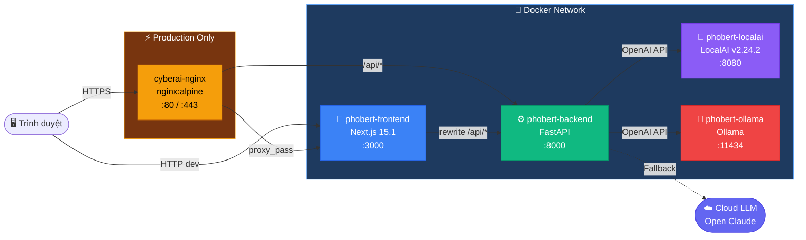
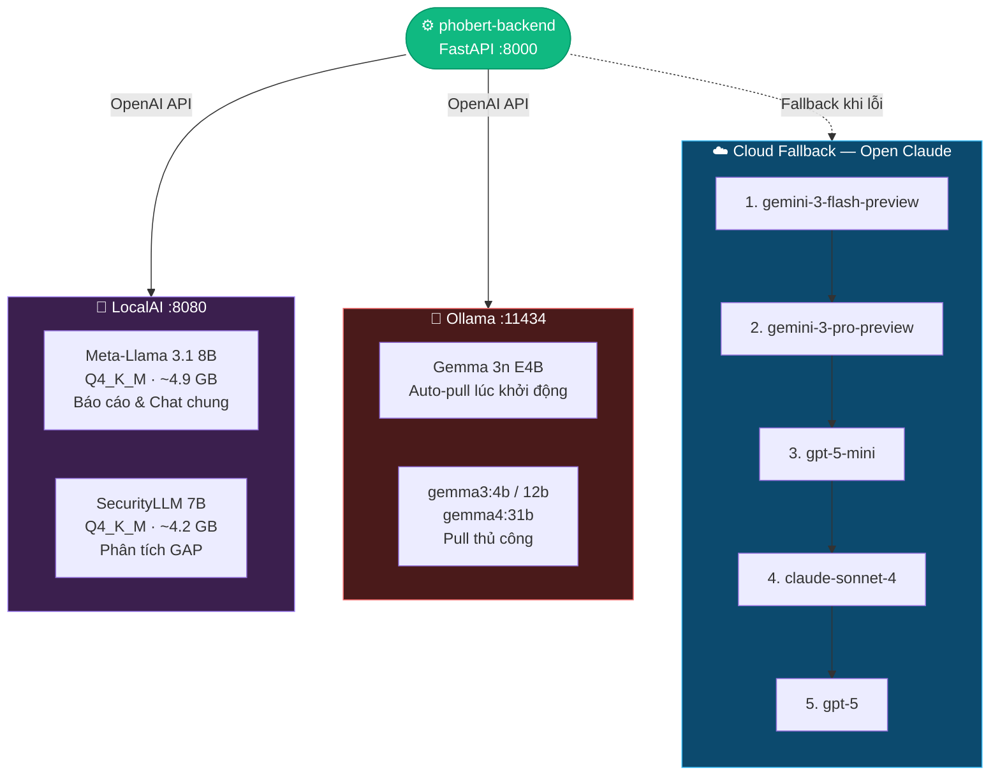
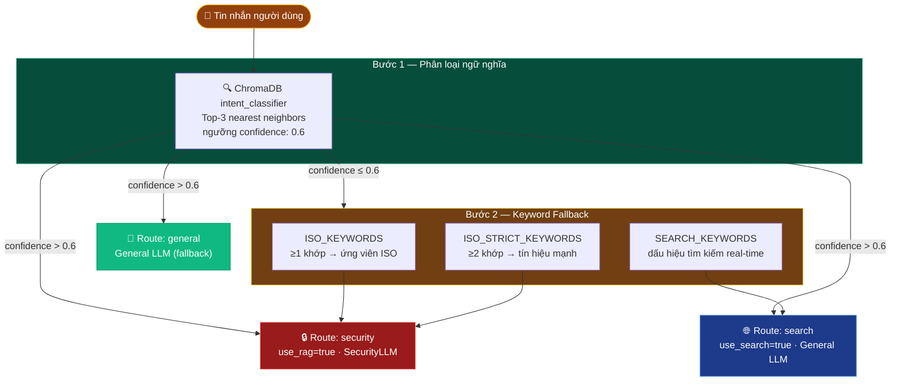
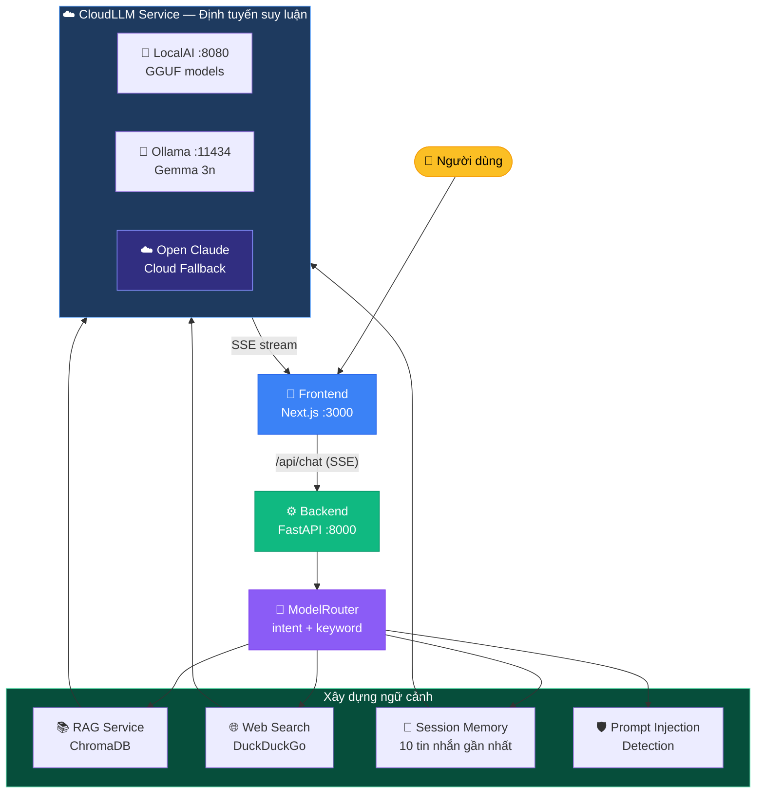
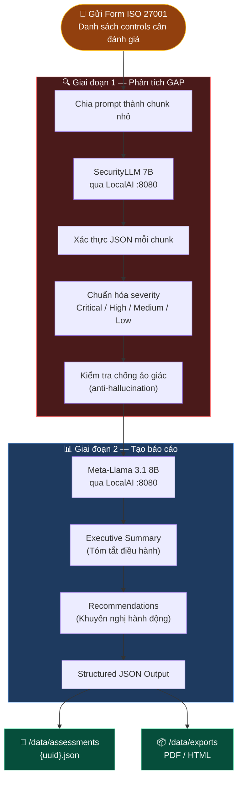
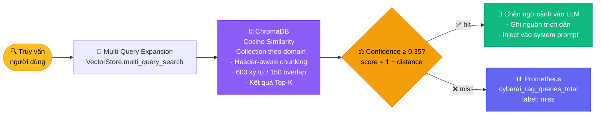
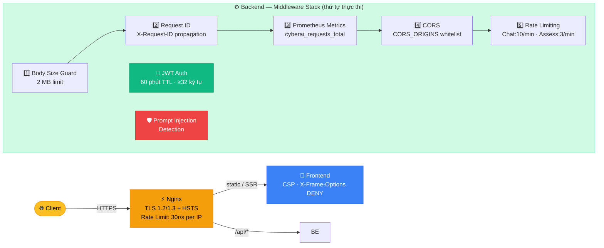

# 🏗️ CyberAI Assessment Platform — Kiến Trúc Hệ Thống

<div align="center">

[](../en/architecture.md)
[](architecture.md)

</div>

---

## 📑 Mục Lục

1. [Tổng Quan](#1--tổng-quan)
2. [Kiến Trúc Container (Vùng chứa)](#2--kiến-trúc-container-vùng-chứa)
3. [Kiến Trúc Dual Local Inference (Suy luận cục bộ kép)](#3--kiến-trúc-dual-local-inference-suy-luận-cục-bộ-kép)
4. [Luồng Định Tuyến Model (Model Routing)](#4--luồng-định-tuyến-model-model-routing)
5. [Kiến Trúc Backend](#5--kiến-trúc-backend)
6. [Kiến Trúc Frontend](#6--kiến-trúc-frontend)
7. [Sơ Đồ Luồng Dữ Liệu (Data Flow)](#7--sơ-đồ-luồng-dữ-liệu-data-flow)
8. [Lưu Trữ Dữ Liệu (Data Storage)](#8--lưu-trữ-dữ-liệu-data-storage)
9. [Kiến Trúc Bảo Mật (Security Architecture)](#9--kiến-trúc-bảo-mật-security-architecture)
10. [Prometheus Metrics (Chỉ số giám sát)](#10--prometheus-metrics-chỉ-số-giám-sát)

---

## 1. 🔭 Tổng Quan

CyberAI Assessment Platform là hệ thống đánh giá an ninh mạng hỗ trợ bởi AI, được xây dựng trên **kiến trúc Docker 4 Container (Vùng chứa)** (5 trong môi trường production). Nền tảng cung cấp chatbot tuân thủ ISO 27001, phân tích GAP, tạo báo cáo tự động và đánh giá đa tiêu chuẩn thông qua hai công cụ suy luận cục bộ (LocalAI + Ollama) với Cloud LLM Fallback (Dự phòng đám mây).

> 💡 **Tóm tắt cho người mới:** Hãy nghĩ CyberAI Platform như một **chuyên gia tư vấn bảo mật ảo** chạy trên Docker. Nó có:
> - **Frontend** (giao diện người dùng) = Tòa nhà tiếp khách
> - **Backend** (xử lý logic) = Văn phòng điều hành
> - **LocalAI + Ollama** (2 bộ não AI) = Hai chuyên gia tư vấn nội bộ
> - **Cloud LLM** (AI trên mây) = Chuyên gia bên ngoài, chỉ gọi khi cả hai chuyên gia nội bộ bận/trục trặc

**Khả năng cốt lõi:**
- 🤖 Chat hỗ trợ AI với RAG (Retrieval-Augmented Generation — Tạo sinh tăng cường truy xuất) trên 21+ tài liệu kiến thức bảo mật
- 📊 Phân tích GAP tự động và báo cáo đánh giá có cấu trúc
- 📋 Hỗ trợ đa tiêu chuẩn (ISO 27001, NIST CSF, PCI DSS, GDPR, SOC 2, quy định Việt Nam)
- 🔄 Suy luận Hybrid (Kết hợp) cục bộ/đám mây với định tuyến model thông minh
- 📈 Khả năng quan sát Prometheus và ghi log có cấu trúc

---

## 2. 🐳 Kiến Trúc Container (Vùng chứa)

### Sơ đồ topo hệ thống



### Bảng cấu hình Container (Vùng chứa)

| Container (Vùng chứa) | Image | Port | Giới hạn bộ nhớ | Bộ nhớ dự trữ | Health Check (Kiểm tra sức khỏe) |
|-----------|-------|------|-------------|-----------------|-------------|
| `phobert-backend` | Python 3.10-slim (FastAPI) | 8000 | 6 GB | 2 GB | `curl -f http://localhost:8000/health` mỗi 30s |
| `phobert-frontend` | Node 20-alpine (Next.js 15.1) | 3000 | 2 GB (dev) / 1 GB (prod) | — | không có |
| `phobert-localai` | `localai/localai:v2.24.2` | 8080 | 12 GB (dev) / 16 GB (prod) | 4 GB (dev) / 8 GB (prod) | `curl -f http://localhost:8080/readyz` mỗi 30s, start\_period 120s |
| `phobert-ollama` | `ollama/ollama:latest` | 11434 | 12 GB | 2 GB | `curl -sf http://localhost:11434/api/tags` mỗi 30s |
| `cyberai-nginx` *(chỉ prod)* | `nginx:alpine` | 80, 443 | — | — | — |

**Network (Mạng):**
- Development: [`phobert-network`](../../docker-compose.yml:156) (bridge driver)
- Production: [`cyberai-network`](../../docker-compose.prod.yml:129) (bridge driver)

**Volumes (Ổ đĩa):**
- Development: bind mount cho hot reload (`./backend:/app`, `./frontend-next/src:/app/src`, v.v.)
- Production: named volume `cyberai-data` cho `/data`, `ollama_data` cho lưu trữ model Ollama

---

## 3. 🧠 Kiến Trúc Dual Local Inference (Suy luận cục bộ kép)

Nền tảng chạy **hai công cụ suy luận cục bộ độc lập** để tối đa hóa tương thích model và tránh Single-Point-of-Failure (Điểm hỏng đơn lẻ):



### LocalAI (port 8080)

API tương thích OpenAI phục vụ các file model GGUF từ [`models/llm/weights/`](../../models/llm/weights):

| Model | Quant | Kích thước | Vai trò |
|-------|-------|------|------|
| Meta-Llama 3.1 8B Instruct | Q4\_K\_M | ~4.9 GB | Định dạng báo cáo, chat chung |
| SecurityLLM 7B | Q4\_K\_M | ~4.2 GB | Phân tích GAP, kiểm toán bảo mật |

Cấu hình: [`THREADS`](../../.env.example:16)=6, [`CONTEXT_SIZE`](../../.env.example:17)=8192, `PARALLEL_REQUESTS=false`, `MMAP=true`.

### Ollama (port 11434)

API tương thích OpenAI với tự động pull model khi khởi động:

| Model | Phương thức pull |
|-------|-------------|
| Gemma 3n E4B | Auto-pull qua [entrypoint](../../docker-compose.yml:127): `ollama pull gemma3n:e4b` |
| gemma3:4b, gemma3:12b, gemma4:31b | Tùy chọn — pull thủ công hoặc qua script download |

Entrypoint của Ollama khởi động `ollama serve`, chờ 5 giây, sau đó pull `gemma3n:e4b` trước khi vào trạng thái sẵn sàng.

### Cloud Fallback (Dự phòng đám mây)

Cổng API Open Claude tại `https://open-claude.com/v1`:

**Fallback Chain (Chuỗi dự phòng)** (định nghĩa trong [`FALLBACK_CHAIN`](../../backend/services/cloud_llm_service.py:22)):
1. `gemini-3-flash-preview`
2. `gemini-3-pro-preview`
3. `gpt-5-mini`
4. `claude-sonnet-4`
5. `gpt-5`

**Key Rotation (Xoay vòng khóa):** Round-robin qua các [`CLOUD_API_KEYS`](../../.env.example:22) phân cách bằng dấu phẩy, với thời gian làm nguội 30 giây cho mỗi khóa khi nhận phản hồi HTTP 429 Rate Limiting (Giới hạn tốc độ).

---

## 4. 🔀 Luồng Định Tuyến Model (Model Routing)

[`ModelRouter`](../../backend/services/model_router.py:173) sử dụng **phân loại intent hybrid** — ngữ nghĩa trước, keyword fallback sau:

### Sơ đồ luồng định tuyến



### Bước 1: Phân loại ngữ nghĩa (Semantic Classification)

Collection ChromaDB in-memory [`intent_classifier`](../../backend/services/model_router.py:127) được khởi tạo với các template intent song ngữ (Tiếng Việt + Tiếng Anh). Truy vấn trả về top-3 nearest neighbors; phiếu bầu được tổng hợp theo intent với **ngưỡng confidence 0.6**.

### Bước 2: Keyword Fallback (Dự phòng từ khóa)

Nếu confidence ngữ nghĩa ≤ 0.6, regex matching chạy trên ba danh sách từ khóa:
- [`ISO_KEYWORDS`](../../backend/services/model_router.py:61) — thuật ngữ ISO/tuân thủ rộng (≥1 khớp → ứng viên ISO)
- [`ISO_STRICT_KEYWORDS`](../../backend/services/model_router.py:96) — thuật ngữ bảo mật nghiêm ngặt (≥2 khớp → tín hiệu bảo mật mạnh)
- [`SEARCH_KEYWORDS`](../../backend/services/model_router.py:81) — dấu hiệu intent tìm kiếm thời gian thực

### Bước 3: Quyết định Route

| Route | `use_rag` | `use_search` | Model | Điều kiện kích hoạt |
|-------|-----------|-------------|-------|---------|
| `security` | `true` | `false` | SecurityLLM | Intent bảo mật ngữ nghĩa HOẶC khớp keyword ISO nghiêm ngặt |
| `search` | `false` | `true` | General LLM | Intent tìm kiếm ngữ nghĩa HOẶC có keyword tìm kiếm |
| `general` | `false` | `false` | General LLM | Fallback (Dự phòng) mặc định |

### Ưu tiên suy luận (Inference Priority)

Được kiểm soát bởi biến môi trường trong [`CloudLLMService.chat_completion()`](../../backend/services/cloud_llm_service.py:302):

| Cài đặt | Hành vi |
|---------|----------|
| [`PREFER_LOCAL=true`](../../.env.example:4) | LocalAI/Ollama trước → Cloud Fallback (Dự phòng đám mây) khi lỗi |
| `PREFER_LOCAL=false` | Cloud trước → LocalAI Fallback (Dự phòng) |
| [`LOCAL_ONLY_MODE=true`](../../backend/core/config.py:53) | Không gọi API cloud; lỗi nếu model cục bộ không khả dụng |

**Phát hiện Ollama:** Các model bắt đầu bằng tiền tố sau được chuyển tới Ollama thay vì LocalAI (định nghĩa trong [`OLLAMA_MODEL_PREFIXES`](../../backend/services/cloud_llm_service.py:310)):
`gemma3:`, `gemma3n:`, `gemma4:`, `phi4:`, `llama3:`, `mistral:`, `qwen3:`

Ngoài ra, các Gemma ID của LocalAI (`gemma-3-4b-it`, `gemma-3-12b-it`, `gemma-4-31b-it`) được ánh xạ sang tương đương Ollama qua [`_LOCALAI_TO_OLLAMA`](../../backend/services/cloud_llm_service.py:32).

---

## 5. ⚙️ Kiến Trúc Backend

### Framework

[FastAPI 0.115+](../../backend/requirements.txt) với Pydantic v2, quản lý async lifespan, và API routes có phiên bản.

**API versioning (Quản lý phiên bản API):** Router được mount kép tại `/api/v1/...` (có phiên bản) và `/api/...` (tương thích ngược legacy), định nghĩa trong [`main.py`](../../backend/main.py:254).

### Middleware Stack (Ngăn xếp Middleware)

Thứ tự quan trọng — middleware ngoài cùng thực thi trước:

| # | Middleware | Vị trí | Mục đích |
|---|-----------|----------|---------|
| 1 | Giám sát kích thước request body | [`limit_request_size()`](../../backend/main.py:159) | Giới hạn 2 MB; miễn trừ: endpoint upload/validate/evidence |
| 2 | Request ID | [`add_request_id()`](../../backend/main.py:141) | Truyền tiếp header `X-Request-ID` hoặc tạo UUID4 |
| 3 | Prometheus metrics | [`record_metrics()`](../../backend/main.py:113) | `cyberai_requests_total`, `cyberai_request_duration_seconds` |
| 4 | CORS | [`CORSMiddleware`](../../backend/main.py:103) | Origins cấu hình qua [`CORS_ORIGINS`](../../.env.example:33) |
| 5 | Rate Limiting (Giới hạn tốc độ) | [`slowapi`](../../backend/core/limiter.py) | Giới hạn theo endpoint (chat: 10/phút, assess: 3/phút, benchmark: 5/phút) |

### Service Layer (Tầng dịch vụ)

| Dịch vụ | File | Trách nhiệm |
|---------|------|---------------|
| **ChatService** | [`chat_service.py`](../../backend/services/chat_service.py) | Singleton VectorStore/SessionStore, phát hiện prompt injection, bộ nhớ session (10 tin nhắn cho ngữ cảnh LLM), SSE streaming |
| **CloudLLMService** | [`cloud_llm_service.py`](../../backend/services/cloud_llm_service.py) | Round-robin API keys, làm nguội Rate Limiting (30s), Fallback Chain (Chuỗi dự phòng) model, định tuyến LocalAI/Ollama/Cloud |
| **RAGService** | [`rag_service.py`](../../backend/services/rag_service.py) | Tìm kiếm multi-query, ngưỡng confidence 0.35, Prometheus counter (`hit`/`miss`) |
| **ModelRouter** | [`model_router.py`](../../backend/services/model_router.py) | Phân loại intent hybrid ngữ nghĩa + keyword |
| **AssessmentHelpers** | [`assessment_helpers.py`](../../backend/services/assessment_helpers.py) | Prompt chia chunk, xác thực JSON (chống ảo giác), chuẩn hóa mức độ nghiêm trọng |
| **StandardService** | [`standard_service.py`](../../backend/services/standard_service.py) | Upload JSON/YAML, xác thực (tối đa 500 controls), ChromaDB indexing theo domain |
| **WebSearch** | [`web_search.py`](../../backend/services/web_search.py) | DuckDuckGo qua `ddgs`, logic retry, khu vực Việt Nam |
| **ModelGuard** | [`model_guard.py`](../../backend/services/model_guard.py) | Kiểm tra file GGUF tồn tại khi khởi động |

### Repository Layer (Tầng kho dữ liệu)

| Repository (Kho dữ liệu) | File | Trách nhiệm |
|-----------|------|---------------|
| **VectorStore** | [`vector_store.py`](../../backend/repositories/vector_store.py) | ChromaDB `PersistentClient`, collection theo domain, chunking nhận biết header (600 ký tự, 150 overlap), cosine similarity |
| **SessionStore** | [`session_store.py`](../../backend/repositories/session_store.py) | JSON dựa trên file trong `/data/sessions/`, TTL 24h (86400s), tối đa 20 tin nhắn mỗi session |

---

## 6. 🎨 Kiến Trúc Frontend

- **Framework:** Next.js 15.1 (App Router), React 19, chế độ output [`standalone`](../../frontend-next/next.config.js:3)
- **API proxy:** [`next.config.js`](../../frontend-next/next.config.js:4) rewrite `/api/:path*` → `http://backend:8000/api/:path*`
- **Dev Dockerfile:** [`Dockerfile.dev`](../../frontend-next/Dockerfile.dev) với `WATCHPACK_POLLING=true` cho hot reload

### Các trang (Pages)

| Trang | Route | Mục đích |
|------|-------|---------|
| Dashboard | [`/`](../../frontend-next/src/app/page.js) | Tổng quan nền tảng và trạng thái hệ thống |
| AI Chat | [`/chatbot`](../../frontend-next/src/app/chatbot/page.js) | Chatbot an ninh mạng hỗ trợ RAG |
| Assessment (Đánh giá) | [`/form-iso`](../../frontend-next/src/app/form-iso/page.js) | Form phân tích GAP ISO 27001 |
| Standards (Tiêu chuẩn) | [`/standards`](../../frontend-next/src/app/standards/page.js) | Quản lý tiêu chuẩn tùy chỉnh |
| Analytics (Phân tích) | [`/analytics`](../../frontend-next/src/app/analytics/page.js) | Phân tích đánh giá và chỉ số |

### Thành phần (Components)

| Thành phần | File | Mục đích |
|-----------|------|---------|
| Navbar | [`Navbar.js`](../../frontend-next/src/components/Navbar.js) | Chuyển đổi theme, đồng hồ đa múi giờ, chấm trạng thái backend |
| SystemStats | [`SystemStats.js`](../../frontend-next/src/components/SystemStats.js) | Hiển thị chỉ số hệ thống thời gian thực |
| StepProgress | [`StepProgress.js`](../../frontend-next/src/components/StepProgress.js) | Chỉ báo tiến trình form nhiều bước |
| Skeleton | [`Skeleton.js`](../../frontend-next/src/components/Skeleton.js) | Hiệu ứng loading placeholder |
| ThemeProvider | [`ThemeProvider.js`](../../frontend-next/src/components/ThemeProvider.js) | Context theme tối/sáng |
| Toast | [`Toast.js`](../../frontend-next/src/components/Toast.js) | Hệ thống thông báo |

---

## 7. 📊 Sơ Đồ Luồng Dữ Liệu (Data Flow)

### Luồng yêu cầu Chat



<details>
<summary>📋 Luồng Chat dạng text (bấm để mở)</summary>

```
User Input
    │
    ▼
┌─────────────┐    /api/chat     ┌──────────────┐
│   Frontend   │ ─────────────── │   Backend    │
│  (Next.js)   │   SSE stream    │  (FastAPI)   │
└─────────────┘  ◄────────────── └──────┬───────┘
                                        │
                                 ┌──────▼───────┐
                                 │ ModelRouter   │
                                 │ (intent +     │
                                 │  keyword)     │
                                 └──────┬───────┘
                                        │
                    ┌───────────┬───────┴───────┬───────────┐
                    ▼           ▼               ▼           ▼
              ┌──────────┐ ┌────────┐   ┌──────────┐ ┌──────────┐
              │ RAG      │ │ Web    │   │ Session  │ │ Prompt   │
              │ Service  │ │ Search │   │ Memory   │ │ Injection│
              │ (ChromaDB)│ │(ddgs)  │   │ (10 msg) │ │ Detection│
              └────┬─────┘ └───┬────┘   └────┬─────┘ └──────────┘
                   └───────────┴──────────────┘
                                │
                         ┌──────▼───────┐
                         │ CloudLLM     │
                         │ Service      │
                         └──────┬───────┘
                                │
              ┌─────────────────┼─────────────────┐
              ▼                 ▼                  ▼
        ┌──────────┐    ┌──────────┐       ┌──────────┐
        │ LocalAI  │    │  Ollama  │       │  Cloud   │
        │ :8080    │    │  :11434  │       │ (Open    │
        │ (GGUF)   │    │ (Gemma)  │       │  Claude) │
        └──────────┘    └──────────┘       └──────────┘
```

</details>

### Pipeline đánh giá (Assessment Pipeline)



<details>
<summary>📋 Pipeline đánh giá dạng text (bấm để mở)</summary>

```
Form Submit (ISO 27001 controls)
    │
    ▼
┌──────────────────────────────────┐
│  Giai đoạn 1: Phân tích GAP      │
│  - Prompt chia chunk              │
│  - SecurityLLM qua LocalAI       │
│  - Xác thực JSON mỗi chunk       │
│  - Chuẩn hóa mức độ nghiêm trọng │
│  - Kiểm tra chống ảo giác        │
└──────────────┬───────────────────┘
               │
               ▼
┌──────────────────────────────────┐
│  Giai đoạn 2: Tạo báo cáo       │
│  - Meta-Llama 3.1 8B            │
│  - Tóm tắt điều hành             │
│  - Khuyến nghị                    │
│  - Đầu ra JSON có cấu trúc       │
└──────────────┬───────────────────┘
               │
               ▼
┌──────────────────────────────────┐
│  Đầu ra                          │
│  - JSON lưu vào /data/           │
│    assessments/{uuid}.json       │
│  - Xuất PDF/HTML vào             │
│    /data/exports/                │
└──────────────────────────────────┘
```

</details>

### Luồng truy xuất RAG (RAG Retrieval Flow)



<details>
<summary>📋 Luồng RAG dạng text (bấm để mở)</summary>

```
User Query
    │
    ▼
┌──────────────────────────────────┐
│  Mở rộng Multi-Query             │
│  (VectorStore.multi_query_search)│
└──────────────┬───────────────────┘
               │
               ▼
┌──────────────────────────────────┐
│  ChromaDB Cosine Similarity      │
│  - Collection theo domain        │
│  - Chunk nhận biết header        │
│  - Kết quả Top-K                 │
└──────────────┬───────────────────┘
               │
               ▼
┌──────────────────────────────────┐
│  Bộ lọc Confidence (≥ 0.35)      │
│  - score = 1 - cosine_distance   │
│  - Prometheus: hit / miss        │
└──────────────┬───────────────────┘
               │
               ▼
┌──────────────────────────────────┐
│  Chèn ngữ cảnh                   │
│  - Ghi nguồn trích dẫn           │
│  - Chèn vào prompt LLM           │
└──────────────────────────────────┘
```

</details>

---

## 8. 💾 Lưu Trữ Dữ Liệu (Data Storage)

| Đường dẫn | Mục đích |
|------|---------|
| `/data/iso_documents/` | 21+ file markdown cơ sở kiến thức bảo mật (ISO 27001, NIST, PCI DSS, quy định Việt Nam, v.v.) |
| `/data/vector_store/` | Lưu trữ bền vững ChromaDB (index cosine similarity) |
| `/data/assessments/` | Bản ghi JSON đánh giá (`{uuid}.json`) |
| `/data/evidence/` | File bằng chứng tải lên |
| `/data/exports/` | Xuất PDF/HTML |
| `/data/sessions/` | File JSON session chat (TTL 24h, tự động dọn dẹp khi khởi động) |
| `/data/standards/` | Tiêu chuẩn tùy chỉnh tải lên (JSON/YAML) |
| `/data/knowledge_base/` | JSON benchmark + controls (`benchmark_iso27001.json`, `controls.json`, v.v.) |
| `/data/uploads/` | Upload tài liệu |
| `ollama_data` *(named volume)* | Lưu trữ model Ollama (`/root/.ollama`) |

---

## 9. 🔒 Kiến Trúc Bảo Mật (Security Architecture)

### Xác thực & Phân quyền (Authentication & Authorization)
- Xác thực JWT với secret cấu hình được ([`JWT_SECRET`](../../.env.example:38), tối thiểu 32 ký tự)
- Hết hạn token 60 phút ([`JWT_EXPIRE_MINUTES`](../../.env.example:39))
- Phát hiện secret yếu: từ chối khởi động ở production (`DEBUG=false`), cảnh báo ở development

### Rate Limiting (Giới hạn tốc độ)
Giới hạn tốc độ theo endpoint qua [`slowapi`](../../backend/core/limiter.py):

| Endpoint | Giới hạn |
|----------|-------|
| Chat | [`10/phút`](../../.env.example:42) |
| Assessment (Đánh giá) | [`3/phút`](../../.env.example:43) |
| Benchmark | [`5/phút`](../../.env.example:44) |

### Bảo vệ Request (Request Protection)
- Giới hạn kích thước request body: **2 MB** mặc định, miễn trừ cho endpoint upload/validate/evidence
- Upload bằng chứng: **10 MB** qua miễn trừ endpoint cụ thể
- CORS với origins cấu hình được ([`CORS_ORIGINS`](../../.env.example:33))
- Truyền tiếp `X-Request-ID` để truy vết
- Phát hiện prompt injection trong [`ChatService`](../../backend/services/chat_service.py)

### Nginx (Production)

<details>
<summary>🔧 Cấu hình bảo mật Nginx chi tiết (bấm để mở)</summary>

Định nghĩa trong [`nginx.conf`](../../nginx/nginx.conf):

| Cấu hình | Chi tiết |
|-----------|---------|
| TLS | TLS 1.2 / TLS 1.3 với cipher suites hiện đại, OCSP stapling |
| HSTS | `max-age=63072000; includeSubDomains; preload` |
| CSP | `default-src 'self'`, `frame-ancestors 'none'` |
| X-Frame-Options | `DENY` |
| X-Content-Type-Options | `nosniff` |
| X-XSS-Protection | `1; mode=block` |
| File ẩn | Từ chối (`location ~ /\.` → `deny all`) |
| Rate Limiting (Giới hạn tốc độ) | 30 req/s mỗi IP trên `/api/` (burst 20), 100 req/s toàn cục (burst 50) |

</details>

### Tổng quan bảo mật nhiều tầng



---

## 10. 📈 Prometheus Metrics (Chỉ số giám sát)

Tất cả metrics được định nghĩa trong [`metrics.py`](../../backend/api/routes/metrics.py) và expose tại `GET /metrics`:

| Metric (Chỉ số) | Loại | Labels (Nhãn) | Mô tả |
|--------|------|--------|-------------|
| `cyberai_requests_total` | Counter | `method`, `endpoint`, `status` | Tổng số HTTP requests đã xử lý |
| `cyberai_request_duration_seconds` | Histogram | `endpoint` | Thời gian xử lý request (buckets: 5ms–10s) |
| `cyberai_active_sessions` | Gauge | — | Số session chat đang hoạt động |
| `cyberai_rag_queries_total` | Counter | `result` (`hit` / `miss`) | Kết quả truy vấn RAG vector-store |
| `cyberai_assessments_total` | Gauge | — | Tổng bản ghi đánh giá trên đĩa |

Middleware metrics trong [`main.py`](../../backend/main.py:113) theo dõi mọi HTTP request ngoại trừ `/metrics` để tránh cardinality tự tham chiếu.

---

<div align="center">

📖 **Tài liệu liên quan:** [API Reference](api.md) · [Deployment](deployment.md) · [ChromaDB Guide](chromadb_guide.md) · [Chatbot RAG](chatbot_rag.md) · [Benchmark](benchmark.md)

</div>
