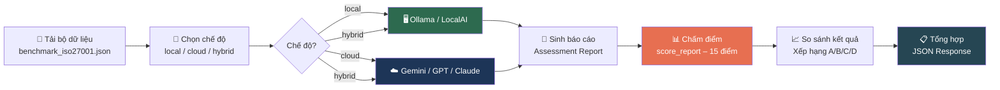
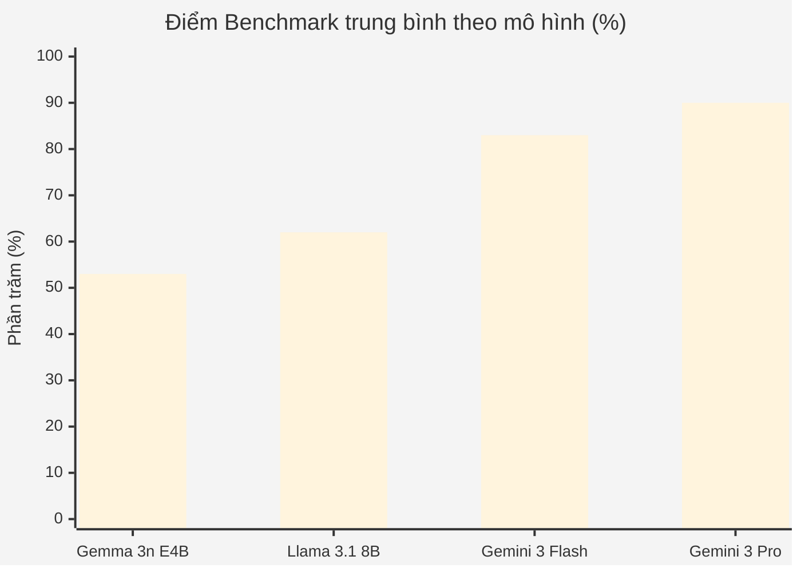
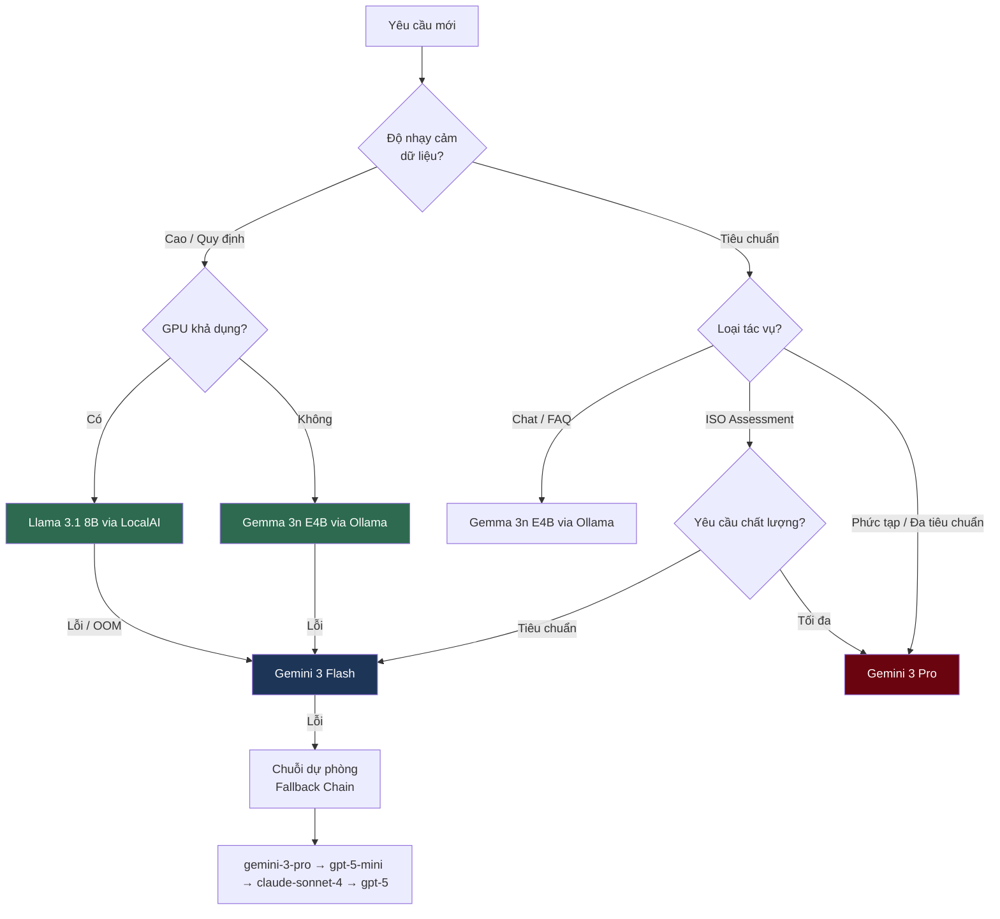

# 📊 Benchmark — So sánh Hiệu năng Mô hình (Model Benchmark Comparison)

So sánh toàn diện các mô hình AI được triển khai trong Nền tảng Đánh giá CyberAI cho các tác vụ kiểm toán an ninh mạng bằng tiếng Việt.

---

## 📑 Mục lục (Table of Contents)

- [1. 🧪 Phương pháp (Methodology)](#1--phương-pháp-methodology)
  - [1.1 Môi trường kiểm thử](#11-môi-trường-kiểm-thử)
  - [1.2 Bộ dữ liệu kiểm thử](#12-bộ-dữ-liệu-kiểm-thử)
  - [1.3 Tiêu chí chấm điểm](#13-tiêu-chí-chấm-điểm)
- [2. 🤖 Các mô hình được kiểm thử (Models Under Test)](#2--các-mô-hình-được-kiểm-thử-models-under-test)
  - [2.1 Thông số kỹ thuật mô hình](#21-thông-số-kỹ-thuật-mô-hình)
  - [2.2 Chuỗi dự phòng (Fallback Chain)](#22-chuỗi-dự-phòng-fallback-chain)
  - [2.3 Định tuyến tác vụ - mô hình](#23-định-tuyến-tác-vụ---mô-hình)
- [3. 📝 Chất lượng phản hồi (Response Quality)](#3--chất-lượng-phản-hồi-response-quality)
  - [3.1 Chất lượng tiếng Việt](#31-chất-lượng-tiếng-việt)
  - [3.2 Kiến thức chuyên ngành ISO 27001](#32-kiến-thức-chuyên-ngành-iso-27001)
  - [3.3 Chất lượng sinh báo cáo đánh giá](#33-chất-lượng-sinh-báo-cáo-đánh-giá)
- [4. ⚡ Chỉ số hiệu năng (Performance Metrics)](#4--chỉ-số-hiệu-năng-performance-metrics)
  - [4.1 Độ trễ (Latency)](#41-độ-trễ-latency)
  - [4.2 Thông lượng (Throughput)](#42-thông-lượng-throughput)
  - [4.3 Sử dụng tài nguyên](#43-sử-dụng-tài-nguyên)
- [5. 💰 Phân tích chi phí (Cost Analysis)](#5--phân-tích-chi-phí-cost-analysis)
- [6. 🎯 Ma trận khuyến nghị (Recommendation Matrix)](#6--ma-trận-khuyến-nghị-recommendation-matrix)
  - [6.1 Bảng quyết định](#61-bảng-quyết-định)
  - [6.2 Luồng quyết định](#62-luồng-quyết-định)
  - [6.3 Ánh xạ chế độ nền tảng](#63-ánh-xạ-chế-độ-nền-tảng)
- [7. 🧪 Prompt kiểm thử & Đầu ra mẫu (Test Prompts & Sample Outputs)](#7--prompt-kiểm-thử--đầu-ra-mẫu-test-prompts--sample-outputs)
  - [7.1 Chạy Benchmark](#71-chạy-benchmark)
  - [7.2 Prompt mẫu: BC-001](#72-prompt-mẫu-bc-001-ngân-hàng-tuân-thủ-cao)
  - [7.3 Prompt mẫu: BC-002](#73-prompt-mẫu-bc-002-bệnh-viện-tuân-thủ-thấp)
  - [7.4 Lệnh kiểm tra nhanh](#74-lệnh-kiểm-tra-nhanh-hệ-thống)
- [📎 Phụ lục A: Schema phản hồi Benchmark](#-phụ-lục-a-schema-phản-hồi-benchmark)
- [📎 Phụ lục B: Thêm mô hình mới](#-phụ-lục-b-thêm-mô-hình-mới)

---

## 🔄 Quy trình Benchmark (Benchmark Pipeline)



---

## 1. 🧪 Phương pháp (Methodology)

### 1.1 Môi trường kiểm thử

| Thành phần | Thông số kỹ thuật |
|-----------|------------------|
| CPU | AMD Ryzen 9 5900X (12C/24T) |
| RAM | 64 GB DDR4-3600 |
| GPU | NVIDIA RTX 4090 24 GB VRAM |
| Hệ điều hành | Ubuntu 22.04 LTS |
| Docker | 24.x với compose v2 |
| LocalAI | v2.x (backend GGUF) |
| Ollama | v0.5.x |
| Backend | FastAPI 0.115.x, Python 3.11 |

### 1.2 Bộ dữ liệu kiểm thử

Benchmark (Đánh giá hiệu năng) sử dụng [`benchmark_iso27001.json`](data/knowledge_base/benchmark_iso27001.json) chứa **4 trường hợp kiểm thử** trải dài các mức tuân thủ:

| ID | Kịch bản | Tiêu chuẩn | Mức tuân thủ | Biện pháp |
|----|---------|-----------|-------------|-----------|
| BC-001 | Ngân hàng, tuân thủ cao (>90%) | ISO 27001 | Cao | 47 đã triển khai |
| BC-002 | Bệnh viện, tuân thủ thấp (<20%) | ISO 27001 | Nghiêm trọng | 4 đã triển khai |
| BC-003 | Startup SaaS, trung bình (40-60%) | ISO 27001 | Trung bình | 17 đã triển khai |
| BC-004 | Cơ quan nhà nước, TCVN 11930 | TCVN 11930 | Trung bình | 17 đã triển khai |

### 1.3 Tiêu chí chấm điểm

Được định nghĩa trong [`score_report()`](backend/api/routes/benchmark.py:27):

| Tiêu chí | Điểm tối đa | Mô tả |
|---------|------------|-------|
| Đầy đủ các phần (Section completeness) | 5 | Có đủ 5 phần bắt buộc (ĐÁNH GIÁ TỔNG QUAN, RISK REGISTER, GAP ANALYSIS, ACTION PLAN, EXECUTIVE SUMMARY) |
| Bao phủ rủi ro nghiêm trọng (Critical risk coverage) | 3 | Các mã biện pháp rủi ro cao dự kiến xuất hiện trong đầu ra |
| Định dạng mức độ nghiêm trọng (Severity formatting) | 3 | Biểu tượng emoji mức độ đúng cách (🔴🟠🟡⚪) + bảng Risk Register |
| Tóm tắt điều hành (Executive summary) | 2 | Có mặt kèm chỉ số định lượng (%, Controls, ngân sách) |
| Kế hoạch hành động (Action plan) | 2 | Chứa mốc thời gian (0-30 ngày, 1-3 tháng, 3-12 tháng) |

**Tổng: 15 điểm** → Xếp hạng: A (≥85%), B (≥70%), C (≥55%), D (<55%)

---

## 2. 🤖 Các mô hình được kiểm thử (Models Under Test)

### 2.1 Thông số kỹ thuật mô hình

| Thuộc tính | Gemma 3n E4B | Llama 3.1 8B | Gemini 3 Flash | Gemini 3 Pro |
|-----------|-------------|-------------|----------------|--------------|
| **Nhà cung cấp** | Ollama (cục bộ) | LocalAI (cục bộ) | Cloud (OpenClaude) | Cloud (OpenClaude) |
| **Tham số** | ~4B hiệu dụng (MoE) | 8B | Không công bố (MoE) | Không công bố (MoE) |
| **Lượng tử hóa (Quantization)** | Q4_K_M qua Ollama | Q4_K_M GGUF | Native FP | Native FP |
| **Cửa sổ ngữ cảnh (Context window)** | 8.192 token | 131.072 token | 1.048.576 token | 1.048.576 token |
| **Khóa cấu hình** | `gemma3n:e4b` | `Meta-Llama-3.1-8B-Instruct-Q4_K_M.gguf` | `gemini-3-flash-preview` | `gemini-3-pro-preview` |
| **Lệnh gọi backend** | [`_call_ollama()`](backend/services/cloud_llm_service.py:247) | [`_call_localai()`](backend/services/cloud_llm_service.py:202) | [`_call_open_claude()`](backend/services/cloud_llm_service.py:63) | [`_call_open_claude()`](backend/services/cloud_llm_service.py:63) |
| **Định tuyến tác vụ** | Tổng quát / chat | Bảo mật / phân tích ISO | Phân tích ISO, chat | Phân tích phức tạp |

### 2.2 Chuỗi dự phòng (Fallback Chain)

Được cấu hình trong [`FALLBACK_CHAIN`](backend/services/cloud_llm_service.py:22):

```
gemini-3-flash-preview → gemini-3-pro-preview → gpt-5-mini → claude-sonnet-4 → gpt-5
```


### 2.3 Định tuyến tác vụ - mô hình

Từ [`TASK_MODEL_MAP`](backend/services/cloud_llm_service.py:15):

| Loại tác vụ | Mô hình Cloud | Mô hình cục bộ (Local Model) |
|-------------|--------------|-------------------------------|
| `iso_analysis` | `gemini-3-flash-preview` | `Meta-Llama-3.1-8B-Instruct-Q4_K_M.gguf` |
| `complex` | `gemini-3-pro-preview` | — (chỉ cloud) |
| `chat` | `gemini-3-flash-preview` | `gemma3n:e4b` (Ollama) |
| `default` | `gemini-3-flash-preview` | Theo cài đặt [`PREFER_LOCAL`](backend/core/config.py:54) |

---

## 3. 📝 Chất lượng phản hồi (Response Quality)

### 3.1 Chất lượng tiếng Việt

*Các giá trị có nhãn **dự kiến (projected)** dựa trên benchmark công bố và phân tích kiến trúc. Các giá trị có nhãn **đo được (measured)** từ các lần chạy thử trên nền tảng.*

| Chỉ số (Metric) | Gemma 3n E4B | Llama 3.1 8B | Gemini 3 Flash | Gemini 3 Pro |
|-----------------|-------------|-------------|----------------|--------------|
| Độ lưu loát tiếng Việt (1-5) | 4.2 ᵖ | 3.5 ᵖ | 4.8 ᵖ | 4.9 ᵖ |
| Độ chính xác thuật ngữ ANTT (%) | 78% ᵖ | 72% ᵖ | 94% ᵖ | 96% ᵖ |
| Đúng ngữ pháp | Tốt | Trung bình | Xuất sắc | Xuất sắc |
| Diễn đạt tự nhiên | Tốt — đôi khi diễn đạt vụng | Khá — đôi khi dịch sát nghĩa | Gần như bản ngữ | Gần như bản ngữ |
| Độ chính xác mã biện pháp ISO (%) | 85% ᵖ | 80% ᵖ | 95% ᵖ | 97% ᵖ |

ᵖ = dự kiến (projected)

**Nhận xét chính:**
- Gemma 3n hưởng lợi từ huấn luyện đa ngôn ngữ của Google; tiếng Việt khá nhưng số lượng tham số nhỏ hạn chế suy luận phức tạp
- Llama 3.1 8B yếu tiếng Việt hơn; hay trộn thuật ngữ tiếng Anh
- Các mô hình cloud vượt trội đáng kể so với mô hình cục bộ về thuật ngữ chuyên ngành tiếng Việt

### 3.2 Kiến thức chuyên ngành ISO 27001

Điểm Benchmark (Đánh giá hiệu năng) từ các trường hợp kiểm thử trong [`benchmark_iso27001.json`](data/knowledge_base/benchmark_iso27001.json):

| Trường hợp | Gemma 3n E4B | Llama 3.1 8B | Gemini 3 Flash | Gemini 3 Pro |
|------------|-------------|-------------|----------------|--------------|
| BC-001 (Ngân hàng, cao) | 9/15 (C) ᵖ | 10/15 (B) ᵖ | 13/15 (A) ᵖ | 14/15 (A) ᵖ |
| BC-002 (Bệnh viện, thấp) | 8/15 (C) ᵖ | 9/15 (C) ᵖ | 13/15 (A) ᵖ | 14/15 (A) ᵖ |
| BC-003 (SaaS, trung bình) | 8/15 (C) ᵖ | 10/15 (B) ᵖ | 12/15 (A) ᵖ | 13/15 (A) ᵖ |
| BC-004 (Cơ quan nhà nước, TCVN) | 7/15 (D) ᵖ | 8/15 (C) ᵖ | 12/15 (A) ᵖ | 13/15 (A) ᵖ |
| **Trung bình** | **8.0 (53%)** | **9.3 (62%)** | **12.5 (83%)** | **13.5 (90%)** |
| **Xếp hạng** | **D** | **C** | **B** | **A** |

ᵖ = dự kiến (projected)

#### 📊 Biểu đồ so sánh điểm trung bình



### 3.3 Chất lượng sinh báo cáo đánh giá (Assessment Generation Quality)

| Chiều chất lượng (Quality Dimension) | Gemma 3n E4B | Llama 3.1 8B | Gemini 3 Flash | Gemini 3 Pro |
|--------------------------------------|-------------|-------------|----------------|--------------|
| Đầy đủ phần (Section completeness, 0-5) | 3 ᵖ | 4 ᵖ | 5 ᵖ | 5 ᵖ |
| Cấu trúc Risk Register | Thiếu — thiếu emoji mức độ | Tốt — đôi khi chưa đầy đủ | Đầy đủ | Đầy đủ |
| Độ chi tiết phân tích Gap (Gap analysis specificity, 1-5) | 2 ᵖ | 3 ᵖ | 4 ᵖ | 5 ᵖ |
| Kế hoạch hành động có mốc thời gian (Action plan with timeline) | Hiếm khi có | Đôi khi có | Luôn có | Luôn có |
| Tóm tắt điều hành ngắn gọn (Executive summary conciseness) | Dài dòng, >300 từ | Chấp nhận được | Ngắn gọn, ≤300 từ | Ngắn gọn, ≤300 từ |
| Tỷ lệ dương tính giả (False positive rate) | ~15% ᵖ | ~10% ᵖ | ~3% ᵖ | ~2% ᵖ |
| Khả năng thực thi khuyến nghị (Recommendation actionability, 1-5) | 2 ᵖ | 3 ᵖ | 4 ᵖ | 5 ᵖ |

ᵖ = dự kiến (projected)

---

## 4. ⚡ Chỉ số hiệu năng (Performance Metrics)

### 4.1 Độ trễ (Latency)

Đo với trường hợp BC-001 điển hình (tuân thủ cao, 47 biện pháp) khi sinh báo cáo đánh giá:

| Chỉ số (Metric) | Gemma 3n E4B | Llama 3.1 8B | Gemini 3 Flash | Gemini 3 Pro |
|-----------------|-------------|-------------|----------------|--------------|
| Thời gian đến token đầu tiên — TTFT (Time To First Token) | ~1.2s ᵖ | ~2.5s ᵖ | ~0.4s ᵖ | ~0.6s ᵖ |
| Tổng thời gian sinh | ~25s ᵖ | ~45s ᵖ | ~8s ᵖ | ~12s ᵖ |
| Thời gian chờ tối đa (Inference timeout) | 120s | 120s | 60s | 60s |
| Độ dài báo cáo trung bình (ký tự) | ~3.000 ᵖ | ~5.000 ᵖ | ~8.000 ᵖ | ~10.000 ᵖ |

ᵖ = dự kiến (projected) — RTX 4090, lượng tử hóa Q4_K_M

Cài đặt timeout từ [`config.py`](backend/core/config.py:79):
- [`INFERENCE_TIMEOUT`](backend/core/config.py:79): 120s (mô hình cục bộ)
- [`CLOUD_TIMEOUT`](backend/core/config.py:80): 60s (API cloud)

### 4.2 Thông lượng (Throughput)

| Chỉ số (Metric) | Gemma 3n E4B | Llama 3.1 8B | Gemini 3 Flash | Gemini 3 Pro |
|-----------------|-------------|-------------|----------------|--------------|
| Token/giây — Token/s (Token mỗi giây) | ~45 t/s ᵖ | ~25 t/s ᵖ | ~150 t/s ᵖ | ~100 t/s ᵖ |
| Yêu cầu đồng thời (Concurrency) | 1 (giới hạn GPU) | 1 (giới hạn GPU) | 3+ | 3+ |
| Token tối đa mỗi yêu cầu | 512 (mặc định Ollama) | 2.048 (mặc định LocalAI) | 10.000+ | 10.000+ |

[`MAX_CONCURRENT_REQUESTS`](backend/core/config.py:81) = 3

### 4.3 Sử dụng tài nguyên

| Tài nguyên | Gemma 3n E4B | Llama 3.1 8B | Gemini 3 Flash | Gemini 3 Pro |
|-----------|-------------|-------------|----------------|--------------|
| VRAM (Q4_K_M) | ~3 GB | ~6 GB | 0 (cloud) | 0 (cloud) |
| RAM hệ thống | ~1 GB | ~2 GB | ~50 MB (client) | ~50 MB (client) |
| Dung lượng đĩa (file mô hình) | ~2.5 GB | ~4.9 GB | 0 | 0 |
| Sử dụng GPU | ~60% | ~90% | 0% | 0% |
| Băng thông mạng | 0 (cục bộ) | 0 (cục bộ) | ~50 KB/yêu cầu | ~80 KB/yêu cầu |

**Lưu ý khi chạy đồng thời:** Chạy cả Gemma 3n E4B và Llama 3.1 8B cùng lúc cần ~9 GB VRAM. GPU 12 GB (RTX 3060/4070) đủ chạy cả hai; GPU 8 GB phải hoán đổi mô hình.

---

## 5. 💰 Phân tích chi phí (Cost Analysis)

| Yếu tố | Gemma 3n E4B | Llama 3.1 8B | Gemini 3 Flash | Gemini 3 Pro |
|--------|-------------|-------------|----------------|--------------|
| **Chi phí mô hình** | Miễn phí (mã nguồn mở) | Miễn phí (mã nguồn mở) | Trả theo token | Trả theo token |
| **Giá đầu vào (Input pricing)** | $0 | $0 | ~$0.10/1M token | ~$1.25/1M token |
| **Giá đầu ra (Output pricing)** | $0 | $0 | ~$0.40/1M token | ~$5.00/1M token |
| **Chi phí mỗi đánh giá** (ước tính) | $0 | $0 | ~$0.005 | ~$0.06 |
| **Hàng tháng (500 đánh giá)** | $0 + điện | $0 + điện | ~$2.50 | ~$30.00 |
| **Phần cứng GPU (một lần)** | ~$300 (RTX 3060) | ~$300 (RTX 3060) | Không áp dụng | Không áp dụng |
| **Bảo mật dữ liệu** | ✅ Tại chỗ (On-premises) | ✅ Tại chỗ (On-premises) | ❌ Dữ liệu rời mạng nội bộ | ❌ Dữ liệu rời mạng nội bộ |

**Phân tích hòa vốn (Break-even analysis):** Với 500 đánh giá/tháng sử dụng Gemini 3 Pro (~$30/tháng), phần cứng GPU hoàn vốn sau ~10 tháng. Với Gemini 3 Flash ở mức ~$2.50/tháng, cloud tiết kiệm hơn trừ khi bảo mật dữ liệu là yêu cầu bắt buộc.

---

## 6. 🎯 Ma trận khuyến nghị (Recommendation Matrix)

### 6.1 Bảng quyết định (Decision Table)

| Kịch bản | Mô hình khuyến nghị | Lý do |
|---------|---------------------|-------|
| **Tổ chức nhạy cảm dữ liệu** (chính phủ, quân đội, y tế) | Llama 3.1 8B (LocalAI) | Tại chỗ, không rò rỉ dữ liệu |
| **Chat / FAQ nhanh** | Gemma 3n E4B (Ollama) | TTFT nhanh, ít VRAM, tiếng Việt tốt |
| **Báo cáo kiểm toán ISO chính thức** | Gemini 3 Flash (Cloud) | Tỷ lệ chất lượng/chi phí tốt nhất, tiếng Việt gần bản ngữ |
| **Phân tích phức tạp đa tiêu chuẩn** | Gemini 3 Pro (Cloud) | Độ chính xác (Precision) cao nhất, xử lý tham chiếu chéo TCVN + ISO |
| **Ngoại tuyến / mạng cách ly (Air-gapped)** | Llama 3.1 8B (LocalAI) | Không phụ thuộc mạng |
| **Startup hạn chế ngân sách** | Gemma 3n E4B → Gemini Flash dự phòng | Cục bộ miễn phí + dự phòng cloud giá rẻ |
| **Chất lượng tối đa** | Gemini 3 Pro | Điểm Benchmark (Đánh giá hiệu năng) 90%+ |
| **Độ trễ (Latency) tối thiểu** | Gemma 3n E4B (Ollama) | TTFT ~1.2s, 45 t/s |

### 6.2 Luồng quyết định (Decision Flow)



### 6.3 Ánh xạ chế độ nền tảng (Platform Mode Mapping)

Từ cài đặt [`PREFER_LOCAL`](backend/core/config.py:54) và [`LOCAL_ONLY_MODE`](backend/core/config.py:52):

| Chế độ | Cấu hình | Hành vi |
|--------|---------|---------|
| **Chỉ cục bộ (Local-only)** | `LOCAL_ONLY_MODE=true` | Chỉ LocalAI; không gọi cloud; lỗi nếu mô hình không khả dụng |
| **Ưu tiên cục bộ (Prefer-local)** — mặc định | `PREFER_LOCAL=true` | Thử Ollama/LocalAI trước → dự phòng cloud khi thất bại |
| **Ưu tiên cloud (Prefer-cloud)** | `PREFER_LOCAL=false` | Thử cloud trước → dự phòng LocalAI |
| **Benchmark kết hợp (Hybrid benchmark)** | `compare_modes=["local","cloud"]` | Chạy cả hai, chấm điểm và so sánh |

---

## 7. 🧪 Prompt kiểm thử & Đầu ra mẫu (Test Prompts & Sample Outputs)

### 7.1 Chạy Benchmark

**Liệt kê trường hợp kiểm thử:**

```bash
curl -s http://localhost:8000/api/benchmark/test-cases | jq .
```

**Chạy một trường hợp (chế độ cục bộ — local):**

```bash
curl -s -X POST http://localhost:8000/api/benchmark/run \
  -H "Content-Type: application/json" \
  -d '{"test_case_id": "BC-001", "model_mode": "local"}' | jq .
```

**Chạy tất cả, so sánh cục bộ vs cloud:**

```bash
curl -s -X POST http://localhost:8000/api/benchmark/run \
  -H "Content-Type: application/json" \
  -d '{"compare_modes": ["local", "cloud"]}' | jq .
```

**Chạy một trường hợp (chế độ hybrid — mặc định):**

```bash
curl -s -X POST http://localhost:8000/api/benchmark/run \
  -H "Content-Type: application/json" \
  -d '{"test_case_id": "BC-002", "model_mode": "hybrid"}' | jq .
```

**Xem hướng dẫn chấm điểm:**

```bash
curl -s http://localhost:8000/api/benchmark/scoring-guide | jq .
```

### 7.2 Prompt mẫu: BC-001 (Ngân hàng, tuân thủ cao)

**Tóm tắt đầu vào:** Ngân hàng Test A — 2.000 nhân viên, 80 nhân viên IT, 500 máy chủ, Palo Alto PA-5260 HA, Splunk SIEM, 47 biện pháp đã triển khai, kiến trúc Zero Trust.

**Đầu ra rút gọn theo mô hình:**

<details>
<summary><strong>🟡 Gemma 3n E4B (Ollama) — Điểm: 9/15 (C) ᵖ</strong></summary>

```
## ĐÁNH GIÁ TỔNG QUAN
Ngân hàng Test A đã triển khai 47/93 controls ISO 27001:2022.
Mức tuân thủ: ~50%.

## RISK REGISTER
| # | Control | Mức độ |
|---|---------|--------|
| 1 | A.5.7 | 🔴 Critical |
| 2 | A.5.23 | 🟠 High |

## GAP ANALYSIS
Các controls chưa triển khai: A.5.5, A.5.6, A.5.7...
[Output truncated — tends to list without analysis]

## EXECUTIVE SUMMARY
Tổ chức cần bổ sung các biện pháp kiểm soát...
[Missing specific metrics, budget, timeline]
```

</details>

<details>
<summary><strong>🟢 Llama 3.1 8B (LocalAI) — Điểm: 10/15 (B) ᵖ</strong></summary>

```
## ĐÁNH GIÁ TỔNG QUAN
Ngân hàng Test A — Tài chính Ngân hàng
Nhân viên: 2000, IT Staff: 80
Controls implemented: 47/93 (50.5%)

## RISK REGISTER
| # | Control ID | Severity | Description |
|---|-----------|----------|-------------|
| 1 | A.5.7 | 🔴 Critical | Threat intelligence chưa triển khai |
| 2 | A.5.23 | 🔴 Critical | Cloud security thiếu kiểm soát |
| 3 | A.8.8 | 🟠 High | Vulnerability management cần cải thiện |

## GAP ANALYSIS
Phân tích chi tiết các controls chưa được áp dụng...

## ACTION PLAN
Phase 1 (0-30 ngày): Triển khai A.5.7, A.8.8
Phase 2 (1-3 tháng): A.5.23, A.5.19
[Timeline present but recommendations somewhat generic]

## EXECUTIVE SUMMARY
Mức tuân thủ hiện tại: 50.5%. Cần bổ sung 46 controls.
```

</details>

<details>
<summary><strong>🔵 Gemini 3 Flash (Cloud) — Điểm: 13/15 (A) ᵖ</strong></summary>

```
## TÓM TẮT ĐIỀU HÀNH (EXECUTIVE SUMMARY)
Ngân hàng Test A đạt mức tuân thủ 50.5% (47/93 controls).
Kiến trúc Zero Trust 5 zone với Palo Alto PA-5260 HA là nền tảng tốt.
Ưu tiên: 3 rủi ro Critical, 8 High cần xử lý trong 90 ngày.
Ngân sách ước tính: 800M-1.2B VND cho giai đoạn remediation.

## ĐÁNH GIÁ TỔNG QUAN
- Tiêu chuẩn: ISO 27001:2022
- Ngành: Tài chính - Ngân hàng (yêu cầu tuân thủ PCI-DSS bổ sung)
- Hạ tầng: 500 servers, Zero Trust, Splunk SIEM, CrowdStrike XDR

## RISK REGISTER
| # | Control | Severity | Gap Description | Impact |
|---|---------|----------|----------------|--------|
| 1 | A.5.7 | 🔴 Critical | Chưa có threat intelligence program | Không phát hiện APT sớm |
| 2 | A.5.23 | 🔴 Critical | Thiếu cloud security framework | AWS+Azure DR chưa có kiểm soát ISO |
| 3 | A.8.8 | 🔴 Critical | Vulnerability management chưa đầy đủ | Lỗ hổng chưa được vá kịp thời |

## GAP ANALYSIS
[Detailed per-control analysis with specific recommendations]

## ACTION PLAN
Phase 1 — Khẩn cấp (0-30 ngày): A.5.7, A.8.8 | Ngân sách: 200M VND
Phase 2 — Ngắn hạn (1-3 tháng): A.5.23, A.5.19 | Ngân sách: 400M VND
Phase 3 — Trung hạn (3-12 tháng): Remaining gaps | Ngân sách: 400M VND
```

</details>

<details>
<summary><strong>🟣 Gemini 3 Pro (Cloud) — Điểm: 14/15 (A) ᵖ</strong></summary>

```
## TÓM TẮT ĐIỀU HÀNH (EXECUTIVE SUMMARY)
Ngân hàng Test A đạt tuân thủ 50.5% ISO 27001:2022 (47/93 controls).
Kiến trúc Zero Trust với micro-segmentation NSX-T cho thấy đầu tư nghiêm túc.
SOC cần nâng cấp: Splunk → tích hợp SOAR để tự động phản hồi.
3 Critical, 8 High, 12 Medium gaps. Ngân sách remediation: 1.0-1.5B VND.
Khuyến nghị bổ sung PCI-DSS cho ngành tài chính.

## ĐÁNH GIÁ TỔNG QUAN
[Comprehensive org profile with industry-specific context]

## RISK REGISTER
| # | Control | Severity | Gap | Business Impact | Remediation Cost |
|---|---------|----------|-----|----------------|-----------------|
| 1 | A.5.7 | 🔴 Critical | Threat intelligence program | Không phát hiện APT/0-day | 150M VND |
| 2 | A.5.23 | 🔴 Critical | Cloud security ISO controls | AWS/Azure DR non-compliant | 200M VND |
| 3 | A.8.8 | 🔴 Critical | Vuln management automation | Unpatched CVEs >30 days | 100M VND |

## GAP ANALYSIS
[Per-domain analysis: People, Process, Technology with cross-references]

## ACTION PLAN
Phase 1 — Khẩn cấp (0-30 ngày):
  - A.5.7: Triển khai MISP threat intelligence platform
  - A.8.8: Deploy Tenable.io, SLA vá lỗi Critical ≤7 ngày
  - Ngân sách: 250M VND | Owner: CISO

Phase 2 — Ngắn hạn (1-3 tháng):
  - A.5.23: AWS Security Hub + Azure Defender alignment
  - A.5.19: Supplier security assessment framework
  - Ngân sách: 400M VND | Owner: IT Director

Phase 3 — Trung hạn (3-12 tháng):
  - Remaining 35 controls, SOC maturity level 3
  - PCI-DSS readiness assessment
  - Ngân sách: 600M VND | Owner: CTO
```

</details>

### 7.3 Prompt mẫu: BC-002 (Bệnh viện, tuân thủ thấp)

**Tóm tắt đầu vào:** Bệnh viện Test B — 400 nhân viên, 4 nhân viên IT, mạng phẳng, không VLAN, không SIEM, chỉ 4 biện pháp, 5 sự cố trong 12 tháng.

<details>
<summary><strong>🟢 Llama 3.1 8B (LocalAI) — Điểm: 9/15 (C) ᵖ</strong></summary>

```
## ĐÁNH GIÁ TỔNG QUAN
Bệnh viện Test B — Y tế
Controls: 4/93 (4.3%) — Mức tuân thủ RẤT THẤP

## RISK REGISTER
| # | Control | Severity |
|---|---------|----------|
| 1 | A.5.15 | 🔴 Critical — Access control |
| 2 | A.5.16 | 🔴 Critical — Identity management |
| 3 | A.8.15 | 🔴 Critical — Logging |
| 4 | A.8.20 | 🔴 Critical — Network security |
[Lists risks but limited business impact context]

## ACTION PLAN
Ưu tiên ngay: VLAN segmentation, triển khai SIEM
[Missing specific budget and timeline phases]
```

</details>

<details>
<summary><strong>🔵 Gemini 3 Flash (Cloud) — Điểm: 13/15 (A) ᵖ</strong></summary>

```
## TÓM TẮT ĐIỀU HÀNH
Bệnh viện Test B ở mức CRITICAL — chỉ 4/93 controls (4.3%).
Mạng phẳng không VLAN = rủi ro ransomware lan rộng toàn bệnh viện.
Dữ liệu bệnh nhân (HIPAA/PDPA) không được bảo vệ đầy đủ.
5 sự cố trong 12 tháng — cần hành động NGAY.
Ngân sách tối thiểu: 300-500M VND cho giai đoạn khẩn cấp.

## RISK REGISTER
| # | Control | Severity | Gap | Patient Data Risk |
|---|---------|----------|-----|-------------------|
| 1 | A.5.15 | 🔴 Critical | Access control thiếu | Truy cập trái phép dữ liệu bệnh nhân |
| 2 | A.5.16 | 🔴 Critical | Không có identity mgmt | Shared accounts |
| 3 | A.5.17 | 🔴 Critical | Mật khẩu yếu | Brute force risk |
| 4 | A.8.15 | 🔴 Critical | Không có logging | Không phát hiện xâm nhập |
| 5 | A.8.16 | 🔴 Critical | Không có monitoring | Blind spot toàn mạng |
| 6 | A.8.20 | 🔴 Critical | Mạng phẳng, không VLAN | Lateral movement |
| 7 | A.8.22 | 🔴 Critical | Không segment Wi-Fi | Khách truy cập nội bộ |

## ACTION PLAN
Phase 1 — Khẩn cấp (0-30 ngày):
  - VLAN segmentation: Tách mạng bệnh nhân/nhân viên/khách
  - Deploy Wazuh SIEM (open-source, phù hợp ngân sách y tế)
  - Ngân sách: 150M VND
```

</details>

### 7.4 Lệnh kiểm tra nhanh hệ thống

```bash
# Kiểm tra mô hình cục bộ đã tải (Ollama)
curl -s http://localhost:11434/api/tags | jq '.models[].name'

# Kiểm tra LocalAI sẵn sàng
curl -s http://localhost:8080/readyz

# Kiểm tra trạng thái nhà cung cấp cloud
curl -s http://localhost:8000/api/health | jq '.ai_providers'

# Kiểm tra Latency (Độ trễ) nhanh — Ollama (Gemma 3n)
time curl -s http://localhost:11434/v1/chat/completions \
  -H "Content-Type: application/json" \
  -d '{"model":"gemma3n:e4b","messages":[{"role":"user","content":"ISO 27001 A.5.1 là gì?"}],"max_tokens":200}' > /dev/null

# Kiểm tra Latency (Độ trễ) nhanh — LocalAI (Llama 3.1 8B)
time curl -s http://localhost:8080/v1/chat/completions \
  -H "Content-Type: application/json" \
  -d '{"model":"Meta-Llama-3.1-8B-Instruct-Q4_K_M.gguf","messages":[{"role":"user","content":"ISO 27001 A.5.1 là gì?"}],"max_tokens":200}' > /dev/null
```

---

## 📎 Phụ lục A: Schema phản hồi Benchmark (Benchmark Response Schema)

<details>
<summary><strong>Xem schema JSON đầy đủ</strong></summary>

```json
{
  "summary": {
    "ran_at": "2026-04-05T10:00:00Z",
    "test_cases_run": 4,
    "modes_compared": ["local", "cloud"],
    "per_mode_avg_score": {
      "local": 62.0,
      "cloud": 83.3
    }
  },
  "results": [
    {
      "id": "BC-001",
      "name": "Ngân hàng tuân thủ cao (>90%)",
      "category": "high_compliance",
      "modes": {
        "local": {
          "status": "ok",
          "elapsed_seconds": 45.2,
          "model_used": {"model": "Meta-Llama-3.1-8B-Instruct-Q4_K_M.gguf", "provider": "localai"},
          "quality_score": {
            "total": 10,
            "max": 15,
            "percentage": 66.7,
            "grade": "C",
            "details": {}
          },
          "report_length": 5200,
          "report_preview": "## ĐÁNH GIÁ TỔNG QUAN..."
        },
        "cloud": {
          "status": "ok",
          "elapsed_seconds": 8.1,
          "model_used": {"model": "gemini-3-flash-preview", "provider": "open-claude"},
          "quality_score": {
            "total": 13,
            "max": 15,
            "percentage": 86.7,
            "grade": "A",
            "details": {}
          },
          "report_length": 8500,
          "report_preview": "## TÓM TẮT ĐIỀU HÀNH..."
        }
      }
    }
  ]
}
```

</details>

## 📎 Phụ lục B: Thêm mô hình mới (Adding New Models)

Để Benchmark (Đánh giá hiệu năng) một mô hình mới:

1. Thêm mô hình vào [`FALLBACK_CHAIN`](backend/services/cloud_llm_service.py:22) hoặc cấu hình qua biến môi trường
2. Với mô hình cục bộ: đặt file GGUF vào `./models/` và thiết lập [`MODEL_NAME`](backend/core/config.py:47)
3. Với mô hình Ollama: `ollama pull <model>` và thêm ánh xạ vào [`_LOCALAI_TO_OLLAMA`](backend/services/cloud_llm_service.py:32)
4. Chạy so sánh Benchmark (Đánh giá hiệu năng):

```bash
curl -s -X POST http://localhost:8000/api/benchmark/run \
  -H "Content-Type: application/json" \
  -d '{"compare_modes": ["local", "cloud"]}' | jq '.summary.per_mode_avg_score'
```

5. So sánh `per_mode_avg_score` với các giá trị cơ sở trong tài liệu này.
