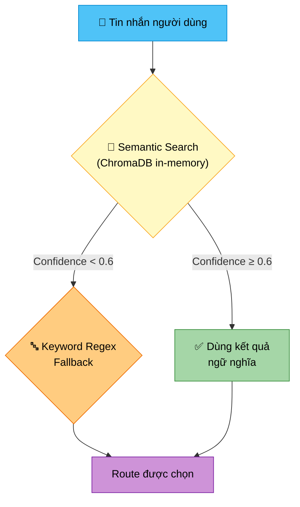
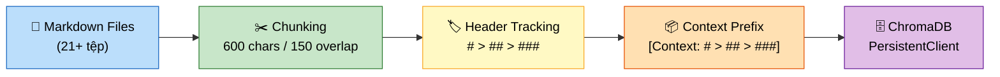
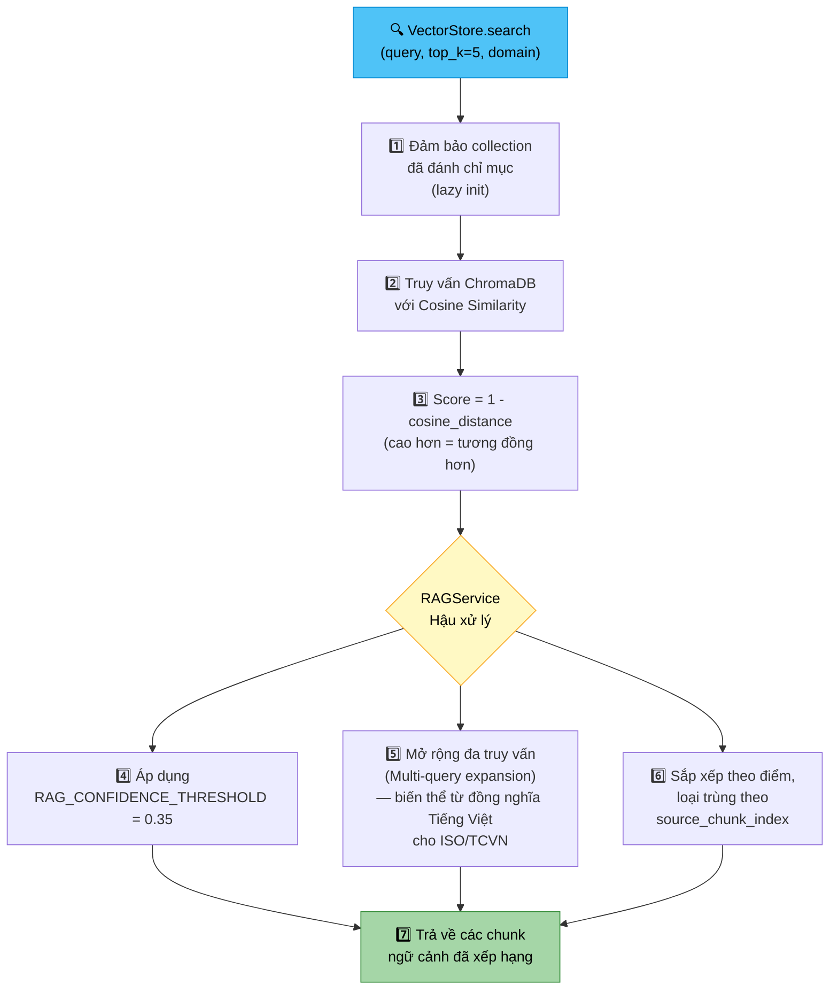
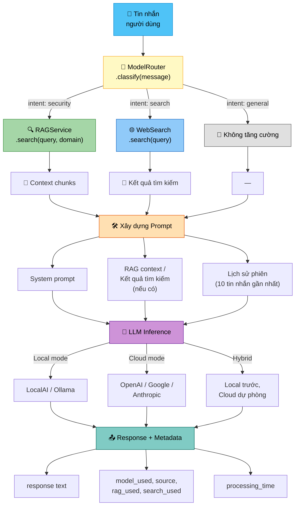
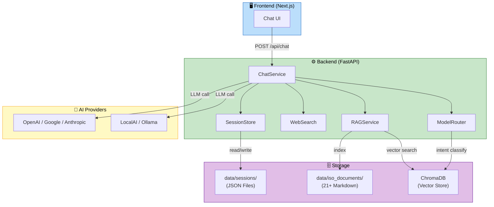

# 🤖 CyberAI Platform — Chatbot & RAG Pipeline (Tìm kiếm tăng cường sinh)

<div align="center">

[](../en/chatbot_rag.md)
[](chatbot_rag.md)

</div>

---

## 📑 Mục Lục

1. [🏗️ Kiến Trúc Chatbot](#1--kiến-trúc-chatbot)
   - [Hỗ Trợ Đa Mô Hình](#hỗ-trợ-đa-mô-hình)
   - [Quản Lý Phiên](#quản-lý-phiên)
   - [Bảo Mật](#bảo-mật)
   - [Streaming](#streaming)
2. [🧭 Định Tuyến Mô Hình (Model Routing)](#2--định-tuyến-mô-hình-model-routing)
   - [Pipeline Phân Loại](#pipeline-phân-loại)
   - [Bảng Định Tuyến Intent](#bảng-định-tuyến-intent)
3. [🔍 RAG Pipeline (Tìm kiếm tăng cường sinh)](#3--rag-pipeline-tìm-kiếm-tăng-cường-sinh)
   - [Nạp Tài Liệu (Document Ingestion)](#nạp-tài-liệu-document-ingestion)
   - [Bộ Sưu Tập Theo Phạm Vi (Domain-Scoped Collections)](#bộ-sưu-tập-theo-phạm-vi-domain-scoped-collections)
   - [Luồng Truy Xuất (Retrieval Flow)](#luồng-truy-xuất-retrieval-flow)
   - [Embedding (Nhúng vector)](#embedding-nhúng-vector)
4. [🌐 Tích Hợp Tìm Kiếm Web](#4--tích-hợp-tìm-kiếm-web)
5. [💬 Luồng Chat (Chat Flow)](#5--luồng-chat-chat-flow)

---

## 1. 🏗️ Kiến Trúc Chatbot

### Hỗ Trợ Đa Mô Hình

Hỗ trợ **18+ mô hình** từ 5 nhà cung cấp, có thể chọn theo từng request qua trường `model` hoặc dropdown trên giao diện (nhóm theo nhà cung cấp):

| Nhà cung cấp | Ví dụ |
|---------------|-------|
| **OpenAI** | gpt-4o, gpt-4o-mini, gpt-3.5-turbo |
| **Google** | gemini-1.5-pro, gemini-1.5-flash |
| **Anthropic** | claude-3.5-sonnet, claude-3-haiku |
| **Ollama** | llama3, mistral, phi3 |
| **LocalAI** | SecurityLLM 7B, Meta-Llama 8B |

> 📝 Danh sách mô hình được tổng hợp từ giá trị mặc định tích hợp, gộp với [`models.json`](../../models.json) khi khởi động.

### Quản Lý Phiên

Được xử lý bởi [`SessionStore`](../../backend/repositories/session_store.py) — lưu trữ file-based JSON dưới thư mục `data/sessions/`.

| Tham số | Giá trị |
|---------|---------|
| Định dạng lưu trữ | File JSON cho mỗi phiên |
| TTL (Thời gian sống) | 24 giờ |
| Số tin nhắn lưu tối đa | 20 tin nhắn mỗi phiên |
| Context Window (Cửa sổ ngữ cảnh) gửi tới LLM | 10 tin nhắn gần nhất |
| Session ID (Mã phiên) | Tự động tạo `uuid4` nếu không cung cấp |

### Bảo Mật

- **Phát hiện Prompt Injection (Tiêm prompt)** được thực hiện bên trong [`ChatService`](../../backend/services/chat_service.py) trước khi chuyển tiếp tới LLM
- [`ModelGuard`](../../backend/services/model_guard.py) công khai trạng thái sức khỏe qua `/api/chat/health`

### Streaming

SSE streaming được triển khai qua `sse-starlette`. Endpoint `/api/chat/stream` phát ra Token (Đơn vị từ) dạng `text/event-stream`:

```
data: {"token": "partial ", "done": false}
data: {"token": "", "done": true, "metadata": {...}}
```

---

## 2. 🧭 Định Tuyến Mô Hình (Model Routing)

[`ModelRouter`](../../backend/services/model_router.py) phân loại mỗi tin nhắn đầu vào thành một trong ba intent bằng phương pháp **kết hợp ngữ nghĩa + từ khóa (hybrid semantic + keyword)**.

### Pipeline Phân Loại



<details>
<summary>📖 Chi tiết Classification Pipeline (Pipeline phân loại)</summary>

Collection ChromaDB in-memory tên `intent_classifier` lưu các tin nhắn mẫu đã được gán nhãn cho mỗi route. Bộ phân loại nhúng (Embedding) tin nhắn đầu vào và tìm mẫu gần nhất bằng **Cosine Similarity (Độ tương đồng cosine)**:

```python
# Tạo/lấy collection in-memory cho phân loại intent
collection = client.get_or_create_collection(
    name="intent_classifier",
    metadata={"hnsw:space": "cosine"}
)

# Truy vấn tin nhắn đầu vào
result = collection.query(
    query_texts=[message],
    n_results=1
)
distance   = result["distances"][0][0]
confidence = 1 - distance    # cosine → 0=giống hệt, 1=trực giao
```

Nếu `confidence ≥ 0.6` → dùng kết quả Semantic Search (Tìm kiếm ngữ nghĩa).

Nếu `confidence < 0.6` → fallback sang khớp từ khóa regex.

</details>

### Bảng Định Tuyến Intent

| Intent | Hành động | Cờ |
|--------|-----------|-----|
| `security` | RAG (Retrieval-Augmented Generation - Tìm kiếm tăng cường sinh) truy vấn tài liệu ISO/an ninh mạng | `use_rag=true` |
| `search` | Tìm kiếm web qua DuckDuckGo | `use_search=true` |
| `general` | Phản hồi trực tiếp từ LLM (không tăng cường) | — |

<details>
<summary>💡 Ví dụ phân loại intent</summary>

```
Input: "ISO 27001 Annex A.9 nói gì về kiểm soát truy cập?"
  → Confidence ngữ nghĩa: 0.91  →  route: security  ✅

Input: "Tin tức ransomware mới nhất hôm nay"
  → Confidence ngữ nghĩa: 0.44  →  keyword fallback
  → "latest", "today" khớp search_keywords  →  route: search  ✅

Input: "Làm thế nào để viết hàm Python?"
  → Confidence ngữ nghĩa: 0.28  →  keyword fallback
  → Không khớp từ khóa  →  route: general  ✅
```

</details>

---

## 3. 🔍 RAG Pipeline (Tìm kiếm tăng cường sinh)

### Nạp Tài Liệu (Document Ingestion)

**Nguồn:** 21+ file markdown trong [`/data/iso_documents/`](../../data/iso_documents/).

**Các tiêu chuẩn được bao phủ:**

| Nhóm tiêu chuẩn | Tên tiêu chuẩn |
|------------------|-----------------|
| 🏛️ ISO | ISO 27001:2022, ISO 27002:2022 |
| 🇻🇳 Việt Nam | TCVN 11930:2017, Luật An ninh Mạng 2018, Nghị định 13/2023 (BVDLCN), Nghị định 85/2016 |
| 🇺🇸 NIST | NIST CSF 2.0, NIST SP 800-53 |
| 💳 PCI | PCI DSS 4.0 |
| 🏥 Y tế | HIPAA Security Rule |
| 🇪🇺 EU | GDPR, NIS2 Directive |
| 🔒 Khác | SOC 2 Trust Criteria, CIS Controls v8, OWASP Top 10 2021 |

**Chiến lược Chunking (Phân đoạn văn bản)** — triển khai trong [`VectorStore`](../../backend/repositories/vector_store.py):

| Tham số | Giá trị |
|---------|---------|
| Kích thước chunk | 600 ký tự |
| Overlap (Chồng lấn) | 150 ký tự |
| Theo dõi tiêu đề | `#`, `##`, `###` theo hệ thống phân cấp |
| Tiền tố ngữ cảnh | `[Context: # > ## > ###]` gắn trước mỗi chunk |



### Bộ Sưu Tập Theo Phạm Vi (Domain-Scoped Collections)

Mỗi nhóm tiêu chuẩn được đánh chỉ mục vào collection ChromaDB riêng để truy xuất theo phạm vi:

| Domain | File nguồn |
|--------|-----------|
| `iso_documents` | Tất cả file markdown (collection mặc định) |
| `iso27001` | `iso27001_annex_a.md`, `iso27002_2022.md` |
| `tcvn11930` | `tcvn_11930_2017.md`, `nd85_2016_cap_do_httt.md` |
| `nd13` | `nghi_dinh_13_2023_bvdlcn.md`, `luat_an_ninh_mang_2018.md` |
| `nist_csf` | `nist_csf_2.md`, `nist_sp800_53.md` |
| `pci_dss` | `pci_dss_4.md` |
| `hipaa` | `hipaa_security_rule.md` |
| `gdpr` | `gdpr_compliance.md` |
| `soc2` | `soc2_trust_criteria.md` |
| Custom | Tự động đánh chỉ mục khi upload vào collection `{standard_id}` |

### Luồng Truy Xuất (Retrieval Flow)



> 📌 Triển khai trong [`RAGService`](../../backend/services/rag_service.py) và [`VectorStore`](../../backend/repositories/vector_store.py).

<details>
<summary>💡 Ví dụ RAG Query & Response</summary>

**Query:** "ISO 27001 Annex A.9 quy định gì về kiểm soát truy cập?"

**Luồng xử lý:**
1. `ModelRouter` phân loại → `security` (confidence: 0.91)
2. `VectorStore.search(query, top_k=5, domain="iso27001")`
3. Trả về 5 chunk liên quan với context prefix:

```
[Context: # ISO 27001:2022 > ## Annex A > ### A.9 Access Control]
A.9.1.1 Chính sách kiểm soát truy cập — Cần thiết lập, lập tài liệu,
được phê duyệt bởi ban quản lý, công bố và truyền đạt tới nhân viên
và các bên liên quan bên ngoài...
```

4. Các chunk được gộp thành context cho Prompt Engineering (Kỹ thuật prompt)
5. LLM sinh phản hồi dựa trên context được cung cấp

</details>

### Embedding (Nhúng vector)

Sử dụng hàm Embedding (Nhúng vector) mặc định tích hợp của ChromaDB — **không yêu cầu** dependency `sentence-transformers` riêng.

**Lưu trữ:** ChromaDB `PersistentClient` tại `data/vector_store/`.

---

## 4. 🌐 Tích Hợp Tìm Kiếm Web

Triển khai trong [`web_search.py`](../../backend/services/web_search.py).

| Tham số | Giá trị |
|---------|---------|
| Thư viện | `duckduckgo_search` (`ddgs`) |
| Logic retry (Thử lại) | 2 lần thử lại khi thất bại |
| Khu vực | `vn-vi` (Tiếng Việt) |
| Điều kiện kích hoạt | `ModelRouter` phân loại intent là `search` |

> Kết quả tìm kiếm được đưa vào prompt dưới dạng ngữ cảnh bổ sung, kết hợp cùng kết quả RAG (Tìm kiếm tăng cường sinh) nếu có.

<details>
<summary>📖 Chi tiết mã nguồn Web Search</summary>

```python
from duckduckgo_search import DDGS

def search(query, max_results=5, retries=2):
    for attempt in range(retries):
        try:
            with DDGS() as ddgs:
                raw = list(ddgs.text(query, max_results=max_results))
            if raw:
                return [{"title": r["title"], "body": r["body"], "href": r["href"]}
                        for r in raw]
        except Exception as e:
            if attempt < retries - 1:
                time.sleep(1)
    return []
```

Kết quả được format thành context cho prompt:

```python
@staticmethod
def format_context(results):
    if not results:
        return "Không có kết quả tìm kiếm web."
    lines = ["## Kết Quả Tìm Kiếm Web\n"]
    for i, r in enumerate(results, 1):
        lines.append(f"**[{i}] {r['title']}**")
        lines.append(r['body'])
        lines.append(f"Nguồn: {r['href']}\n")
    return "\n".join(lines)
```

</details>

---

## 5. 💬 Luồng Chat (Chat Flow)



<details>
<summary>📖 Mô tả chi tiết luồng Chat</summary>

| Bước | Mô tả | Thành phần |
|------|--------|------------|
| 1 | Người dùng gửi tin nhắn | Frontend → `POST /api/chat` |
| 2 | Phân loại intent | [`ModelRouter`](../../backend/services/model_router.py) |
| 3a | Truy xuất tài liệu ISO (nếu `security`) | [`RAGService`](../../backend/services/rag_service.py) |
| 3b | Tìm kiếm web (nếu `search`) | [`WebSearch`](../../backend/services/web_search.py) |
| 3c | Không tăng cường (nếu `general`) | — |
| 4 | Xây dựng prompt với context | [`ChatService`](../../backend/services/chat_service.py) |
| 5 | Gọi LLM (local/cloud/hybrid) | [`CloudLLMService`](../../backend/services/cloud_llm_service.py) |
| 6 | Trả về response + metadata | `response`, `model_used`, `processing_time` |

</details>

---

## 📊 Tổng Quan Kiến Trúc



---

> 📖 **Tham khảo thêm:**
> - [Kiến trúc hệ thống](architecture.md) — Tổng quan kiến trúc toàn bộ platform
> - [API Reference](api.md) — Tài liệu chi tiết các endpoint
> - [Hướng dẫn ChromaDB](chromadb_guide.md) — Cấu hình và quản lý Vector Store (Kho vector)
> - [Triển khai](deployment.md) — Hướng dẫn deploy production
