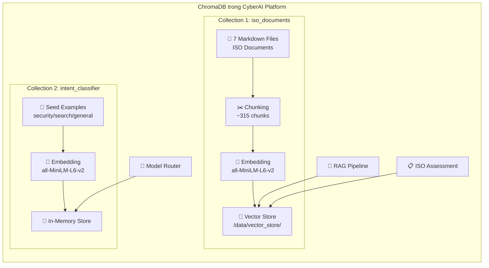
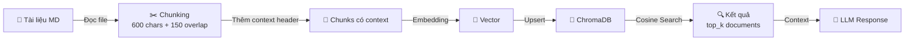
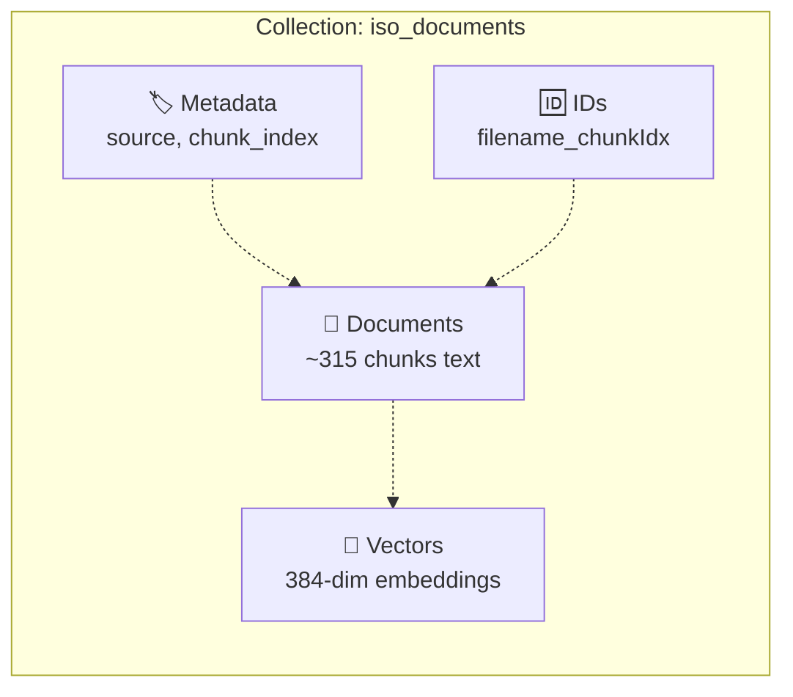
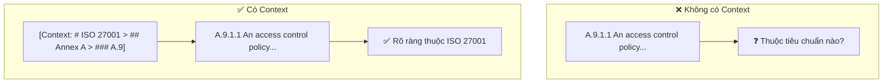
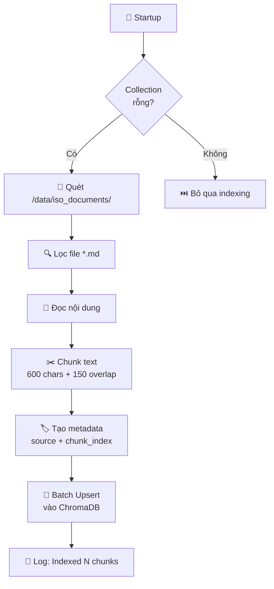
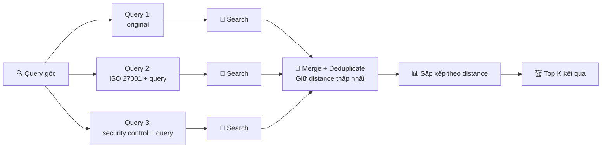
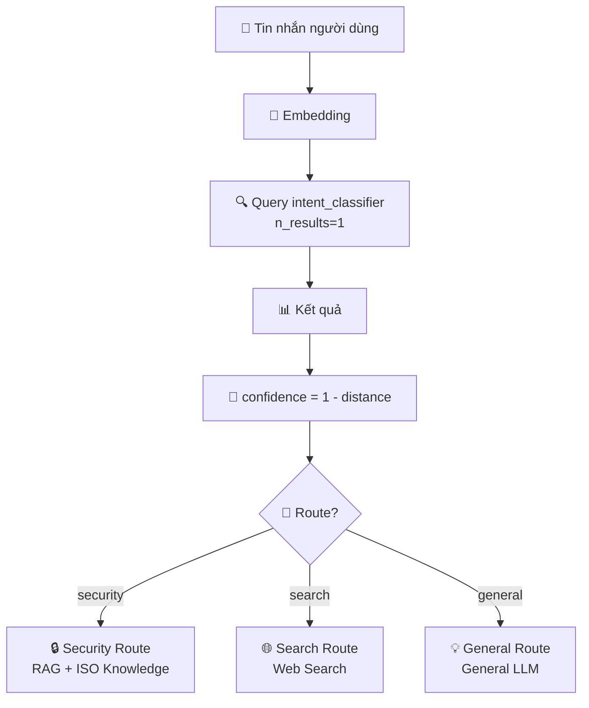
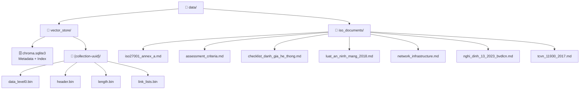
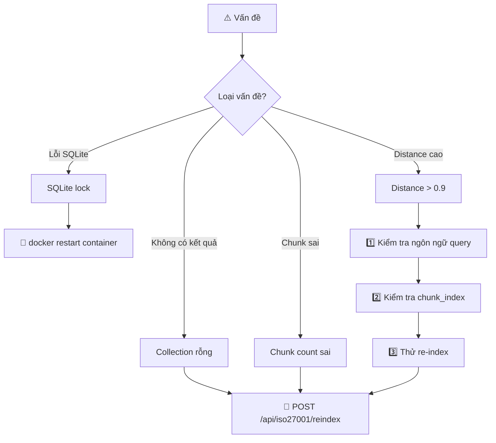

# 📦 Hướng Dẫn ChromaDB Vector Store (Kho Vector)

<div align="center">

[](../en/chromadb_guide.md)
[](chromadb_guide.md)

**Hướng dẫn toàn diện về cách ChromaDB Vector Store (Kho vector) được sử dụng trong nền tảng CyberAI**

</div>

---

## 📑 Mục Lục

| # | Phần | Mô tả |
|---|------|--------|
| 1 | [🔍 Tổng Quan](#1--tổng-quan) | Kiến trúc tổng thể và vai trò của ChromaDB |
| 2 | [⚙️ Cấu Hình Collection (Bộ sưu tập)](#2-️-cấu-hình-collection-bộ-sưu-tập) | Persistence (Lưu trữ bền vững) và Distance Metric (Thước đo khoảng cách) |
| 3 | [✂️ Document Chunking — Nhận Biết Header](#3-️-document-chunking--nhận-biết-header) | Thuật toán chia nhỏ tài liệu có nhận biết header |
| 4 | [📥 Indexing Pipeline (Quy trình lập chỉ mục)](#4--indexing-pipeline-quy-trình-lập-chỉ-mục) | Auto-index khi khởi động và re-index |
| 5 | [🔎 Search API (API Tìm kiếm)](#5--search-api-api-tìm-kiếm) | Query (Truy vấn) cơ bản và định dạng kết quả |
| 6 | [🔀 Multi-Query Search (Tìm kiếm đa truy vấn)](#6--multi-query-search-tìm-kiếm-đa-truy-vấn) | Tìm kiếm nhiều biến thể để cải thiện recall |
| 7 | [🧠 Intent Classifier Collection](#7--intent-classifier-collection) | Phân loại intent người dùng bằng ChromaDB |
| 8 | [🛠️ Admin Operations (Thao tác quản trị)](#8-️-admin-operations-thao-tác-quản-trị) | Endpoint thống kê, tìm kiếm, re-index |
| 9 | [📂 Data Directory Layout (Cấu trúc thư mục)](#9--data-directory-layout-cấu-trúc-thư-mục) | Sơ đồ thư mục dữ liệu |
| 10 | [🔧 Troubleshooting (Xử lý sự cố)](#10--troubleshooting-xử-lý-sự-cố) | Giải pháp cho các vấn đề thường gặp |

---

## 1. 🔍 Tổng Quan

ChromaDB được sử dụng theo **hai cách khác nhau** trong dự án này:

| Collection (Bộ sưu tập) | Mục đích | Storage (Lưu trữ) |
|--------------------------|----------|-------------------|
| `iso_documents` | Cơ sở kiến thức ISO cho RAG retrieval (truy xuất RAG) | Persistence (Bền vững): `/data/vector_store/` |
| `intent_classifier` | Ví dụ intent cho model router (bộ định tuyến mô hình) | In-memory (xây lại khi khởi động) |

Collection (Bộ sưu tập) `iso_documents` lập Index (Chỉ mục) cho **7 file markdown** tổng cộng ~315 chunks, hỗ trợ tìm kiếm ngữ nghĩa với Cosine Similarity (Độ tương đồng cosine) cho cả pipeline RAG chatbot và tra cứu kiến thức đánh giá ISO.

### 🏗️ Kiến Trúc ChromaDB



### 🔄 Luồng Dữ Liệu



---

## 2. ⚙️ Cấu Hình Collection (Bộ sưu tập)

File: [`backend/repositories/vector_store.py`](../../backend/repositories/vector_store.py)

```python
self.client = chromadb.PersistentClient(
    path=persist_dir or "/data/vector_store"
)

self.collection = self.client.get_or_create_collection(
    name="iso_documents",
    metadata={"hnsw:space": "cosine"}   # Cosine Distance Metric (Thước đo khoảng cách cosine)
)
```

### 📋 Bảng Tham Số

| Tham số | Giá trị | Ghi chú |
|---------|---------|---------|
| Tên Collection (Bộ sưu tập) | `iso_documents` | Cố định — dùng bởi cả RAG và ISO assessment |
| Distance Metric (Thước đo khoảng cách) | cosine | 0 = giống hệt, 1 = trực giao, 2 = đối lập |
| Persist directory (Thư mục lưu trữ) | `/data/vector_store` | Tồn tại qua các lần khởi động lại container |
| Embedding function (Hàm nhúng) | Mặc định ChromaDB | `sentence-transformers/all-MiniLM-L6-v2` |

### 📐 Cấu Trúc Collection



---

## 3. ✂️ Document Chunking — Nhận Biết Header

File: [`backend/repositories/vector_store.py`](../../backend/repositories/vector_store.py) — [`_chunk_text()`](../../backend/repositories/vector_store.py)

### 📋 Tham Số Chunking

```python
def _chunk_text(self, text: str, chunk_size: int = 600, overlap: int = 150) -> list:
```

| Tham số | Giá trị | Mô tả |
|---------|---------|-------|
| `chunk_size` | 600 ký tự | Kích thước tối đa mỗi chunk |
| `overlap` | 150 ký tự | Độ chồng lấp giữa các chunk liên tiếp |

### 🔍 Header Context Tracking (Theo dõi ngữ cảnh Header)

Khi quét text, phân cấp markdown heading hiện tại được theo dõi và thêm vào đầu mỗi chunk:

```python
header_pattern = re.compile(r'^(#{1,3})\s+(.+)$', re.MULTILINE)
current_headers = {1: "", 2: "", 3: ""}

for match in header_pattern.finditer(text):
    level = len(match.group(1))    # 1, 2, hoặc 3
    title = match.group(2).strip()
    current_headers[level] = title
    # Xóa sub-headers khi parent thay đổi
    for sub in range(level+1, 4):
        current_headers[sub] = ""
```

### 📝 Context Prefix Format (Định dạng tiền tố ngữ cảnh)

```
[Context: # <h1> > ## <h2> > ### <h3>]
```

**Ví dụ:**

```
[Context: # ISO 27001:2022 > ## Annex A Controls > ### A.9 Access Control]
A.9.1.1 Access control policy
An access control policy shall be established, documented, approved by
management, published and communicated to employees and relevant
external parties. The access control policy shall address...
```

### 🧮 Thuật Toán Chunking

<details>
<summary>📜 Xem code thuật toán chunking đầy đủ</summary>

```python
def _chunk_text(self, text, chunk_size=600, overlap=150):
    chunks = []
    paragraphs = text.split("\n\n")
    current = ""

    for para in paragraphs:
        if len(current) + len(para) > chunk_size and current:
            # Xây dựng tiền tố context từ headers hiện tại
            context = self._build_context_prefix(current_headers)
            chunks.append(f"{context}\n{current.strip()}" if context else current.strip())

            # Overlap: giữ lại `overlap` ký tự cuối của chunk hiện tại
            current = current[-overlap:] + "\n\n" + para
        else:
            current += ("\n\n" if current else "") + para

    # Chunk cuối cùng
    if current.strip():
        context = self._build_context_prefix(current_headers)
        chunks.append(f"{context}\n{current.strip()}" if context else current.strip())

    return chunks
```

</details>

### 💡 Tại Sao Điều Này Quan Trọng

Không có Header Context (ngữ cảnh header), một chunk như `"A.9.1.1 — An access control policy shall be..."` không có chỉ báo thuộc tiêu chuẩn hay mục nào. Với tiền tố:

```
[Context: # ISO 27001:2022 > ## Annex A > ### A.9]
A.9.1.1 An access control policy shall be...
```

Embedding (Nhúng vector) model thấy được toàn bộ ngữ cảnh phân cấp, **cải thiện đáng kể độ chính xác** truy xuất cho các Query (Truy vấn) như "ISO 27001 access control" so với "TCVN 11930 access control".



---

## 4. 📥 Indexing Pipeline (Quy trình lập chỉ mục)

File: [`backend/repositories/vector_store.py`](../../backend/repositories/vector_store.py) — [`index_documents()`](../../backend/repositories/vector_store.py)

### 🚀 Auto-Index Khi Khởi Động

```python
@app.on_event("startup")
def on_startup():
    VectorStore().ensure_indexed()
```

```python
def ensure_indexed(self):
    if self.collection.count() == 0:
        self.index_documents()
```

> ✅ Chỉ index nếu Collection (Bộ sưu tập) rỗng — **không index trùng** khi khởi động lại.

### 📊 Quy Trình Index (Chỉ mục) Đầy Đủ



<details>
<summary>📜 Xem code quy trình index đầy đủ</summary>

```python
def index_documents(self, docs_dir=None):
    docs_dir = docs_dir or "/data/iso_documents"
    documents, metadatas, ids = [], [], []

    for filename in sorted(os.listdir(docs_dir)):
        if not filename.endswith(".md"):
            continue
        filepath = os.path.join(docs_dir, filename)
        with open(filepath, "r", encoding="utf-8") as f:
            text = f.read()

        chunks = self._chunk_text(text)
        for i, chunk in enumerate(chunks):
            doc_id = f"{filename}_{i}"
            documents.append(chunk)
            metadatas.append({"source": filename, "chunk_index": i})
            ids.append(doc_id)

    # Batch Processing (Xử lý hàng loạt) upsert vào ChromaDB
    self.collection.upsert(
        documents=documents,
        metadatas=metadatas,
        ids=ids
    )
    logger.info(f"[VectorStore] Indexed {len(ids)} chunks from {docs_dir}")
```

</details>

### 🔄 Force Re-index (Buộc lập chỉ mục lại)

```
POST /api/iso27001/reindex
```

Xóa và xây lại toàn bộ Collection (Bộ sưu tập):

<details>
<summary>📜 Xem code re-index endpoint</summary>

```python
@router.post("/iso27001/reindex")
async def reindex():
    vs = VectorStore()
    vs.client.delete_collection("iso_documents")
    vs.collection = vs.client.create_collection(
        name="iso_documents",
        metadata={"hnsw:space": "cosine"}
    )
    vs.index_documents()
    return {"status": "ok", "indexed": vs.collection.count()}
```

</details>

---

## 5. 🔎 Search API (API Tìm kiếm)

File: [`backend/repositories/vector_store.py`](../../backend/repositories/vector_store.py) — [`search()`](../../backend/repositories/vector_store.py)

### 🔍 Basic Search (Tìm kiếm cơ bản)

```python
def search(self, query: str, top_k: int = 5) -> list:
    results = self.collection.query(
        query_texts=[query],
        n_results=top_k,
        include=["documents", "metadatas", "distances"]
    )

    output = []
    for i in range(len(results["ids"][0])):
        output.append({
            "id":       results["ids"][0][i],
            "document": results["documents"][0][i],
            "metadata": results["metadatas"][0][i],
            "distance": results["distances"][0][i],
        })
    return output
```

### 📄 Result Format (Định dạng kết quả)

```python
[
  {
    "id":       "iso27001_annex_a.md_42",
    "document": "[Context: # ISO 27001 > ## Annex A > ### A.9]\nA.9.1.1 Access control...",
    "metadata": { "source": "iso27001_annex_a.md", "chunk_index": 42 },
    "distance": 0.12     # thấp hơn = tương tự hơn
  },
  ...
]
```

### 📏 Distance Interpretation (Diễn giải khoảng cách)

| Distance (Khoảng cách) | Ý nghĩa | Biểu tượng |
|-------------------------|----------|-------------|
| 0.0–0.2 | Độ liên quan rất cao | 🟢 |
| 0.2–0.4 | Độ liên quan cao | 🟡 |
| 0.4–0.6 | Độ liên quan trung bình | 🟠 |
| 0.6–1.0 | Độ liên quan thấp | 🔴 |
| > 1.0 | Không liên quan (cosine distance có thể vượt 1 khi similarity âm) | ⚫ |

---

## 6. 🔀 Multi-Query Search (Tìm kiếm đa truy vấn)

File: [`backend/repositories/vector_store.py`](../../backend/repositories/vector_store.py) — [`multi_query_search()`](../../backend/repositories/vector_store.py)

Với các Query (Truy vấn) phức tạp, tạo nhiều biến thể để cải thiện recall:

```python
def multi_query_search(self, query: str, top_k: int = 5) -> list:
    queries = [
        query,
        f"ISO 27001 {query}",
        f"security control {query}"
    ]

    seen_ids = {}
    for q in queries:
        results = self.search(q, top_k=top_k)
        for r in results:
            if r["id"] not in seen_ids or r["distance"] < seen_ids[r["id"]]["distance"]:
                seen_ids[r["id"]] = r

    # Sắp xếp theo distance, trả về top_k
    merged = sorted(seen_ids.values(), key=lambda x: x["distance"])
    return merged[:top_k]
```

**Khi nào dùng:** Pipeline ISO assessment dùng `multi_query_search` để tối đa độ phủ truy xuất kiến thức trên tất cả controls liên quan.

### 🔄 Quy Trình Multi-Query



---

## 7. 🧠 Intent Classifier Collection

File: [`backend/services/model_router.py`](../../backend/services/model_router.py)

Một Collection (Bộ sưu tập) ChromaDB **in-memory** riêng biệt được dùng để phân loại intent (ý định) chat người dùng.

### 🏗️ Setup (Thiết lập)

```python
_client = chromadb.Client()   # in-memory, không có Persistence (Lưu trữ bền vững)

def _get_intent_collection():
    collection = _client.get_or_create_collection(
        name="intent_classifier",
        metadata={"hnsw:space": "cosine"}
    )
    if collection.count() == 0:
        _seed_examples(collection)
    return collection
```

### 🌱 Seed Examples (Ví dụ mẫu)

```python
def _seed_examples(collection):
    examples = [
        # Ví dụ route security
        ("What are ISO 27001 Annex A controls?",         "security"),
        ("Explain the access control policy requirement", "security"),
        ("How to implement encryption under ISO 27001?", "security"),
        ("CVE vulnerability assessment requirements",    "security"),
        # Ví dụ route search
        ("Latest ransomware news today",                 "search"),
        ("Recent cybersecurity incidents this week",     "search"),
        ("Current stock market trends",                  "search"),
        # Ví dụ route general
        ("How does HTTPS work?",                         "general"),
        ("Explain what a firewall does",                 "general"),
        ("What is the difference between IDS and IPS?",  "general"),
    ]
    collection.upsert(
        documents=[e[0] for e in examples],
        metadatas=[{"route": e[1]} for e in examples],
        ids=[f"ex_{i}" for i in range(len(examples))]
    )
```

### 🎯 Classification (Phân loại)

```python
def _semantic_classify(message: str) -> Dict:
    collection = _get_intent_collection()
    result = collection.query(query_texts=[message], n_results=1)
    distance   = result["distances"][0][0]
    confidence = 1 - distance
    route      = result["metadatas"][0][0]["route"]
    return {"route": route, "confidence": confidence}
```

### 🗺️ Luồng Phân Loại Intent



| Route | Mô tả | Ví dụ Query (Truy vấn) |
|-------|--------|------------------------|
| `security` | Kiến thức ISO/bảo mật, dùng RAG | "ISO 27001 Annex A controls là gì?" |
| `search` | Tin tức/sự kiện, dùng web search | "Tin tức ransomware mới nhất" |
| `general` | Câu hỏi chung, dùng LLM trực tiếp | "HTTPS hoạt động như thế nào?" |

---

## 8. 🛠️ Admin Operations (Thao tác quản trị)

### 📊 Stats Endpoint (Endpoint thống kê)

```
GET /api/iso27001/chromadb/stats
```

```json
{
  "collection": "iso_documents",
  "count": 312,
  "persist_dir": "/data/vector_store",
  "metadata": { "hnsw:space": "cosine" }
}
```

### 🔎 Search Endpoint (Endpoint tìm kiếm)

```
POST /api/iso27001/chromadb/search
{ "query": "access control", "top_k": 5 }
```

Có thể truy cập từ giao diện ChromaDB Explorer trên trang Analytics.

### 🔄 Re-index Endpoint (Endpoint lập chỉ mục lại)

```
POST /api/iso27001/reindex
```

Xóa và xây lại Collection (Bộ sưu tập) `iso_documents`. Dùng khi file tài liệu ISO được cập nhật.

### 📋 Tổng Hợp Admin Endpoints

| Endpoint | Method | Mô tả |
|----------|--------|--------|
| `/api/iso27001/chromadb/stats` | `GET` | Xem thống kê Collection (Bộ sưu tập) |
| `/api/iso27001/chromadb/search` | `POST` | Tìm kiếm ngữ nghĩa trong vector store |
| `/api/iso27001/reindex` | `POST` | Xóa và xây lại toàn bộ Index (Chỉ mục) |

---

## 9. 📂 Data Directory Layout (Cấu trúc thư mục dữ liệu)

```
data/
├── vector_store/                   ← Thư mục Persistence (Lưu trữ bền vững) ChromaDB
│   ├── chroma.sqlite3              ← Metadata (Siêu dữ liệu) + Embedding (Nhúng vector) index
│   └── {collection-uuid}/
│       ├── data_level0.bin         ← HNSW graph level 0
│       ├── header.bin
│       ├── length.bin
│       └── link_lists.bin
│
└── iso_documents/                  ← File markdown nguồn
    ├── iso27001_annex_a.md
    ├── assessment_criteria.md
    ├── checklist_danh_gia_he_thong.md
    ├── luat_an_ninh_mang_2018.md
    ├── network_infrastructure.md
    ├── nghi_dinh_13_2023_bvdlcn.md
    └── tcvn_11930_2017.md
```

### 🗂️ Sơ Đồ Thư Mục



---

## 10. 🔧 Troubleshooting (Xử lý sự cố)

### ❌ Collection rỗng (không có kết quả tìm kiếm)

```bash
# Buộc re-index qua API
curl -X POST http://localhost:8000/api/iso27001/reindex

# Hoặc kiểm tra số file
docker exec <backend_container> ls -la /data/iso_documents/
```

### 🔢 Số chunk sai sau khi cập nhật tài liệu

Sau khi chỉnh sửa bất kỳ file nào trong `data/iso_documents/`, buộc re-index:

```
POST /api/iso27001/reindex
```

### 🔒 Lỗi ChromaDB SQLite lock

Xảy ra khi hai process truy cập cùng đường dẫn `PersistentClient` đồng thời. Backend là single-process (Uvicorn), nên không nên xảy ra. Nếu gặp lỗi:

```bash
docker restart <backend_container>
```

### 🔍 Xác Minh Nội Dung Collection (Bộ sưu tập)

```bash
# Kiểm tra thống kê
curl http://localhost:8000/api/iso27001/chromadb/stats

# Test tìm kiếm ngữ nghĩa
curl -X POST http://localhost:8000/api/iso27001/chromadb/search \
  -H "Content-Type: application/json" \
  -d '{"query": "access control policy", "top_k": 3}'
```

### 📈 Giá trị Distance (Khoảng cách) đều > 0.9 (truy xuất kém)

Cho thấy Embedding (Nhúng vector) không khớp tốt. Kiểm tra:

1. Ngôn ngữ Query (Truy vấn) khớp ngôn ngữ tài liệu (hầu hết tài liệu là tiếng Việt+Anh hỗn hợp)
2. Tài liệu được chunk đúng cách (kiểm tra `chunk_index` trong Metadata (Siêu dữ liệu))
3. Thử re-index: `POST /api/iso27001/reindex`

### 🗺️ Sơ Đồ Quyết Định Xử Lý Sự Cố



---

<div align="center">

📦 **ChromaDB** · Nền tảng Vector Store (Kho vector) cho CyberAI Platform

[⬆️ Về đầu trang](#-hướng-dẫn-chromadb-vector-store-kho-vector)

</div>
