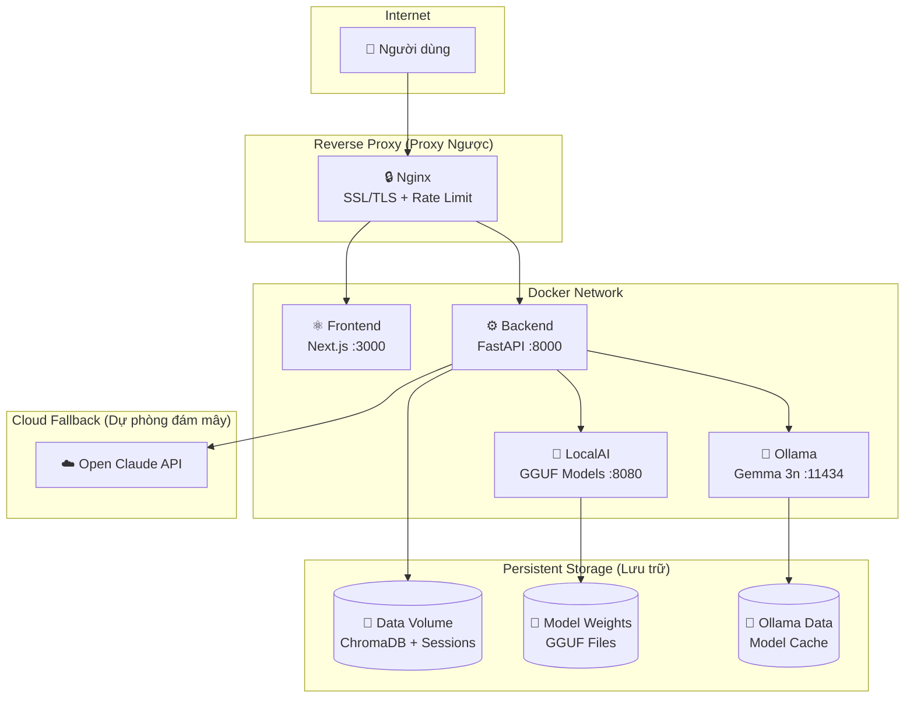
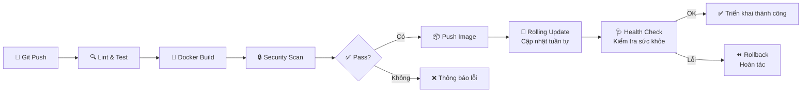
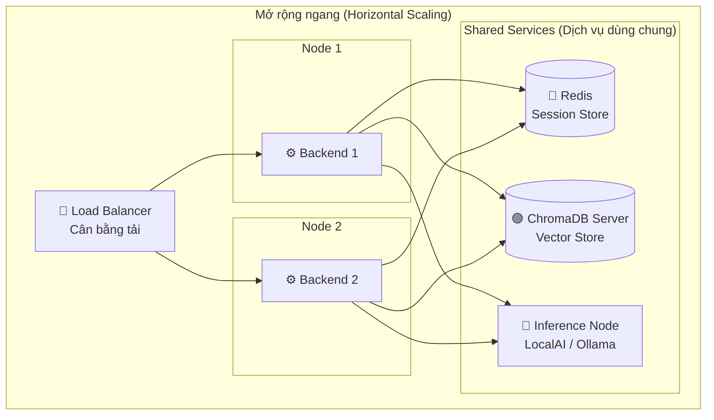

# 🚀 CyberAI Assessment Platform — Hướng Dẫn Triển Khai (Deployment Guide)

<div align="center">

[](../en/deployment.md)
[](deployment.md)

</div>

---

## 📑 Mục Lục

1. [Yêu Cầu Hệ Thống](#-1-yêu-cầu-hệ-thống-prerequisites)
2. [Khởi Động Nhanh (Development)](#-2-khởi-động-nhanh-development)
3. [Tải Model (Model Download)](#-3-tải-model-model-download)
4. [Biến Môi Trường (Environment Variables)](#-4-biến-môi-trường-environment-variables)
5. [Triển Khai Production](#-5-triển-khai-production-production-deployment)
6. [Health Check (Kiểm Tra Sức Khỏe)](#-6-health-check-kiểm-tra-sức-khỏe)
7. [Lưu Trữ Dữ Liệu (Data Persistence)](#-7-lưu-trữ-dữ-liệu-data-persistence)
8. [Backup & Restore (Sao Lưu & Khôi Phục)](#-8-backup--restore-sao-lưu--khôi-phục)
9. [Xử Lý Sự Cố (Troubleshooting)](#-9-xử-lý-sự-cố-troubleshooting)
10. [Mở Rộng Hệ Thống (Scaling)](#-10-mở-rộng-hệ-thống-scaling-considerations)

---

## 🏗️ Kiến Trúc Triển Khai Tổng Quan



---

## 📋 1. Yêu Cầu Hệ Thống (Prerequisites)

| Yêu cầu | Tối thiểu | Khuyến nghị |
|----------|-----------|-------------|
| Docker | 24+ | Phiên bản ổn định mới nhất |
| Docker Compose | v2 | v2.20+ |
| RAM | 16 GB | 32 GB |
| Dung lượng đĩa | 20 GB (file model) | 40 GB+ |
| GPU | — | NVIDIA (tùy chọn, tăng tốc suy luận) |

> **📊 Phân bổ bộ nhớ (Memory breakdown):** Riêng LocalAI cần 12 GB (dev) / 16 GB (prod) để tải model GGUF. Ollama cần thêm 12 GB. Backend và Frontend sử dụng khoảng ~8 GB kết hợp.

---

## ⚡ 2. Khởi Động Nhanh (Development)

```bash
# 1. Clone và cấu hình
cp .env.example .env
# Chỉnh sửa .env — tối thiểu đặt CLOUD_API_KEYS nếu muốn dùng cloud fallback (dự phòng đám mây)

# 2. Khởi động tất cả container (Vùng chứa)
docker compose up -d

# 3. Xác minh
docker compose ps
```

**🌐 Endpoint (Điểm truy cập) sau khi khởi động:**

| Dịch vụ (Service) | URL | Ghi chú |
|--------------------|-----|---------|
| Frontend | http://localhost:3000 | Next.js dev server với hot reload |
| Backend API docs | http://localhost:8000/docs | Swagger UI |
| Backend ReDoc | http://localhost:8000/redoc | Tài liệu API thay thế |
| LocalAI | http://localhost:8080 | API tương thích OpenAI |
| Ollama | http://localhost:11434 | API tương thích OpenAI |

> **⏳ Lưu ý:** LocalAI mất đến 120 giây để sẵn sàng (đang tải model). Container (Vùng chứa) backend khởi động ngay nhưng sẽ lỗi khi gọi suy luận cho đến khi LocalAI vượt qua Health Check (Kiểm tra sức khỏe).

---

## 📥 3. Tải Model (Model Download)

Các file model GGUF cho LocalAI cần được tải xuống trước lần sử dụng đầu tiên:

```bash
pip install huggingface_hub hf_transfer
python scripts/download_models.py --model llama --model security
```

### 📦 Danh Sách Model Khả Dụng

| Model ID | Tên file | Kích thước | Mô tả |
|----------|----------|------------|--------|
| `llama` | `Meta-Llama-3.1-8B-Instruct-Q4_K_M.gguf` | ~4.9 GB | LLM đa năng (định dạng báo cáo, chat) |
| `security` | `SecurityLLM-7B-Q4_K_M.gguf` | ~4.2 GB | Chuyên bảo mật (phân tích GAP) |
| `gemma-3-4b` | `google_gemma-3-4b-it-Q4_K_M.gguf` | ~2.5 GB | Nhanh, nhẹ |
| `gemma-3-12b` | `google_gemma-3-12b-it-Q4_K_M.gguf` | ~7.3 GB | Cân bằng chất lượng/tốc độ |
| `gemma-4-31b` | `gemma-4-31B-it-Q4_K_M.gguf` | ~19 GB | Chất lượng tốt nhất, yêu cầu RAM cao |
| `gemma-4-31b-q3` | `gemma-4-31B-it-Q3_K_M.gguf` | ~13.5 GB | Lượng tử hóa nhẹ hơn |

Model được tải xuống thư mục [`models/llm/weights/`](scripts/download_models.py:32) thông qua HuggingFace Hub.

```bash
# Kiểm tra trạng thái tải
python scripts/download_models.py --status

# Tải tất cả model
python scripts/download_models.py --model all
```

**🦙 Model Ollama:** Gemma 3n E4B được tự động pull khi container khởi động qua [entrypoint](docker-compose.yml:127). Không cần tải thủ công.

---

## ⚙️ 4. Biến Môi Trường (Environment Variables)

Tất cả cấu hình thông qua biến môi trường được định nghĩa trong [`.env.example`](.env.example). Sao chép thành `.env` và tùy chỉnh.

### 🤖 Cài Đặt Model & LLM

| Biến | Mặc định | Mô tả |
|------|----------|--------|
| `LOCALAI_URL` | `http://localai:8080` | URL dịch vụ LocalAI (DNS nội bộ Docker) |
| `OLLAMA_URL` | `http://ollama:11434` | URL dịch vụ Ollama (DNS nội bộ Docker) |
| `MODEL_NAME` | `Meta-Llama-3.1-8B-Instruct-Q4_K_M.gguf` | Model GGUF chính cho chat/báo cáo |
| `SECURITY_MODEL_NAME` | *(fallback về MODEL_NAME)* | Model GGUF chuyên bảo mật cho phân tích GAP |
| `MAX_TOKENS` | `-1` | Số token tạo tối đa (`-1` = mặc định của model) |
| `PREFER_LOCAL` | `true` | `true`: ưu tiên LocalAI/Ollama, dự phòng cloud. `false`: ưu tiên cloud |
| `LOCAL_ONLY_MODE` | `false` | `true`: không bao giờ gọi API cloud |
| `THREADS` | `6` | Số luồng CPU cho suy luận LocalAI |
| `CONTEXT_SIZE` | `8192` | Kích thước cửa sổ ngữ cảnh cho LocalAI |
| `DEBUG` | `true` | Bật log debug và xác thực JWT nới lỏng |

### ☁️ Cloud LLM API

| Biến | Mặc định | Mô tả |
|------|----------|--------|
| `CLOUD_LLM_API_URL` | `https://open-claude.com/v1` | URL cổng Open Claude |
| `CLOUD_MODEL_NAME` | `gemini-3-flash-preview` | Model cloud mặc định |
| `CLOUD_API_KEYS` | *(trống)* | Các API key cách nhau dấu phẩy để xoay vòng (round-robin) |

### 📂 Đường Dẫn Dữ Liệu (Data Paths)

| Biến | Mặc định | Mô tả |
|------|----------|--------|
| `ISO_DOCS_PATH` | `/data/iso_documents` | File markdown cơ sở kiến thức |
| `VECTOR_STORE_PATH` | `/data/vector_store` | Lưu trữ ChromaDB bền vững |
| `DATA_PATH` | `/data` | Thư mục dữ liệu gốc |

### 🔒 Bảo Mật (Security)

| Biến | Mặc định | Mô tả |
|------|----------|--------|
| `JWT_SECRET` | `change-me-in-production` | Khóa ký JWT (**bắt buộc** ≥32 ký tự trong production) |
| `JWT_EXPIRE_MINUTES` | `60` | Thời gian hết hạn token (phút) |
| `CORS_ORIGINS` | `http://localhost:3000` | Các origin được phép, cách nhau dấu phẩy |

> **⚠️ Quan trọng:** Ứng dụng từ chối khởi động trong production (`DEBUG=false`) nếu `JWT_SECRET` là giá trị yếu đã biết hoặc ngắn hơn 32 ký tự. Tạo secret an toàn:
> ```bash
> python -c "import secrets; print(secrets.token_hex(32))"
> ```

### 🚦 Giới Hạn Tốc Độ (Rate Limiting)

| Biến | Mặc định | Mô tả |
|------|----------|--------|
| `RATE_LIMIT_CHAT` | `10/minute` | Giới hạn tốc độ endpoint chat |
| `RATE_LIMIT_ASSESS` | `3/minute` | Giới hạn tốc độ endpoint đánh giá |
| `RATE_LIMIT_BENCHMARK` | `5/minute` | Giới hạn tốc độ endpoint benchmark |

### 🏎️ Hiệu Suất (Performance)

| Biến | Mặc định | Mô tả |
|------|----------|--------|
| `INFERENCE_TIMEOUT` | `300` | Timeout yêu cầu LocalAI/Ollama (giây) |
| `CLOUD_TIMEOUT` | `60` | Timeout yêu cầu Cloud API (giây) |
| `MAX_CONCURRENT_REQUESTS` | `3` | Giới hạn semaphore cho yêu cầu LLM đồng thời |

---

## 🏭 5. Triển Khai Production (Production Deployment)

Production sử dụng [`docker-compose.prod.yml`](docker-compose.prod.yml) ghi đè cấu hình cơ bản:

### 📊 Khác Biệt Chính So Với Development

| Khía cạnh | Development | Production |
|-----------|-------------|------------|
| Nginx | Không bao gồm | [`cyberai-nginx`](docker-compose.prod.yml:12) với TLS |
| Volume (Ổ đĩa ảo) | Bind mounts (hot reload) | Named volume `cyberai-data` |
| Backend | Một worker uvicorn | [`WORKERS=2`](docker-compose.prod.yml:50) |
| Frontend | `Dockerfile.dev` (dev server) | `Dockerfile` (production build, standalone) |
| LocalAI image | `localai/localai:v2.24.2` | `localai/localai:latest` |
| Bộ nhớ LocalAI | 12 GB / 4 GB dự trữ | 16 GB / 8 GB dự trữ |
| Bộ nhớ Frontend | 2 GB | 1 GB |
| Bộ nhớ Backend | 6 GB / 2 GB dự trữ | 4 GB / 1 GB dự trữ |
| DEBUG | `true` | `false` |
| LOG_LEVEL | `INFO` | `WARNING` |
| Tiền tố container | `phobert-*` | `cyberai-*` |
| Network (Mạng) | `phobert-network` | `cyberai-network` |

### 🚀 Lệnh Triển Khai

```bash
docker compose -f docker-compose.yml -f docker-compose.prod.yml up -d
```

### 🔐 Chứng Chỉ SSL/TLS (Chứng chỉ bảo mật)

Đặt chứng chỉ TLS vào [`nginx/certs/`](nginx/nginx.conf:82):

```
nginx/certs/
├── fullchain.pem    # Chuỗi chứng chỉ (Certificate chain)
└── privkey.pem      # Khóa riêng tư (Private key)
```

<details>
<summary>📄 <strong>Chi tiết cấu hình Nginx</strong> (nhấn để mở rộng)</summary>

Cấu hình [Nginx](nginx/nginx.conf) bao gồm:

- **TLS hardening (Cứng hóa TLS):** Chỉ TLSv1.2 + TLSv1.3, bộ mã hóa hiện đại, OCSP stapling
- **Rate Limiting (Giới hạn tốc độ):** 30 req/s mỗi IP trên `/api/` (burst 20), 100 req/s toàn cục (burst 50)
- **Security Headers (Tiêu đề bảo mật):** HSTS, CSP, X-Frame-Options DENY, X-Content-Type-Options nosniff
- **WebSocket support:** Tiêu đề nâng cấp kết nối cho SSE streaming
- **Hidden file denial (Chặn file ẩn):** Chặn truy cập `.env`, `.git`, v.v.
- **Let's Encrypt:** Hỗ trợ ACME challenge tại `/.well-known/acme-challenge/`
- **Gzip compression (Nén Gzip):** Bật cho text, JSON, CSS, JS, SVG

</details>

### 🔄 Quy Trình CI/CD Pipeline



---

## 🩺 6. Health Check (Kiểm Tra Sức Khỏe)

| Dịch vụ | Endpoint | Phương thức | Phản hồi mong đợi | Ghi chú |
|---------|----------|-------------|---------------------|---------|
| Backend | `GET /health` | HTTP | `{"status": "healthy"}` | Mỗi 30s, start\_period 30s |
| LocalAI | `GET /readyz` | HTTP | 200 OK | Mỗi 30s, **start\_period 120s** (đang tải model) |
| Ollama | `GET /api/tags` | HTTP | 200 OK với danh sách model | Mỗi 30s, start\_period 60s |
| Trạng thái AI | `GET /api/system/ai-status` | HTTP | JSON với trạng thái model | Health Check (Kiểm tra sức khỏe) toàn diện (LocalAI + Ollama + Cloud) |

### 🔧 Kiểm Tra Thủ Công

```bash
# Backend
curl -f http://localhost:8000/health

# LocalAI
curl -f http://localhost:8080/readyz

# Ollama
curl -sf http://localhost:11434/api/tags

# Trạng thái AI đầy đủ
curl http://localhost:8000/api/system/ai-status
```

---

## 💾 7. Lưu Trữ Dữ Liệu (Data Persistence)

### 🛠️ Development (Bind Mounts)

Trong development, [`docker-compose.yml`](docker-compose.yml:33) mount trực tiếp thư mục host vào container backend để chỉnh sửa trực tiếp:

<details>
<summary>📄 <strong>Cấu hình Volume (Ổ đĩa ảo) Development</strong> (nhấn để mở rộng)</summary>

```yaml
volumes:
  - ./backend:/app                          # Mã nguồn (hot reload)
  - ./data/iso_documents:/data/iso_documents
  - ./data/vector_store:/data/vector_store
  - ./data/assessments:/data/assessments
  - ./data/evidence:/data/evidence
  - ./data/exports:/data/exports
  - ./data/sessions:/data/sessions
  - ./data/standards:/data/standards
  - ./data/knowledge_base:/data/knowledge_base
  - ./data/uploads:/data/uploads
```

</details>

Mã nguồn Frontend cũng được bind-mount để hot reload qua `WATCHPACK_POLLING=true`.

### 🏭 Production (Named Volumes)

Trong production, [`docker-compose.prod.yml`](docker-compose.prod.yml:54) sử dụng một named volume duy nhất:

```yaml
volumes:
  - cyberai-data:/data    # Tất cả dữ liệu bền vững
```

Lưu trữ model Ollama sử dụng named volume riêng trong cả hai môi trường:

```yaml
volumes:
  - ollama_data:/root/.ollama
```

---

## 💿 8. Backup & Restore (Sao Lưu & Khôi Phục)

Nền tảng bao gồm script Backup (Sao lưu) production tại [`scripts/backup.sh`](scripts/backup.sh):

```bash
# Mặc định: sao lưu vào ./backups/ với thời gian lưu trữ 30 ngày
./scripts/backup.sh

# Tùy chỉnh đích và thời gian lưu trữ
./scripts/backup.sh --dest /backup/path --retention-days 30
```

### 📋 Dữ Liệu Được Sao Lưu

| Thành phần | Đường dẫn nguồn | Nội dung |
|-----------|-----------------|----------|
| Đánh giá (Assessments) | `data/assessments/` | Bản ghi JSON đánh giá |
| Phiên (Sessions) | `data/sessions/` | Lịch sử phiên chat (JSON) |
| Cơ sở kiến thức (Knowledge Base) | `data/knowledge_base/` | Dữ liệu benchmark + controls |
| Vector Store | `data/vector_store/` | Chỉ mục ChromaDB bền vững |

### 📦 Kết Quả Sao Lưu

- Tạo file nén `tar.gz` có dấu thời gian (ví dụ: `cyberai_backup_20260405_143700.tar.gz`)
- Bao gồm `manifest.json` với phiên bản schema, dấu thời gian, và danh sách thành phần
- Tự động dọn dẹp các bản lưu cũ hơn thời gian lưu trữ

### ♻️ Khôi Phục (Restore)

```bash
# Giải nén bản lưu
tar -xzf cyberai_backup_20260405_143700.tar.gz

# Sao chép dữ liệu về dự án
cp -r cyberai_backup_20260405_143700/assessments/ data/assessments/
cp -r cyberai_backup_20260405_143700/sessions/ data/sessions/
cp -r cyberai_backup_20260405_143700/knowledge_base/ data/knowledge_base/
cp -r cyberai_backup_20260405_143700/vector_store/ data/vector_store/

# Khởi động lại backend để nhận dữ liệu khôi phục
docker compose restart backend
```

---

## 🔧 9. Xử Lý Sự Cố (Troubleshooting)

### 🐌 LocalAI Khởi Động Chậm

**Triệu chứng:** Backend trả về "LocalAI connection error" trong khoảng ~2 phút đầu.

**Nguyên nhân:** LocalAI tải model GGUF vào bộ nhớ khi khởi động. Health Check (Kiểm tra sức khỏe) có `start_period` 120 giây để phù hợp.

**Cách sửa:** Chờ Health Check (Kiểm tra sức khỏe) vượt qua:
```bash
docker compose ps   # Kiểm tra cột health status
docker logs phobert-localai --tail 20   # Theo dõi tiến trình tải model
```

---

### 🔍 Không Tìm Thấy Model (Model Not Found)

**Triệu chứng:** `"could not load model"` hoặc `"rpc error"` trong log.

**Cách sửa:**
1. Xác minh file GGUF tồn tại trong `models/llm/weights/`:
   ```bash
   ls -la models/llm/weights/*.gguf
   ```
2. Tải lại nếu thiếu:
   ```bash
   python scripts/download_models.py --model llama --model security
   ```
3. Xác minh `MODEL_NAME` và `SECURITY_MODEL_NAME` trong `.env` khớp với tên file.

---

### 💥 Hết Bộ Nhớ — OOM (Out of Memory)

**Triệu chứng:** Container (Vùng chứa) bị Docker kill hoặc lỗi `Canceled` trong log.

**Cách sửa:**
- Đảm bảo host có đủ RAM (tối thiểu 16 GB).
- Chỉ sử dụng model 8B tham số với giới hạn bộ nhớ LocalAI mặc định 12 GB.
- **Không** đặt `MODEL_NAME` thành model 70B — yêu cầu ~40 GB RAM.
- Giảm `CONTEXT_SIZE` từ 8192 xuống 4096 nếu RAM hạn chế.

---

### 🌐 Lỗi CORS

**Triệu chứng:** Console trình duyệt hiển thị lỗi `Access-Control-Allow-Origin`.

**Cách sửa:** Đặt `CORS_ORIGINS` trong `.env` bao gồm URL frontend của bạn:
```bash
CORS_ORIGINS=http://localhost:3000,https://yourdomain.com
```

---

### 🔑 Sự Cố Cloud API Key

**Triệu chứng:** `"[OpenClaude] No API key configured"` hoặc tất cả key bị giới hạn tốc độ.

**Cách sửa:**
1. Đặt `CLOUD_API_KEYS` trong `.env` với một hoặc nhiều key hợp lệ (cách nhau dấu phẩy).
2. Nếu tất cả key đang trong cooldown (rate limit 429), chờ 30 giây hoặc thêm key mới.
3. Kiểm tra tính hợp lệ key tại `https://open-claude.com`.
4. Nếu không cần cloud, đặt `LOCAL_ONLY_MODE=true`.

---

### 🦙 Ollama Không Kéo Được Model (Model Not Pulling)

**Triệu chứng:** Container Ollama đang chạy nhưng `gemma3n:e4b` không khả dụng.

**Cách sửa:**
```bash
# Kiểm tra log Ollama
docker logs phobert-ollama --tail 30

# Kéo model thủ công
docker exec phobert-ollama ollama pull gemma3n:e4b

# Xác minh
curl http://localhost:11434/api/tags
```

---

## 📈 10. Mở Rộng Hệ Thống (Scaling Considerations)

### 👷 Uvicorn Workers

Production sử dụng [`WORKERS=2`](docker-compose.prod.yml:50) (đặt trong environment backend). Tăng để đạt throughput cao hơn trên máy đa nhân:

```yaml
environment:
  - WORKERS=4
```

> **⚠️ Lưu ý:** Mỗi worker tải VectorStore và SessionStore riêng vào bộ nhớ. Lưu trữ session dựa trên file đảm bảo tính nhất quán giữa các worker.

### 🔒 Semaphore Yêu Cầu Đồng Thời (Concurrent Request Semaphore)

[`MAX_CONCURRENT_REQUESTS=3`](.env.example:51) giới hạn số lệnh gọi suy luận LLM đồng thời để tránh cạn kiệt bộ nhớ. Chỉ tăng nếu host có đủ RAM:

```bash
MAX_CONCURRENT_REQUESTS=5
```

### 🧮 Phân Bổ Bộ Nhớ Mỗi Container (Vùng chứa)

Điều chỉnh giới hạn bộ nhớ trong [`docker-compose.yml`](docker-compose.yml) theo RAM khả dụng trên host:

| Container (Vùng chứa) | Mặc định Dev | Nhẹ (16 GB host) | Đầy đủ (64 GB host) |
|------------------------|-------------|-------------------|----------------------|
| Backend | 6 GB | 4 GB | 8 GB |
| Frontend | 2 GB | 1 GB | 2 GB |
| LocalAI | 12 GB | 8 GB* | 24 GB |
| Ollama | 12 GB | 8 GB | 16 GB |

\* Với 8 GB, chỉ tải một model tại một thời điểm (đặt `PARALLEL_REQUESTS=false`).

### 🌍 Mở Rộng Ngang (Horizontal Scaling)

Kiến trúc hiện tại được thiết kế cho triển khai đơn node. Để mở rộng ngang:

| Thành phần | Trạng thái hiện tại | Hướng mở rộng |
|-----------|---------------------|---------------|
| Backend | Stateless ngoại trừ session dựa trên file | Chuyển session sang Redis cho multi-node |
| ChromaDB | Sử dụng `PersistentClient` (đĩa cục bộ) | Chuyển sang chế độ ChromaDB server để chia sẻ truy cập |
| LocalAI/Ollama | Mỗi instance tải model vào RAM | Sử dụng node suy luận chuyên dụng |



---

<div align="center">

📖 **Tài liệu liên quan:** [Kiến trúc](architecture.md) · [API](api.md) · [ChromaDB](chromadb_guide.md) · [Backup (Sao lưu)](../en/backup_strategy.md) · [Monitoring (Giám sát)](../en/analytics_monitoring.md)

</div>
