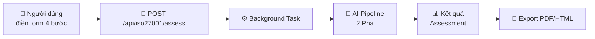
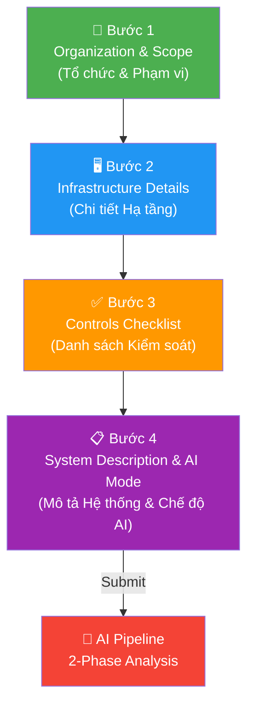
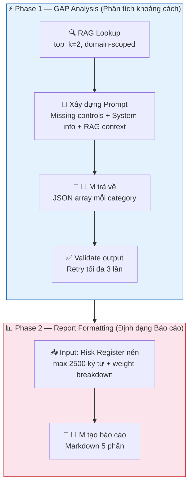
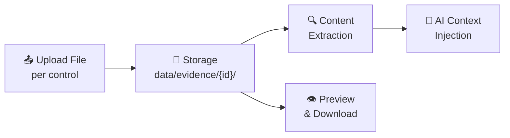
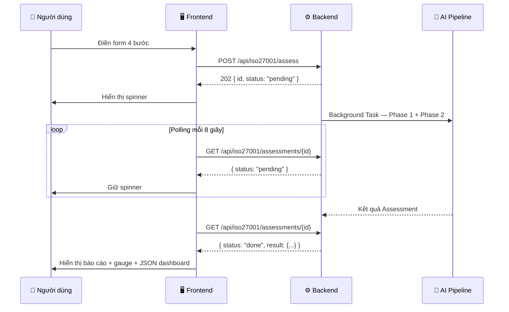

# 🛡️ CyberAI Platform — Tính Năng ISO Assessment (Đánh Giá ISO)

<div align="center">

[](../en/iso_assessment_form.md)
[](iso_assessment_form.md)

</div>

---

## 📑 Mục Lục

1. [Tổng Quan](#-1-tổng-quan)
2. [Assessment Workflow — Quy Trình Đánh Giá (4 Bước)](#-2-assessment-workflow--quy-trình-đánh-giá-4-bước)
3. [2-Phase AI Pipeline (Quy Trình Xử Lý AI 2 Pha)](#-3-2-phase-ai-pipeline-quy-trình-xử-lý-ai-2-pha)
4. [Compliance Scoring (Chấm Điểm Tuân Thủ)](#-4-compliance-scoring-chấm-điểm-tuân-thủ)
5. [Structured JSON Output (Đầu Ra JSON Có Cấu Trúc)](#-5-structured-json-output-đầu-ra-json-có-cấu-trúc)
6. [Supported Standards (Tiêu Chuẩn Hỗ Trợ)](#-6-supported-standards-tiêu-chuẩn-hỗ-trợ)
7. [Evidence System (Hệ Thống Bằng Chứng)](#-7-evidence-system-hệ-thống-bằng-chứng)
8. [Export (Xuất Báo Cáo)](#-8-export-xuất-báo-cáo)
9. [Frontend UI (Giao Diện Người Dùng)](#-9-frontend-ui-giao-diện-người-dùng)

---

## 🔍 1. Tổng Quan

Wizard (Trình hướng dẫn) 4 bước dành cho Assessment (Đánh giá) Compliance (Tuân thủ) an ninh mạng toàn diện. Hỗ trợ **ISO 27001:2022**, **TCVN 11930:2017**, và **tiêu chuẩn tùy chỉnh tải lên**.

Frontend: [`/form-iso`](../../frontend-next/src/app/form-iso/page.js) với điều hướng [`StepProgress`](../../frontend-next/src/components/StepProgress.js).

Backend: [`/api/iso27001/assess`](../../backend/api/routes/iso27001.py) kích hoạt tác vụ nền được xử lý bởi [`assessment_helpers.py`](../../backend/services/assessment_helpers.py).



---

## 📝 2. Assessment Workflow — Quy Trình Đánh Giá (4 Bước)



### 🏢 Bước 1 — Organization & Scope (Tổ chức & Phạm vi)

| Trường | Mô tả |
|--------|--------|
| Organization name (Tên tổ chức) | Tên công ty hoặc tổ chức |
| Industry (Ngành nghề) | Lĩnh vực hoạt động |
| Organization size (Quy mô) | Số nhân viên / quy mô tài sản |
| Standard (Tiêu chuẩn) | ISO 27001 (93 controls, 4 categories) / TCVN 11930 (34 controls, 5 categories) / Custom |
| Scope (Phạm vi) | `full` / `department` / `system` |

### 🖥️ Bước 2 — Infrastructure Details (Chi Tiết Hạ Tầng)

| Trường | Mô tả |
|--------|--------|
| Servers | Danh sách và cấu hình máy chủ |
| Firewalls | Chi tiết triển khai tường lửa |
| VPN | Dịch vụ VPN đang sử dụng |
| Cloud services | Nhà cung cấp và dịch vụ đám mây |
| Antivirus | Giải pháp bảo vệ endpoint |
| SIEM | Hệ thống giám sát an ninh |
| Backup systems | Hạ tầng sao lưu dự phòng |
| Recent incidents | Các sự cố bảo mật gần đây |

### ✅ Bước 3 — Controls Checklist (Danh Sách Biện Pháp Kiểm Soát)

- **Chuyển đổi từng Control (Biện pháp kiểm soát)**: đã triển khai / chưa triển khai
- **Chọn tất cả theo danh mục** để chuyển đổi hàng loạt
- **Evidence (Bằng chứng) upload** cho từng control (kéo-thả, tối đa 10 MB)
- Định dạng file được hỗ trợ: `PDF`, `PNG`, `JPG`, `DOC`, `DOCX`, `XLSX`, `CSV`, `TXT`, `LOG`, `CONF`, `XML`, `JSON`

**Trích xuất nội dung Evidence (Bằng chứng) cho AI context:**

| Loại File | Phương Pháp Trích Xuất |
|-----------|------------------------|
| TXT, LOG, CONF, CSV, XML, JSON | Đọc trực tiếp dạng text |
| PDF | `pypdf` |
| DOCX | `python-docx` |
| XLSX | `openpyxl` |

### 📋 Bước 4 — System Description & AI Mode (Mô Tả Hệ Thống & Chế Độ AI)

| Trường | Mô tả |
|--------|--------|
| Network topology (Kiến trúc mạng) | Mô tả kiến trúc mạng lưới |
| Additional notes (Ghi chú bổ sung) | Thông tin bổ sung dạng tự do |
| AI mode (Chế độ AI) | `Local` / `Hybrid` / `Cloud` |

---

## 🤖 3. 2-Phase AI Pipeline (Quy Trình Xử Lý AI 2 Pha)



### ⚡ Phase 1 — GAP Analysis (Phân Tích Khoảng Cách)

**Model:** SecurityLLM 7B (local) hoặc nhà cung cấp cloud.

```
For each standard category:
  1. RAG lookup (top_k=2, domain-scoped collection)
  2. Build compact prompt:
     ├── Missing (unimplemented) controls for the category
     ├── System summary from infrastructure details
     └── RAG context chunks
  3. LLM returns JSON array per category
  4. Validate output → retry up to 3 times on failure
```

**Schema đầu ra cho từng Control (Biện pháp kiểm soát):**

<details>
<summary>📄 Xem JSON schema mẫu cho Phase 1 output</summary>

```json
[
  {
    "id": "A.5.1",
    "severity": "critical|high|medium|low",
    "likelihood": "high|medium|low",
    "impact": "high|medium|low",
    "risk": "Description of risk",
    "gap": "Description of gap",
    "recommendation": "Remediation action"
  }
]
```

</details>

**Validation & chống ảo giác (anti-hallucination):**

- Trích xuất JSON từ đầu ra LLM (xử lý markdown fences, JSON không hoàn chỉnh)
- **Anti-hallucination**: loại bỏ bất kỳ control ID nào không nằm trong tập control hợp lệ của tiêu chuẩn đã chọn
- Retry tối đa 3 lần khi validation thất bại
- **Fallback**: [`infer_gap_from_control()`](../../backend/services/assessment_helpers.py) tạo Gap Analysis (Phân tích khoảng cách) từ metadata của control khi LLM thất bại
- **Chuẩn hóa Severity**: nếu >70% gaps là `critical`, phân bổ lại theo tỷ lệ giữa các mức severity

> **📌 Lưu ý quan trọng:** Cơ chế anti-hallucination đảm bảo chỉ các control ID hợp lệ được đưa vào kết quả. Nếu LLM tạo ra ID không tồn tại trong tiêu chuẩn đã chọn, chúng sẽ bị loại bỏ tự động.

### 📊 Phase 2 — Report Formatting (Định Dạng Báo Cáo)

**Model:** Meta-Llama 8B (local) hoặc nhà cung cấp cloud.

**Input:** Risk Register nén từ Phase 1 (tối đa 2500 ký tự) + weight breakdown.

**Output:** Báo cáo Markdown 5 phần:

| Phần | Nội Dung |
|------|----------|
| 1. ĐÁNH GIÁ TỔNG QUAN | Compliance (Tuân thủ) %, phân bổ trọng số theo mức severity |
| 2. RISK REGISTER | Bảng: Control \| GAP \| Severity \| Likelihood \| Impact \| Risk \| Recommendation \| Timeline |
| 3. GAP ANALYSIS | Gaps nhóm theo mức severity |
| 4. ACTION PLAN | 0–30 ngày / 1–3 tháng / 3–12 tháng |
| 5. EXECUTIVE SUMMARY | Chỉ số chính, top 3 rủi ro, ước tính ngân sách bằng VND |

---

## 📐 4. Compliance Scoring (Chấm Điểm Tuân Thủ)

### Công Thức Weighted Average (Trung Bình Có Trọng Số)

```
W = Σ(implemented_weight) / Σ(all_weights) × 100%
```

> **📌 Phương pháp Scoring (Chấm điểm):** Điểm Compliance (Tuân thủ) sử dụng trọng số theo severity — các control Critical có trọng số **gấp 4 lần** control Low. Điều này đảm bảo các biện pháp bảo mật quan trọng nhất có ảnh hưởng lớn hơn đến điểm tổng thể.

**Trọng số theo Severity:**

| Severity (Mức nghiêm trọng) | Weight (Trọng số) |
|------------------------------|-------------------|
| Critical (Nghiêm trọng) | 4 |
| High (Cao) | 3 |
| Medium (Trung bình) | 2 |
| Low (Thấp) | 1 |

### Compliance Tiers (Mức Độ Tuân Thủ)

| Score (Điểm) | Tier (Mức độ) |
|---------------|---------------|
| ≥ 80% | ✅ High compliance (Tuân thủ cao) |
| ≥ 50% | ⚠️ Medium compliance (Tuân thủ trung bình) |
| ≥ 25% | 🟠 Low compliance (Tuân thủ thấp) |
| < 25% | 🔴 Critical (Nghiêm trọng) |

---

## 📦 5. Structured JSON Output (Đầu Ra JSON Có Cấu Trúc)

[`_build_structured_json`](../../backend/services/assessment_helpers.py) tạo ra bản tóm tắt dạng machine-readable:

<details>
<summary>📄 Xem ví dụ Structured JSON Output đầy đủ</summary>

```json
{
  "compliance_tier": "medium",
  "compliance_score": 62.5,
  "weight_breakdown": {
    "critical": {"implemented": 3, "total": 5, "weight": 4},
    "high": {"implemented": 10, "total": 15, "weight": 3},
    "medium": {"implemented": 8, "total": 10, "weight": 2},
    "low": {"implemented": 4, "total": 5, "weight": 1}
  },
  "risk_summary": {
    "critical": 2,
    "high": 5,
    "medium": 2,
    "low": 1
  },
  "top_gaps": [
    {"id": "A.8.7", "severity": "critical", "gap": "..."},
    {"id": "A.5.23", "severity": "critical", "gap": "..."}
  ]
}
```

</details>

**Giải thích các trường:**

| Trường | Mô Tả |
|--------|--------|
| `compliance_tier` | Mức Compliance (Tuân thủ): `critical` / `low` / `medium` / `high` |
| `compliance_score` | Điểm Compliance (Tuân thủ) theo Weighted Average (Trung bình có trọng số) (0–100) |
| `weight_breakdown` | Phân bổ trọng số theo severity: số đã triển khai / tổng / trọng số |
| `risk_summary` | Số lượng gaps theo severity |
| `top_gaps` | Danh sách gaps nghiêm trọng nhất cần ưu tiên Remediation (Khắc phục) |

---

## 📚 6. Supported Standards (Tiêu Chuẩn Hỗ Trợ)

### Built-in Standards (Tiêu Chuẩn Có Sẵn)

| Tiêu Chuẩn | ID | Controls (Biện pháp kiểm soát) | Categories (Danh mục) |
|-------------|-----|------|-----------|
| ISO 27001:2022 | `iso27001` | 93 | 4 — A.5 Organizational, A.6 People, A.7 Physical, A.8 Technological |
| TCVN 11930:2017 | `tcvn11930` | 34 | 5 — Network, Server, Application, Data, Management |
| Custom uploaded (Tải lên tùy chỉnh) | `{custom_id}` | Tối đa 500 | Tùy biến |

Danh mục Control (Biện pháp kiểm soát) được định nghĩa trong [`controls_catalog.py`](../../backend/services/controls_catalog.py).

### Additional Standards cho RAG Domain (Lĩnh vực) Mapping

Các tiêu chuẩn sau được index vào ChromaDB collections và sẵn dùng cho RAG context, nhưng không có control checklist riêng:

| Standard | ID |
|----------|-----|
| Nghị định 13/2023 | `nd13` |
| NIST CSF | `nist_csf` |
| PCI DSS | `pci_dss` |
| HIPAA | `hipaa` |
| GDPR | `gdpr` |
| SOC 2 | `soc2` |

---

## 📎 7. Evidence System (Hệ Thống Bằng Chứng)

| Tính Năng | Mô Tả |
|-----------|--------|
| Upload | Upload file theo từng control qua `/api/iso27001/evidence/{control_id}` (tối đa 10 MB) |
| Storage (Lưu trữ) | Thư mục `data/evidence/{control_id}/` |
| Content extraction (Trích xuất) | Nội dung file được trích xuất và đưa vào AI context trong quá trình Assessment (Đánh giá) |
| Summary (Tóm tắt) | `/api/iso27001/evidence-summary` tổng hợp Evidence (Bằng chứng) trên tất cả controls |
| Preview (Xem trước) | `/api/iso27001/evidence/{control_id}/{filename}/preview` trả về nội dung text cho các định dạng được hỗ trợ |
| Management (Quản lý) | Liệt kê, tải xuống, xóa cho từng file của từng control |



---

## 📤 8. Export (Xuất Báo Cáo)

| Phương Thức | Công Nghệ | Chi Tiết |
|-------------|-----------|----------|
| **PDF** (server) | weasyprint | HTML → PDF với định dạng chuyên nghiệp, qua `/api/iso27001/assessments/{id}/export-pdf` |
| **HTML fallback** (server) | Jinja2 | Trả về HTML có style nếu weasyprint không khả dụng |
| **HTML** (client) | Browser | Xuất HTML phía client với tính năng in-sang-PDF của trình duyệt |

---

## 🖥️ 9. Frontend UI (Giao Diện Người Dùng)

Được triển khai tại [`/form-iso`](../../frontend-next/src/app/form-iso/page.js).

### Navigation (Điều Hướng)

Wizard (Trình hướng dẫn) 4 bước sử dụng component [`StepProgress`](../../frontend-next/src/components/StepProgress.js).

### Tabs

| Tab | Mục Đích |
|-----|----------|
| Form | Assessment Wizard (Trình hướng dẫn đánh giá) (Bước 1–4) |
| Result (Kết quả) | Báo cáo Markdown đã render + compliance gauge + JSON dashboard |
| History (Lịch sử) | Danh sách phân trang các Assessment (Đánh giá) trước đó |
| Templates (Mẫu) | Các mẫu Assessment (Đánh giá) đã điền sẵn |

### Processing UX (Trải Nghiệm Xử Lý)

- Submit kích hoạt tác vụ nền (background task)
- **Polling interval**: mỗi 8 giây cho đến khi hoàn tất
- Compliance gauge hiển thị trực quan trên trang kết quả
- Structured JSON dashboard cho đầu ra machine-readable



---

<details>
<summary>📄 Ví dụ Assessment Result (Kết Quả Đánh Giá) JSON đầy đủ</summary>

```json
{
  "id": "7e0b008d-34d9-4c5b-bf9a-f3de2d53658e",
  "status": "done",
  "created_at": "2025-03-24T09:00:00",
  "data": {
    "company_name": "ACME Corp",
    "industry": "Finance",
    "standard_id": "iso27001",
    "scope": "full",
    "controls": ["A.5.1", "A.6.1", "A.7.1", "A.8.1"],
    "infrastructure": {
      "servers": "10 Linux servers, 5 Windows servers",
      "firewalls": "Palo Alto PA-3200",
      "vpn": "OpenVPN",
      "cloud_services": "AWS (EC2, S3, RDS)",
      "antivirus": "CrowdStrike Falcon",
      "siem": "Splunk Enterprise",
      "backup_systems": "Veeam Backup",
      "recent_incidents": "None in last 12 months"
    }
  },
  "result": {
    "analysis": "## Đánh Giá Tuân Thủ ISO 27001:2022\n\n**Điểm tổng thể: 62/100**\n...",
    "structured_json": {
      "compliance_tier": "medium",
      "compliance_score": 62.5,
      "weight_breakdown": {
        "critical": {"implemented": 3, "total": 5, "weight": 4},
        "high": {"implemented": 10, "total": 15, "weight": 3}
      },
      "risk_summary": {"critical": 2, "high": 5, "medium": 2, "low": 1},
      "top_gaps": [
        {"id": "A.8.7", "severity": "critical", "gap": "Thiếu quản lý malware protection"},
        {"id": "A.5.23", "severity": "critical", "gap": "Thiếu quy trình information security for cloud services"}
      ]
    },
    "model": "SecurityLLM-7B",
    "provider": "local"
  }
}
```

</details>

---

> **📌 Tóm tắt:** Hệ thống Assessment (Đánh giá) ISO cung cấp quy trình đánh giá Compliance (Tuân thủ) đầy đủ từ thu thập dữ liệu qua Wizard (Trình hướng dẫn) 4 bước, phân tích GAP tự động bằng AI Pipeline (Quy trình xử lý) 2 pha, Scoring (Chấm điểm) bằng Weighted Average (Trung bình có trọng số), đến xuất báo cáo PDF/HTML chuyên nghiệp — tất cả chạy bất đồng bộ với polling UX mượt mà.
